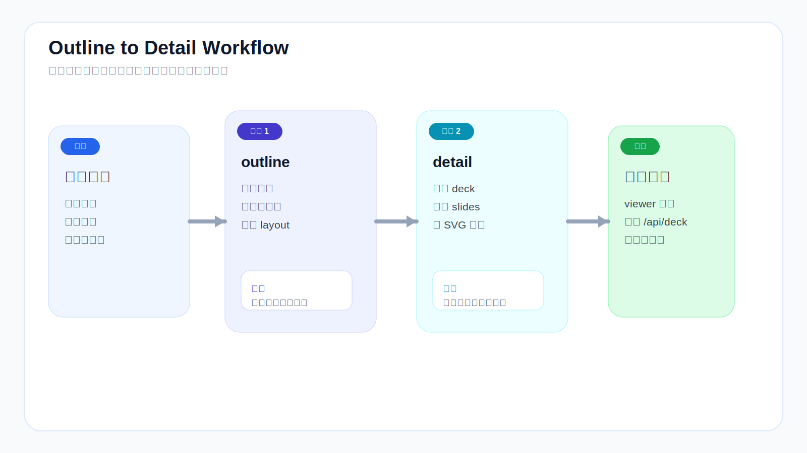
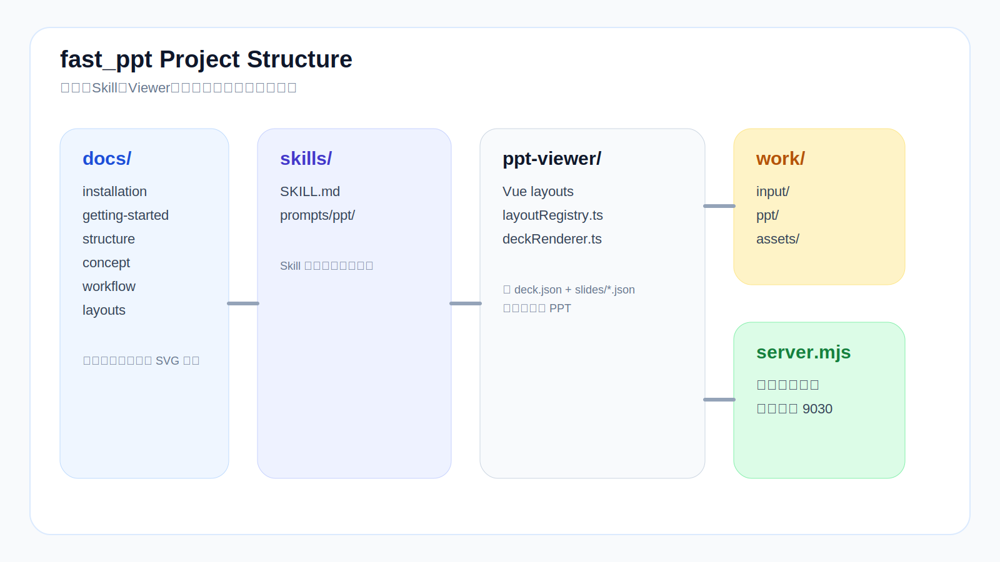
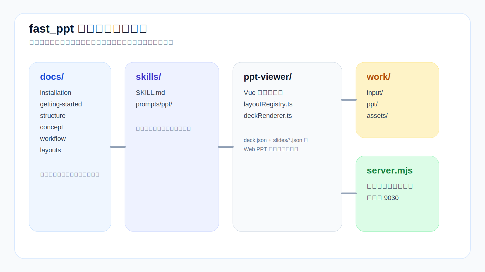

<h3 align="center">fast_ppt</h3>
<p align="center">Outline → Detail → Preview：一套把材料整理成网页 PPT 的工程化 Skill 体系</p>
<p align="center">
  <a href="README.md">中文</a> · <a href="#english">English</a> · <a href="#japanese">日本語</a>
  <br/>
  <a href="docs/zh-CN/getting-started.md">快速开始</a> · <a href="docs/zh-CN/manual.md">操作手册</a> · <a href="docs/zh-CN/examples.md">案例工程</a> · <a href="docs/zh-CN/concept.md">设计理念</a>
</p>
<hr />

License: MIT ([LICENSE](LICENSE))

## 一句话说明

不是一次性吐出一份静态 PPT，而是：**先生成 outline.json → 确认结构 → 再生成 deck.json + slides/*.json → 浏览器预览**。

## 它能做什么

- 生成可直接被前端读取的 PPT JSON 产物
- 支持 课件类 / 方案类 / 汇报类 / 演示类 四种类型
- 支持 zh-CN / ja-JP / en-US 三种语言
- 50+ 结构化 layout（卡片、图表、泳道、架构图等）
- 图形化页面优先 SVG，标准数据图支持 ECharts
- 一键导出 PPTX
- 可 fork 成你自己的风格和类型体系

## Quick Start（3 行）

```bash
npm install
npm --prefix ppt-viewer install
node server.mjs
```

打开 `http://localhost:9030/`，选择项目即可预览。

## 工作流



1. 准备材料 → `work/input/001_项目名/`
2. `/fppt:outline` → 生成 `outline.json`
3. 确认大纲（章节/页序/图页比例/layout）
4. `/fppt:detail` → 生成 `deck.json` + `slides/*.json` + SVG 素材
5. `node server.mjs` → 浏览器预览 `http://localhost:9030/`

## 核心命令

| 命令 | 作用 | 产出 |
|------|------|------|
| `/fppt:outline` | 生成大纲结构 | `outline.json` |
| `/fppt:detail` | 生成详细页面 + SVG 素材 | `deck.json` + `slides/*.json` + `work/assets/*.svg` |

## 项目结构



## 文档导航

新手必读：
- [快速开始](docs/zh-CN/getting-started.md)
- [安装说明](docs/zh-CN/installation.md)
- [操作手册](docs/zh-CN/manual.md)
- [案例工程](docs/zh-CN/examples.md)

理解设计：
- [设计理念](docs/zh-CN/concept.md)
- [工作流](docs/zh-CN/workflow.md)
- [项目结构](docs/zh-CN/structure.md)

深入使用：
- [布局类型库](docs/zh-CN/layouts.md)
- [使用说明](docs/zh-CN/usage.md)
- [故障排查](docs/zh-CN/troubleshooting.md)

扩展定制：
- [Fork 指南](docs/zh-CN/fork.md)

文档索引：[docs/index.md](docs/index.md)

## FAQ

- 支持什么语言？  
  PPT 生成支持 zh-CN / ja-JP / en-US，文档和 README 同样三语。
- 产出在哪里？  
  `work/ppt/001_项目名/` 下（outline.json + deck.json + slides/），素材在 `work/assets/`。
- 怎么预览？  
  `node server.mjs` 后打开 `http://localhost:9030/`。

---

<a id="english"></a>
<h3 align="center">fast_ppt</h3>
<p align="center">Outline → Detail → Preview: An engineered Skill system for turning materials into web PPTs</p>
<p align="center">
  <a href="#top">中文</a> · <a href="#english">English</a> · <a href="#japanese">日本語</a>
  <br/>
  <a href="docs/en-US/getting-started.md">Getting Started</a> · <a href="docs/en-US/manual.md">Manual</a> · <a href="docs/en-US/examples.md">Examples</a> · <a href="docs/en-US/concept.md">Concept</a>
</p>
<hr />

License: MIT ([LICENSE](LICENSE))

## One-Liner

Not a one-shot static PPT generator — **outline.json → confirm → deck.json + slides/*.json → browser preview**.

## What It Does

- Generates PPT JSON directly readable by the frontend
- Four types: Courseware / Proposal / Report / Demo
- Three languages: zh-CN / ja-JP / en-US
- 50+ structured layouts (cards, charts, swimlanes, architecture, etc.)
- Graphics-first: SVG for diagrams, ECharts for data charts
- One-click PPTX export
- Fully forkable

## Quick Start (3 Lines)

```bash
npm install
npm --prefix ppt-viewer install
node server.mjs
```

Open `http://localhost:9030/`, select a project.

## Workflow


1. Prepare input → `work/input/001_project/`
2. `/fppt:outline` → generates `outline.json`
3. Confirm structure (chapters / page order / diagram ratio / layout)
4. `/fppt:detail` → generates `deck.json` + `slides/*.json` + SVG assets
5. `node server.mjs` → preview at `http://localhost:9030/`

## Commands

| Command | Purpose | Output |
|---------|---------|--------|
| `/fppt:outline` | Generate outline structure | `outline.json` |
| `/fppt:detail` | Generate detail pages + SVG assets | `deck.json` + `slides/*.json` + `work/assets/*.svg` |

## Project Structure


## Docs

Get started:
- [Getting Started](docs/en-US/getting-started.md)
- [Installation](docs/en-US/installation.md)
- [Manual](docs/en-US/manual.md)
- [Examples](docs/en-US/examples.md)

Understand:
- [Concept](docs/en-US/concept.md)
- [Workflow](docs/en-US/workflow.md)
- [Structure](docs/en-US/structure.md)

Deep dive:
- [Layouts](docs/en-US/layouts.md)
- [Usage](docs/en-US/usage.md)
- [Troubleshooting](docs/en-US/troubleshooting.md)

Customize:
- [Fork Guide](docs/en-US/fork.md)

Full index: [docs/index.md](docs/index.md)

## FAQ

- Languages supported?  
  PPT generation: zh-CN / ja-JP / en-US. Docs and README are trilingual.
- Where do outputs go?  
  `work/ppt/001_project/` (outline.json + deck.json + slides/), assets in `work/assets/`.
- How to preview?  
  `node server.mjs` then open `http://localhost:9030/`.

---

<a id="japanese"></a>
<h3 align="center">fast_ppt</h3>
<p align="center">Outline → Detail → Preview：資料を Web PPT に変換するエンジニアリング Skill システム</p>
<p align="center">
  <a href="#top">中文</a> · <a href="#english">English</a> · <a href="#japanese">日本語</a>
  <br/>
  <a href="docs/ja-JP/getting-started.md">はじめに</a> · <a href="docs/ja-JP/manual.md">マニュアル</a> · <a href="docs/ja-JP/examples.md">事例</a> · <a href="docs/ja-JP/concept.md">設計理念</a>
</p>
<hr />

License: MIT ([LICENSE](LICENSE))

## 概要

静的な PPT を一度に吐き出すのではなく：**outline.json → 構造確認 → deck.json + slides/*.json → ブラウザプレビュー**。

## 機能

- フロントエンドで直接読み取り可能な PPT JSON の生成
- 教材型 / 提案型 / 報告型 / デモ型 の 4 タイプ対応
- 3 言語対応（zh-CN / ja-JP / en-US）
- 50 以上の構造化レイアウト
- 図表現優先：SVG（構造図）+ ECharts（データチャート）
- ワンクリック PPTX エクスポート
- フォークして独自体系に拡張可能

## クイックスタート

```bash
npm install
npm --prefix ppt-viewer install
node server.mjs
```

`http://localhost:9030/` を開いてプロジェクトを選択。

## ワークフロー


1. 入力準備 → `work/input/001_プロジェクト/`
2. `/fppt:outline` → `outline.json` 生成
3. 構造確認（章 / ページ順 / 図比率 / レイアウト）
4. `/fppt:detail` → `deck.json` + `slides/*.json` + SVG アセット生成
5. `node server.mjs` → `http://localhost:9030/` でプレビュー

## コマンド

| コマンド | 目的 | 成果物 |
|----------|------|--------|
| `/fppt:outline` | アウトライン生成 | `outline.json` |
| `/fppt:detail` | 詳細ページ + SVG 生成 | `deck.json` + `slides/*.json` + `work/assets/*.svg` |

## プロジェクト構成



## ドキュメント

入門：
- [はじめに](docs/ja-JP/getting-started.md)
- [インストール](docs/ja-JP/installation.md)
- [マニュアル](docs/ja-JP/manual.md)
- [事例](docs/ja-JP/examples.md)

理解：
- [設計理念](docs/ja-JP/concept.md)
- [ワークフロー](docs/ja-JP/workflow.md)
- [構造](docs/ja-JP/structure.md)

詳細：
- [レイアウト](docs/ja-JP/layouts.md)
- [使い方](docs/ja-JP/usage.md)
- [トラブルシューティング](docs/ja-JP/troubleshooting.md)

カスタマイズ：
- [フォークガイド](docs/ja-JP/fork.md)

全索引：[docs/index.md](docs/index.md)

## FAQ

- 対応言語は？  
  PPT 生成：zh-CN / ja-JP / en-US。ドキュメントと README も 3 言語対応。
- 出力先は？  
  `work/ppt/001_プロジェクト/`（outline.json + deck.json + slides/）、アセットは `work/assets/`。
- プレビュー方法は？  
  `node server.mjs` → `http://localhost:9030/` を開く。
