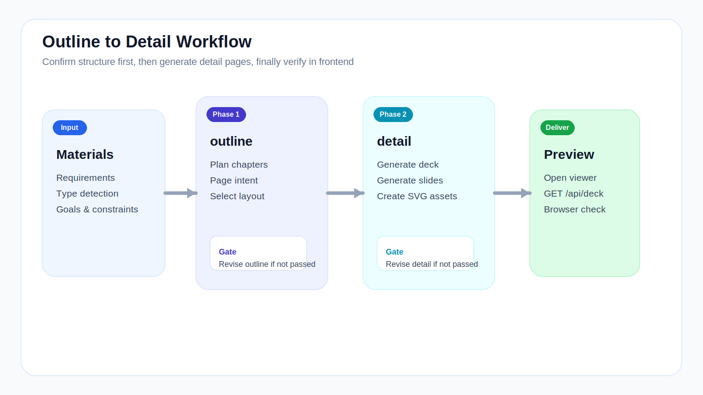

# Getting Started



## Quick Start

### 1. Prepare Input

Place project materials into:

```text
work/input/001_project_name/
```

Input can be requirement docs, raw drafts, course outlines, or proposal descriptions.

### 2. Generate Outline

Run the Skill's first phase:

```text
/fppt:outline
```

This phase generates:

```text
work/ppt/001_project_name/outline.json
```

### 3. Confirm Structure

Before generating detail pages, verify:

- Chapters are complete
- Page order is logical
- Page intent is clear
- Enough diagram pages are planned

### 4. Generate Detail Pages

After confirming, run:

```text
/fppt:detail
```

This phase generates:

- `deck.json`
- `slides/*.json`
- `work/assets/*.svg`

### 5. Open Preview

Start local server and open in browser:

```text
http://localhost:9030/
```

If pages don't reflect the latest build, force-refresh your browser.
