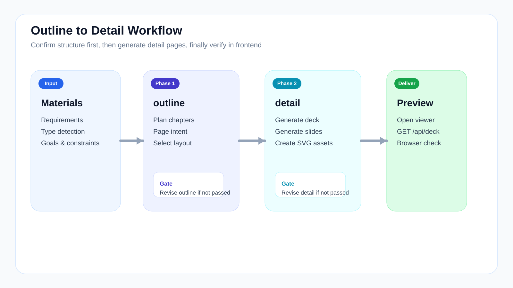

# Getting Started



## Who This Is For

If this is your first time using `fast_ppt`, this is the best place to start. The goal is not to understand every rule first. The goal is to run one complete minimal loop:

1. Prepare input materials
2. Generate `outline.json`
3. Confirm the structure
4. Generate `deck.json + slides/*.json`
5. Preview the result in the browser

After this document, you should know:

- where project materials should be placed
- what `outline` and `detail` each do
- which layer to edit when something looks wrong

## Prerequisites

Before starting, make sure the local environment is ready:

- dependencies installed: `npm install`
- viewer dependencies installed: `npm --prefix ppt-viewer install`
- local server can start: `node server.mjs`

If not, read [Installation](installation.md) first.

## Step 1: Prepare Input Materials

Put one project's raw materials into:

```text
work/input/001_project_name/
```

Recommended practice:

- one project per folder, with a three-digit prefix such as `001_project_name`
- keep related materials together instead of scattering them across the repo
- use filenames that describe purpose, for example:
  - `requirements.md`
  - `course-outline.md`
  - `draft.txt`
  - `references.pdf`

Typical inputs include:

- requirement descriptions
- course outlines
- speech drafts
- proposal narratives
- research notes

## Step 2: Generate the Outline First

The first phase only defines structure. It does not try to fully generate every page:

```text
/fppt:outline
```

The main output is:

```text
work/ppt/001_project_name/outline.json
```

This phase decides:

- PPT type
- chapter structure
- page order
- page intent
- likely `layout_type` for each page

## Step 3: Confirm the Outline Before Detail

Many quality issues come from structure, not page rendering.

Before moving to detail, check at least:

- whether the chapter chain is complete
- whether the page order flows well
- whether page intent is clear
- whether enough visual / diagram pages are planned

If this part is wrong, fix `outline.json` first instead of patching detail pages too early.

For the reasoning behind that, see [Workflow](workflow.md).

## Step 4: Generate Detail Pages

Once the outline is confirmed, run:

```text
/fppt:detail
```

This phase generates:

- `deck.json`
- `slides/*.json`
- `work/assets/*.svg`

The full output will appear under:

```text
work/ppt/001_project_name/
```

Where:

- `deck.json` is the global deck config
- `slides/*.json` contains page-level data
- `work/assets/*.svg` contains real SVG assets used by graphic pages

## Step 5: Start the Preview

Start the local server:

```bash
node server.mjs
```

Then open:

```text
http://localhost:9030/
```

If you have multiple projects, you can switch by project token or full folder name.

Common forms:

- `http://localhost:9030/?project=001`
- `http://localhost:9030/?project=001_project_name`

## Step 6: What to Check in Preview

Do not only ask whether the deck "looks good". Check whether the structure actually holds.

Recommended checks:

- title matches the page content
- the chosen layout is appropriate
- content stays within deck bounds
- SVG pages are truly graphical, not just text packed into a drawing
- cover / agenda / section divider feel properly layered

If the problem is structural, go back to `outline`.
If the problem is page-level, fix `slides/*.json` or SVG assets.

## The Smallest Practical Loop

```bash
npm install
npm --prefix ppt-viewer install
node server.mjs
```

Then in the conversation:

```text
/fppt:outline
/fppt:detail
```

## What to Read Next

After your first successful pass, continue in this order:

1. [Workflow](workflow.md): why `outline -> detail` is mandatory
2. [Structure](structure.md): what each directory is for
3. [Layouts](layouts.md): which layouts are available
4. [Manual](manual.md): how to work with the project day to day
