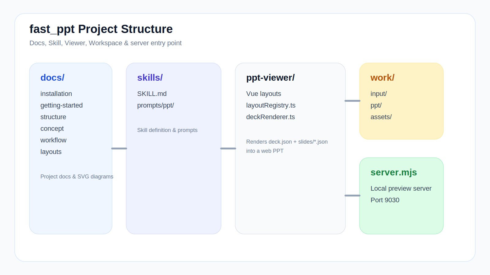

# Structure



## Project Layout

```
fast_ppt/
  README.md
  LICENSE
  docs/
  skills/
    SKILL.md
    prompts/
      ppt/
  ppt-viewer/
  work/
    input/
    ppt/
    assets/
  server.mjs
```

## Directory Responsibilities

### `docs/`
Project documentation: installation, getting started, workflow, concepts, layouts, fork guide. Available in Chinese, Japanese, and English.

### `skills/`
Skill entry definition and prompts.

- `SKILL.md`: Skill metadata and execution constraints
- `prompts/ppt/`: PPT generation prompts by type

### `ppt-viewer/`
Web PPT frontend rendering project.

- Reads `deck.json + slides/*.json`
- Maps `layout_type` to Vue layout components
- Provides preview and build capability

### `work/input/`
Raw input materials, organized by project directory (`001_project_name/`).

### `work/ppt/`
Generated outputs per project: `outline.json`, `deck.json`, `slides/*.json`.

### `work/assets/`
SVG graphic assets referenced by pages.

### `server.mjs`
Local preview server — aggregates deck data and serves it to the browser.
