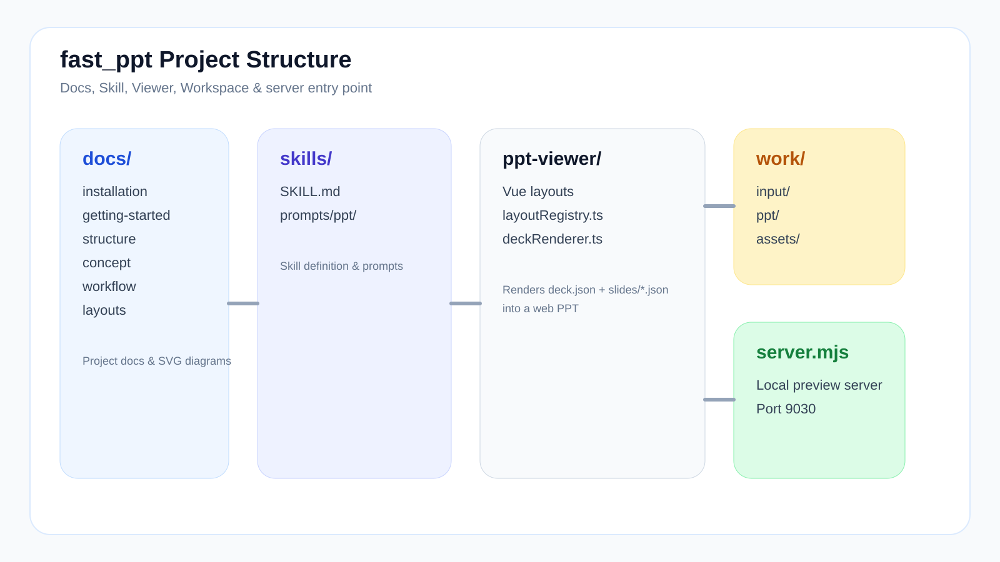

# Structure



## Why This Document Matters

`fast_ppt` is not just a prompt bundle. It is a working project with:

- input space
- generated outputs
- a web viewer
- an export chain
- rules and docs

Understanding the directory structure helps you know where to fix a problem instead of patching everything in one place.

## Project Layout

```text
fast_ppt/
  README.md
  LICENSE
  docs/
  skills/
    SKILL.md
    prompts/
      ppt/
  ppt-viewer/
  work/
    input/
    ppt/
    assets/
  lib/
  scripts/
  server.mjs
```

## Directory Responsibilities

### `docs/`

Human-facing project documentation:

- installation
- getting started
- workflow
- structure
- layouts
- usage
- troubleshooting

This is documentation for people, not runtime data for the viewer.

### `skills/`

The rule layer of the generation system.

Important parts:

- `SKILL.md`: skill metadata, constraints, and usage
- `prompts/ppt/`: prompt files, layout rules, and type-specific generation guidance

If generation quality keeps drifting, layout choice is unstable, or type selection feels wrong, this is often where the fix belongs.

### `ppt-viewer/`

The frontend project for rendering web PPT decks.

It is responsible for:

- reading `deck.json + slides/*.json`
- mapping each `layout_type` to a Vue component
- previewing pages in the browser
- producing frontend builds

Important locations:

- `src/layoutRegistry.ts`: layout registration
- `src/components/layouts/`: layout implementations
- `src/lib/`: theme presets and rendering helpers

If the issue is visual overflow, weak design quality, or a layout rendering incorrectly, this is usually the layer to inspect.

### `work/input/`

Raw source materials, organized per project.

Recommended form:

```text
work/input/001_project_name/
```

This is source input, not final output.

### `work/ppt/`

Structured generated output for each project.

Typical structure:

```text
work/ppt/001_project_name/
  outline.json
  deck.json
  slides/
```

Where:

- `outline.json` stores chapter and page structure
- `deck.json` stores deck-level config and `slide_files`
- `slides/*.json` stores page-level data

If you are fixing a specific slide's content, this is usually where you work.

### `work/assets/`

Real SVG assets referenced by pages.

This matters because `svg_full` pages are not supposed to be conceptual placeholders. They are meant to reference actual assets.

If you find that:

- an architecture page is not graphical enough
- a comparison page is still mostly text
- an SVG repeats the page title unnecessarily

then this is often the right place to fix.

### `lib/`

Shared server-side or export-side logic, such as:

- PPTX export
- style presets
- deck rendering helpers

If the viewer looks right but export output does not match, check here.

### `scripts/`

Automation and utility scripts, for example:

- batch export
- output verification
- repeatable tooling steps

Good for repeatable operations, not for hiding core project logic.

### `server.mjs`

The local preview server entry point.

It is responsible for:

- reading project directories
- aggregating deck data
- serving browser preview
- exposing export endpoints

If the issue is project switching, broken preview APIs, or local preview not opening, start here.

## How Outputs Flow Through the Project

The most common data path is:

```text
work/input/001_project_name/
  -> /fppt:outline
  -> work/ppt/001_project_name/outline.json
  -> /fppt:detail
  -> work/ppt/001_project_name/deck.json + slides/*.json
  -> work/assets/*.svg
  -> ppt-viewer / server.mjs preview
  -> lib/pptxExport.mjs export
```

You can think of it as four layers:

1. input layer: `work/input/`
2. structured output layer: `work/ppt/`
3. asset layer: `work/assets/`
4. rendering and export layer: `ppt-viewer/` + `lib/` + `server.mjs`

## Where to Fix Problems

### Structure feels wrong

Check:

- `outline.json`
- `skills/prompts/ppt/*`

### A slide is missing or fields are incomplete

Check:

- `work/ppt/xxx/slides/*.json`

### SVG content is weak or incorrect

Check:

- `work/assets/*.svg`

### Viewer rendering is wrong

Check:

- `ppt-viewer/src/components/layouts/*`
- `ppt-viewer/src/layoutRegistry.ts`
- `ppt-viewer/src/style.css`

### Export does not match viewer

Check:

- `lib/pptxExport.mjs`
- `ppt-viewer/src/lib/*`
- `server.mjs`

## Suggested Reading Order

If you are onboarding onto this project, the best order is:

1. [Getting Started](getting-started.md)
2. [Workflow](workflow.md)
3. [Layouts](layouts.md)
4. [Manual](manual.md)
