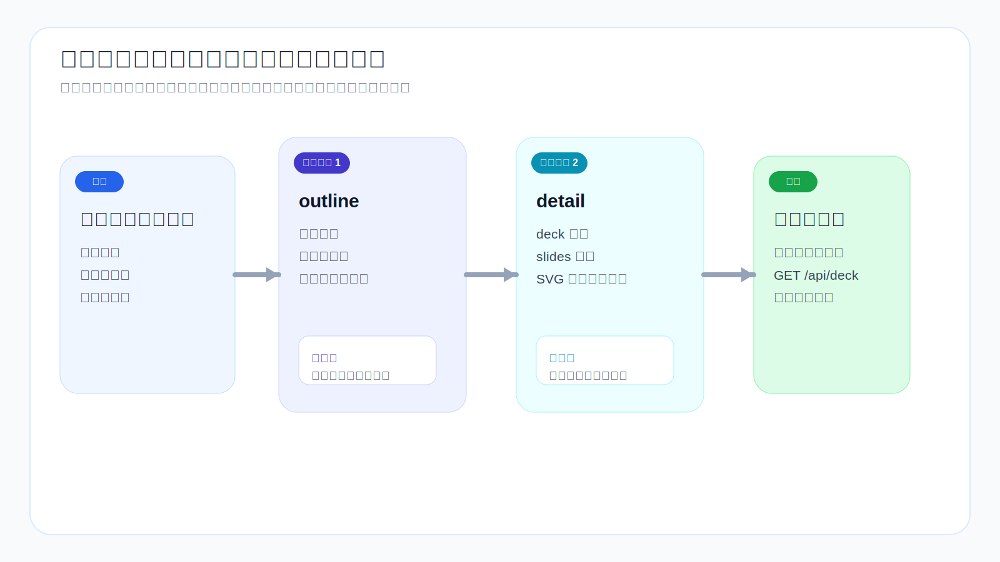

# Concept

## このシステムが解決するもの

このシステムは静的な `.pptx` や一枚の長大な画像を生成するのではなく、フロントエンドでレンダリング可能な一連のアーティファクトを生成します。

最終成果物：
- `deck.json`
- `slides/*.json`
- `work/assets/*.svg`

## JSON ストレージを選ぶ理由

**理由 1**：生成結果は自然に構造化データ。PPT はメタデータ・ページ順序・layout_type・タイトル・カード・テーブル・ステップ・スイムレーン・図表参照で構成される。

**理由 2**：フロントエンドの読み取りコストが低い。`deck.json` と `slides/*.json` を直接読み取るだけでよく、ドキュメント解析やフォーマット変換が不要。

**理由 3**：プログラムによる検証が容易。フィールド完全性・layout_type の妥当性・slide_files の一貫性・SVG の存在確認が可能。

**理由 4**：バージョン管理に適する。テキストファイルであるため diff/review/部分編集/ロールバックが容易。

## 4 つの PPT タイプ

生成前に `deck.type` を確定：

- **教材型**：講義順序・知識分解・演習・持ち帰り事項
- **提案型**：問題・ソリューション・アーキテクチャ・パス・リスク
- **報告型**：結論・指標・進捗・比較・次のステップ
- **デモ型**：ナラティブリズム・キーページ・ライブプレゼン効果

## なぜアウトラインが先か

`outline` は構造を、`detail` はコンテンツを解決する。別の問題を解決するため、フェーズを分離する。

**outline が解決するもの**：タイプ・章構成・ページ順序・ページ意図・レイアウト選択

**detail が解決するもの**：`deck.json`・`slides/*.json`・`work/assets/*.svg`・プレビュー可能な状態への完成

## なぜ SVG か

**理由 1**：正確な制御（位置・サイズ・フォント・色・矢印・接続・階層）
**理由 2**：バージョン管理に適する（テキストベースで編集容易）
**理由 3**：安定したスケーリング

## なぜ ECharts か

標準的なデータチャート（棒・折れ線・円・レーダー・面）に適している。原則：構造図・関係図・フロー図 → SVG、標準データチャート → ECharts

## まとめ

タイプ決定 → outline → detail → フロントエンドレンダリング・QA → 図表は SVG、データチャートは ECharts → 編集困難なビットマップは使わない
