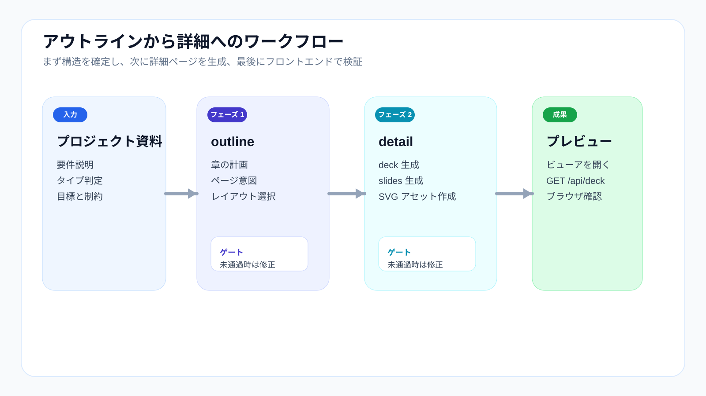

# はじめに



## この文書の対象

`fast_ppt` を初めて使うなら、まずこの文書から始めるのが最適です。最初から全ルールを理解する必要はありません。まずは最小の 1 ループを通します。

1. 入力資料を準備する
2. `outline.json` を生成する
3. 構造を確認する
4. `deck.json + slides/*.json` を生成する
5. ブラウザでプレビューする

この文書を読み終えるころには、少なくとも次の 3 点が分かるはずです。

- 資料をどこに置くか
- `outline` と `detail` がそれぞれ何を担うか
- 問題が出たときにどの層へ戻るべきか

## 事前準備

開始前に、ローカル環境が使える状態か確認します。

- 依存関係が入っている：`npm install`
- viewer 側の依存関係が入っている：`npm --prefix ppt-viewer install`
- ローカルサーバーを起動できる：`node server.mjs`

まだの場合は、先に [Installation](installation.md) を見てください。

## Step 1: 入力資料を準備する

1 つのプロジェクトに関する資料を、次の場所へまとめます。

```text
work/input/001_プロジェクト名/
```

推奨ルール：

- 1 プロジェクト 1 ディレクトリ
- `001_プロジェクト名` のように三桁プレフィックスを付ける
- 関連資料を分散させず、1 か所に寄せる

入力資料の例：

- 要件説明
- 講義アウトライン
- 草稿
- 提案文書
- 調査メモ

## Step 2: 先に Outline を生成する

最初のフェーズは構造決めです。まだ全ページを作り切る段階ではありません。

```text
/fppt:outline
```

主な成果物：

```text
work/ppt/001_プロジェクト名/outline.json
```

このフェーズで決めること：

- PPT のタイプ
- 章構成
- ページ順
- ページ意図
- 各ページの想定 `layout_type`

## Step 3: Detail の前に Outline を確認する

品質問題の多くは、描画ではなく構造から発生します。

detail に進む前に、少なくとも以下を確認してください。

- 章の流れが成立しているか
- ページ順が自然か
- ページ意図が明確か
- 図版ページが十分に計画されているか

ここが崩れているなら、detail を増やす前に `outline.json` を直すべきです。

理由は [Workflow](workflow.md) に詳しく書いてあります。

## Step 4: 詳細ページを生成する

outline を確定したら、次に進みます。

```text
/fppt:detail
```

このフェーズで生成されるもの：

- `deck.json`
- `slides/*.json`
- `work/assets/*.svg`

成果物は通常、次のディレクトリにまとまります。

```text
work/ppt/001_プロジェクト名/
```

役割はそれぞれ：

- `deck.json`：deck 全体設定
- `slides/*.json`：ページごとのデータ
- `work/assets/*.svg`：図版ページが参照する実 SVG 資産

## Step 5: プレビューする

ローカルサーバーを起動：

```bash
node server.mjs
```

その後、ブラウザで開きます。

```text
http://localhost:9030/
```

複数プロジェクトがある場合は、プロジェクト番号やフォルダ名で切り替えできます。

例：

- `http://localhost:9030/?project=001`
- `http://localhost:9030/?project=001_プロジェクト名`

## Step 6: プレビューで何を見るか

「見た目が良いか」だけではなく、「構造が成立しているか」を確認します。

主なチェックポイント：

- タイトルと中身が一致しているか
- layout の選択が適切か
- コンテンツが deck 範囲内に収まっているか
- SVG ページが本当に図として成立しているか
- cover / agenda / section divider に十分な階層感があるか

構造の問題なら `outline` に戻る。
ページ表現の問題なら `slides/*.json` や SVG 資産を直す。

## 最小の実用フロー

```bash
npm install
npm --prefix ppt-viewer install
node server.mjs
```

その上で会話内で：

```text
/fppt:outline
/fppt:detail
```

## 次に読む文書

最初の 1 周が終わったら、次はこの順がおすすめです。

1. [Workflow](workflow.md)：なぜ `outline -> detail` が必須なのか
2. [Structure](structure.md)：各ディレクトリの役割
3. [Layouts](layouts.md)：使えるレイアウト一覧
4. [Manual](manual.md)：日々の運用方法
