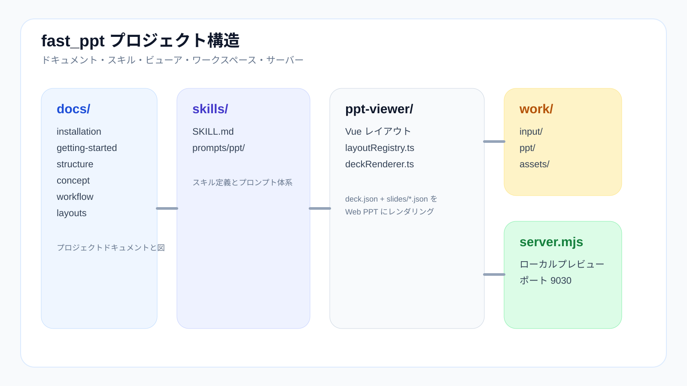

# 構造



## なぜ構造を理解する必要があるのか

`fast_ppt` は単なる prompt 集ではありません。次の層を持つプロジェクトです。

- 入力層
- 生成物層
- Web viewer
- export チェーン
- ルールと文書

この構造を理解すると、「どこを直すべきか」が分かります。すべてを同じ場所で直そうとしなくて済みます。

## プロジェクトレイアウト

```text
fast_ppt/
  README.md
  LICENSE
  docs/
  skills/
    SKILL.md
    prompts/
      ppt/
  ppt-viewer/
  work/
    input/
    ppt/
    assets/
  lib/
  scripts/
  server.mjs
```

## ディレクトリの役割

### `docs/`

人が読むための文書です。

- installation
- getting started
- workflow
- structure
- layouts
- usage
- troubleshooting

viewer の実行データではなく、運用と理解のための文書です。

### `skills/`

生成ルール層です。

主な中身：

- `SKILL.md`：Skill のメタ情報、制約、使い方
- `prompts/ppt/`：prompt 群、layout ルール、タイプ別生成ルール

生成品質がぶれる、layout 選択が不安定、タイプ判定がずれる場合は、まずここを疑います。

### `ppt-viewer/`

Web PPT を描画するフロントエンドです。

役割：

- `deck.json + slides/*.json` を読む
- `layout_type` を Vue component に割り当てる
- ブラウザでプレビューする
- フロントエンド build を出す

見るべき主な場所：

- `src/layoutRegistry.ts`
- `src/components/layouts/`
- `src/lib/`

見た目崩れ、overflow、layout の完成度不足などは、通常ここを見ます。

### `work/input/`

生の入力資料を置く場所です。

推奨形式：

```text
work/input/001_プロジェクト名/
```

ここは source input であり、最終成果物ではありません。

### `work/ppt/`

プロジェクトごとの構造化生成物を置く場所です。

典型例：

```text
work/ppt/001_プロジェクト名/
  outline.json
  deck.json
  slides/
```

役割：

- `outline.json`：章とページ構造
- `deck.json`：deck 全体設定と `slide_files`
- `slides/*.json`：ページ単位のデータ

特定ページの内容を直すなら、通常ここが対象です。

### `work/assets/`

ページから参照される実 SVG 資産を置く場所です。

`svg_full` は概念的な置き場ではなく、実際に使われる SVG を持つ前提です。

次のような問題はここで直すことが多いです。

- アーキテクチャ図が図として弱い
- 比較ページが文字だらけ
- SVG 内でページタイトルが重複している

### `lib/`

サーバー側 / export 側で共通利用するロジックです。

例：

- PPTX export
- style presets
- deck render helper

viewer は良いのに export がずれる場合はここを確認します。

### `scripts/`

自動化や補助スクリプトを置く場所です。

例：

- 一括 export
- 生成物の検証
- 反復作業の自動化

繰り返し作業向きであり、コアロジックを隠す場所ではありません。

### `server.mjs`

ローカルプレビューサーバーの入口です。

役割：

- プロジェクトディレクトリを読む
- deck データを集約する
- ブラウザ向け preview を返す
- export endpoint を提供する

プロジェクト切り替え、API 不具合、preview が開かない問題は、まずここから見ます。

## 成果物の流れ

最も一般的な流れは次の通りです。

```text
work/input/001_プロジェクト名/
  -> /fppt:outline
  -> work/ppt/001_プロジェクト名/outline.json
  -> /fppt:detail
  -> work/ppt/001_プロジェクト名/deck.json + slides/*.json
  -> work/assets/*.svg
  -> ppt-viewer / server.mjs で preview
  -> lib/pptxExport.mjs で export
```

4 層で考えると理解しやすいです。

1. 入力層：`work/input/`
2. 構造化成果物層：`work/ppt/`
3. 資産層：`work/assets/`
4. 描画 / export 層：`ppt-viewer/` + `lib/` + `server.mjs`

## 問題ごとの修正場所

### 構造がおかしい

見る場所：

- `outline.json`
- `skills/prompts/ppt/*`

### ページフィールドが不足している

見る場所：

- `work/ppt/xxx/slides/*.json`

### SVG が弱い / 間違っている

見る場所：

- `work/assets/*.svg`

### viewer 表示がおかしい

見る場所：

- `ppt-viewer/src/components/layouts/*`
- `ppt-viewer/src/layoutRegistry.ts`
- `ppt-viewer/src/style.css`

### export が viewer と一致しない

見る場所：

- `lib/pptxExport.mjs`
- `ppt-viewer/src/lib/*`
- `server.mjs`

## おすすめの読み順

初めてこのプロジェクトに入るなら、この順が分かりやすいです。

1. [Getting Started](getting-started.md)
2. [Workflow](workflow.md)
3. [Layouts](layouts.md)
4. [Manual](manual.md)
