# Layouts

## 说明

下面的示例使用 SVG 方式展示常见 `layout_type` 的外观，风格尽量对齐 `ppt-viewer` 当前的标题、圆角卡片、蓝色强调色和留白节奏。

这些示例不是截图，而是文档专用 SVG，用于快速理解各类布局适合承载什么内容。

字段全集和更底层的类型库说明可对照：

- [skills/prompts/ppt/layouts.md](../skills/prompts/ppt/layouts.md)

## 选择建议

- 开场、章节封面：优先 `cover` / `section_divider`
- 结论和摘要页：优先 `title_bullets`
- 对比页：优先 `comparison_table`
- 阶段门禁页：优先 `phases`
- 按角色推进的工作流：优先 `swimlane_process`
- 需要真实图示表达的页面：优先 `svg_full`

## 常用 Layout

### `cover`


适用场景：

- 首页封面
- 章节封面
- 需要背景图承载情绪的开场页

关键字段：

- `title`
- `subtitle`
- `background`
- `date`
- `lecturer`

示例：

```json
{
  "layout_type": "cover",
  "title": "Skill 和 Harness",
  "subtitle": "从 Prompt Engineering 走向可执行系统",
  "date": "2026-06-17",
  "lecturer": "Stephen Wang",
  "background": {
    "src": "work/assets/001-cover-hero.svg",
    "overlay": "rgba(15,23,42,0.52)",
    "size": "cover",
    "position": "75% 50%"
  }
}
```

### `section_divider`

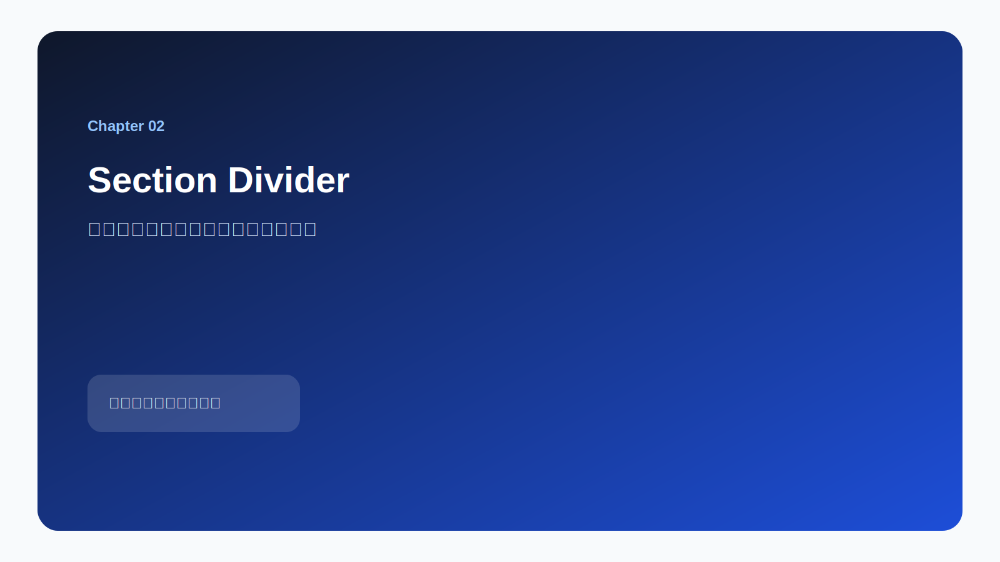

适用场景：

- 章节切换
- 阶段分段
- 节奏重置

关键字段：

- `title`
- `subtitle`
- `background`
- `chapter_label`

示例：

```json
{
  "layout_type": "section_divider",
  "title": "第二部分：Skill 的执行路径",
  "subtitle": "从触发到产出，先看流程再看实现",
  "chapter_label": "Chapter 02",
  "background": {
    "src": "work/assets/001-chapter-02-bg.svg",
    "overlay": "rgba(15,23,42,0.42)",
    "size": "cover",
    "position": "center"
  }
}
```

### `title_bullets`

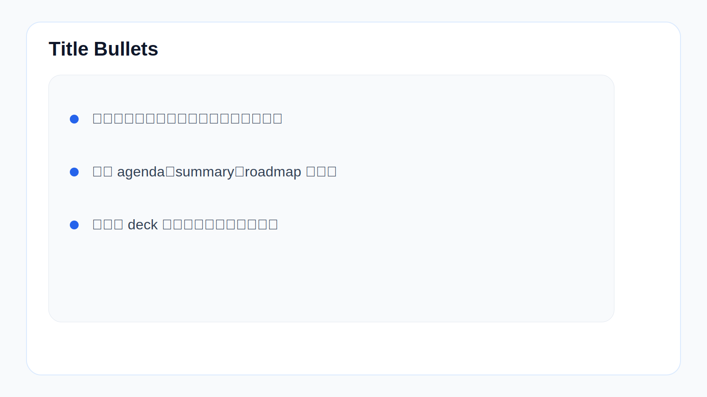

适用场景：

- 开场说明
- agenda
- summary
- roadmap

关键字段：

- `title`
- `bullets`

示例：

```json
{
  "layout_type": "agenda",
  "title": "今天会讲什么",
  "bullets": ["为什么先做 outline", "layout 如何选择", "如何把 SVG 落成产物", "如何在 viewer 验证"]
}
```
- `foreground`

示例：

```json
{
  "layout_type": "title_bullets",
  "title": "这节课你会带走什么",
  "bullets": [
    "先理解 Skill 的职责边界",
    "再看 Harness 如何把生成、检查和预览串起来",
    "最后拿到一套可复用的生成方法"
  ],
  "foreground": "dark"
}
```

### `comparison_table`

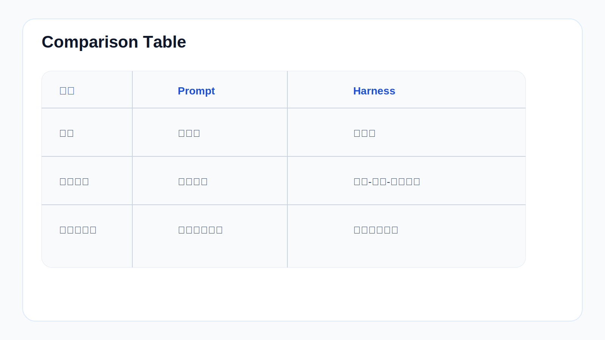

适用场景：

- 概念对比
- 方案对比
- 前后代际差异

关键字段：

- `title`
- `table.headers`
- `table.rows`

示例：

```json
{
  "layout_type": "comparison_table",
  "title": "三代工程方式的差异",
  "table": {
    "headers": ["维度", "Prompt Engineering", "Harness Engineering"],
    "rows": [
      ["目标", "更会问", "更会做"],
      ["执行方式", "单轮生成", "生成-检查-回改循环"],
      ["产出稳定性", "依赖当次发挥", "依赖流程约束"]
    ]
  }
}
```

### `phases`

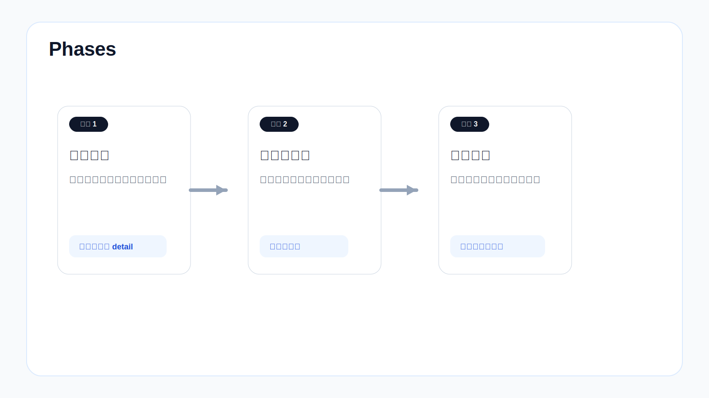

适用场景：

- 阶段门禁
- 质量闭环
- 分阶段推进

关键字段：

- `title`
- `phases[].title`
- `phases[].text`
- `phases[].bullets`
- `phases[].gate`

示例：

```json
{
  "layout_type": "phases",
  "title": "Skill 的质量闭环",
  "phases": [
    {
      "title": "大纲质检",
      "text": "先检查结构和页面意图，再决定能否进入 detail。",
      "bullets": ["检查章节链路", "检查图页比例"],
      "gate": "通过后进入 detail"
    },
    {
      "title": "详细页质检",
      "text": "检查字段、素材和布局表达是否完整。",
      "bullets": ["检查 slide_files", "检查素材落盘"],
      "gate": "未通过则回改"
    }
  ]
}
```

### `swimlane_process`

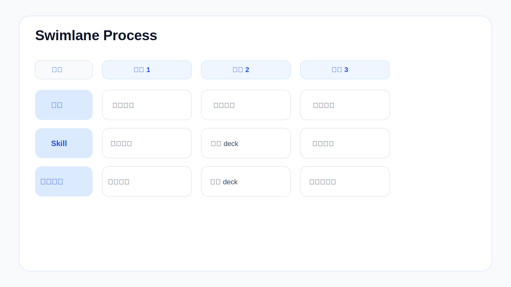

适用场景：

- 多角色协作链路
- 按时间推进的工作流
- 用户、Skill、文件系统、前端预览之间的映射

关键字段：

- `title`
- `lanes[].name`
- `lanes[].steps`

示例：

```json
{
  "layout_type": "swimlane_process",
  "title": "本题里的 Skill 真实落地链路",
  "lanes": [
    { "name": "用户", "steps": ["提出需求", "确认大纲", "查看预览"] },
    { "name": "Skill", "steps": ["读取输入", "生成 deck", "回改重试"] },
    { "name": "前端预览", "steps": ["等待产物", "读取 deck", "浏览器展示"] }
  ]
}
```

### `svg_full`

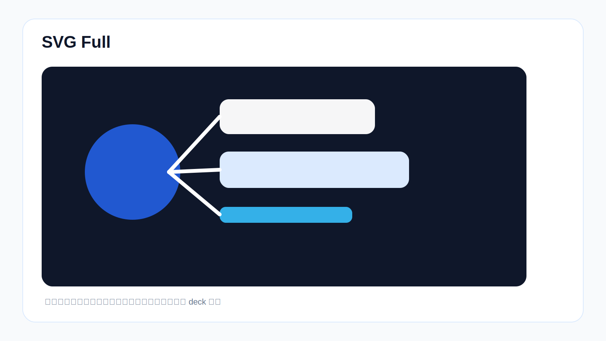

适用场景：

- 结构图
- 关系图
- 工作原理图
- 三层结构图
- 需要真实图形表达的概念页

关键字段：

- `title`
- `svg.src`
- `svg.alt`
- `svg.caption`
- `show_title`

示例：

```json
{
  "layout_type": "svg_full",
  "title": "从 Prompt Engineering 到 Harness Engineering",
  "show_title": true,
  "svg": {
    "src": "work/assets/001-evolution-compare.svg",
    "alt": "三代工程演进关系图",
    "caption": "用真实 SVG 承载结构和关系，而不是继续堆 bullet。"
  }
}
```

使用约束：

- SVG 内不重复写页标题
- 画面尽量填满 16:9
- 优先用卡片、箭头、分层、关系线表达
- 不要把 `svg_full` 当成“换个容器继续放大段文字”

### `two_column`

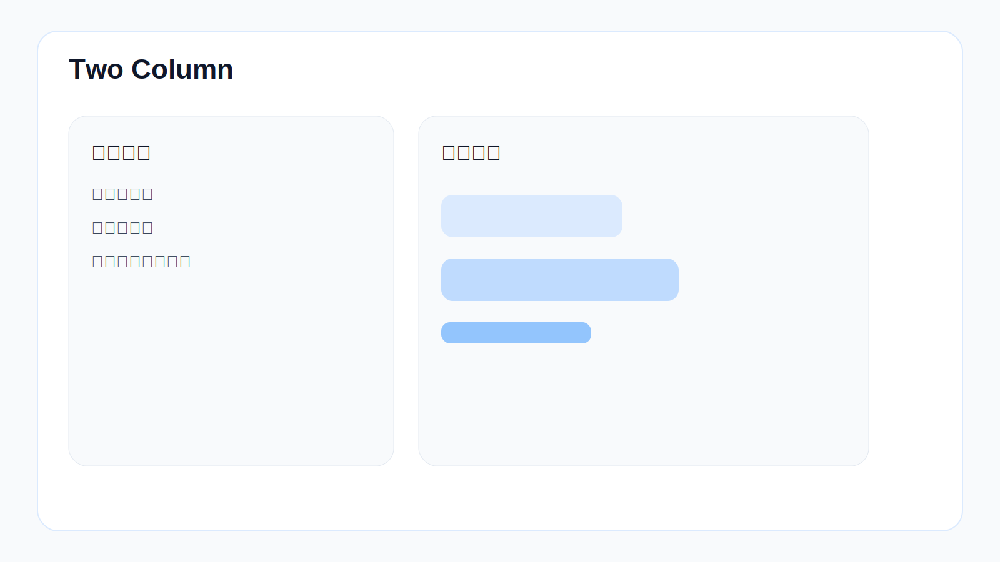

适用场景：

- 左文右图
- 左结论右说明
- 左原则右示意

关键字段：

- `title`
- `left`
- `right`

示例：

```json
{
  "layout_type": "two_column",
  "title": "Skill 的基本职责",
  "left": {
    "title": "左侧结论",
    "bullets": ["先定义输入", "再定义输出", "最后定义执行约束"]
  },
  "right": {
    "title": "右侧图示",
    "image": {
      "src": "work/assets/001-skill-template.svg",
      "caption": "Skill 模板示意"
    }
  }
}
```

### `three_column`

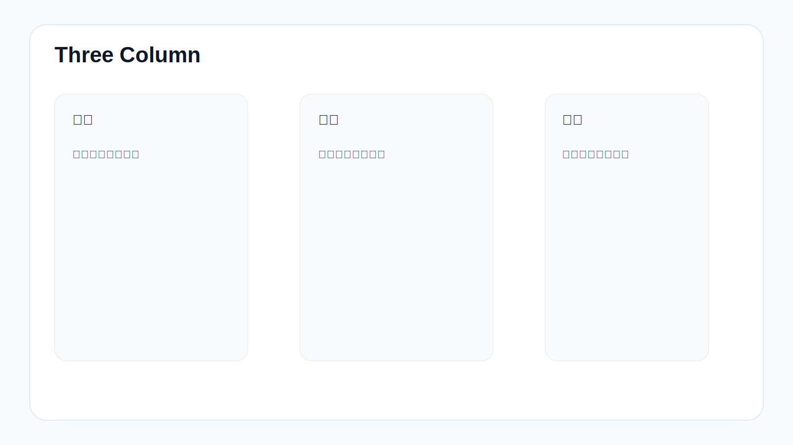

适用场景：

- 三段式拆解
- 三个并列观点
- 三类对象对照

关键字段：

- `title`
- `columns`

示例：

```json
{
  "layout_type": "three_column",
  "title": "Harness 的三个核心层",
  "columns": [
    { "title": "输入层", "bullets": ["接收需求", "读取上下文"] },
    { "title": "执行层", "bullets": ["生成结果", "调用工具"] },
    { "title": "验证层", "bullets": ["检查质量", "回改输出"] }
  ]
}
```

### `problem_statement`

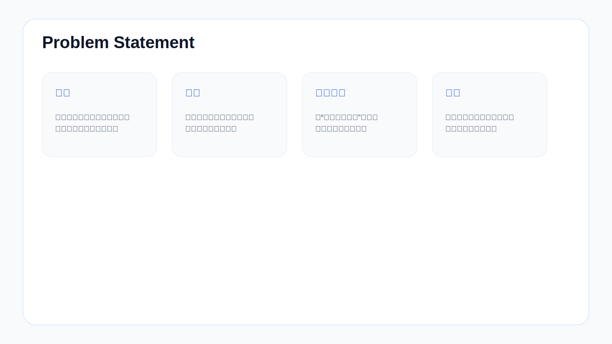

适用场景：

- 问题定义
- 方案前置说明
- 先界定问题，再进入解法

关键字段：

- `title`
- `blocks`

示例：

```json
{
  "layout_type": "problem_statement",
  "title": "为什么不能只靠一次生成",
  "blocks": [
    { "title": "现象", "text": "同一请求多次生成结果差异大。" },
    { "title": "影响", "text": "页面风格和结构不稳定。" },
    { "title": "根因", "text": "缺少固定流程与质量门。" }
  ]
}
```

### `before_after`

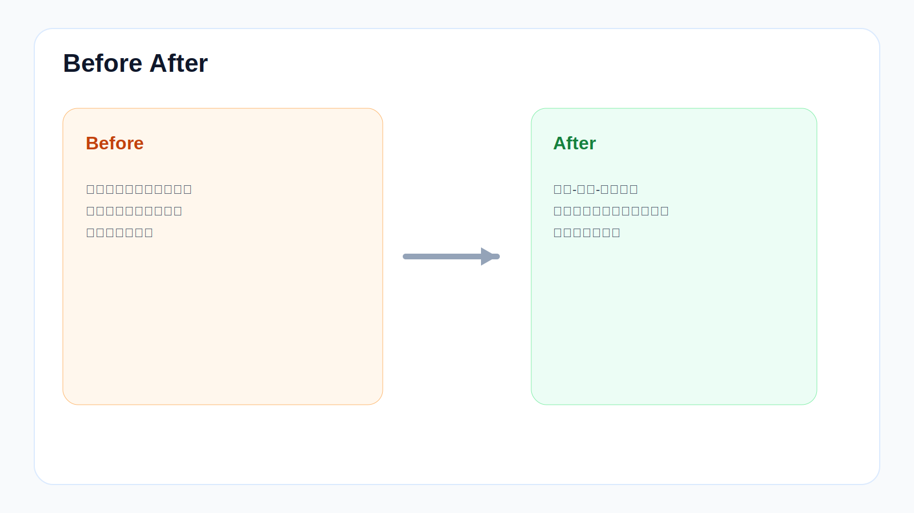

适用场景：

- 改造前后对照
- 单轮方式与闭环方式对照
- 旧方案与新方案对照

关键字段：

- `title`
- `before`
- `after`

示例：

```json
{
  "layout_type": "before_after",
  "title": "Prompt 到 Harness 的变化",
  "before": { "title": "Before", "bullets": ["单轮问答", "靠模型临场发挥"] },
  "after": { "title": "After", "bullets": ["流程化执行", "带质检和回改"] }
}
```

### `kpi_cards`

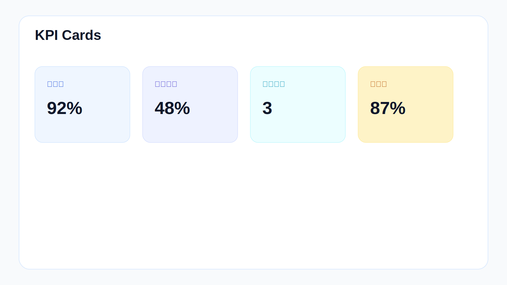

适用场景：

- 核心指标总览
- 一页展示多个关键数值
- 开场或总结的指标摘要

关键字段：

- `title`
- `cards`

示例：

```json
{
  "layout_type": "kpi_cards",
  "title": "本轮交付指标",
  "cards": [
    { "label": "页数", "value": "24", "note": "含结构图 9 页" },
    { "label": "图页占比", "value": "42%", "note": "优先 SVG" },
    { "label": "返工轮次", "value": "2", "note": "detail 阶段回改" }
  ]
}
```

### `steps`

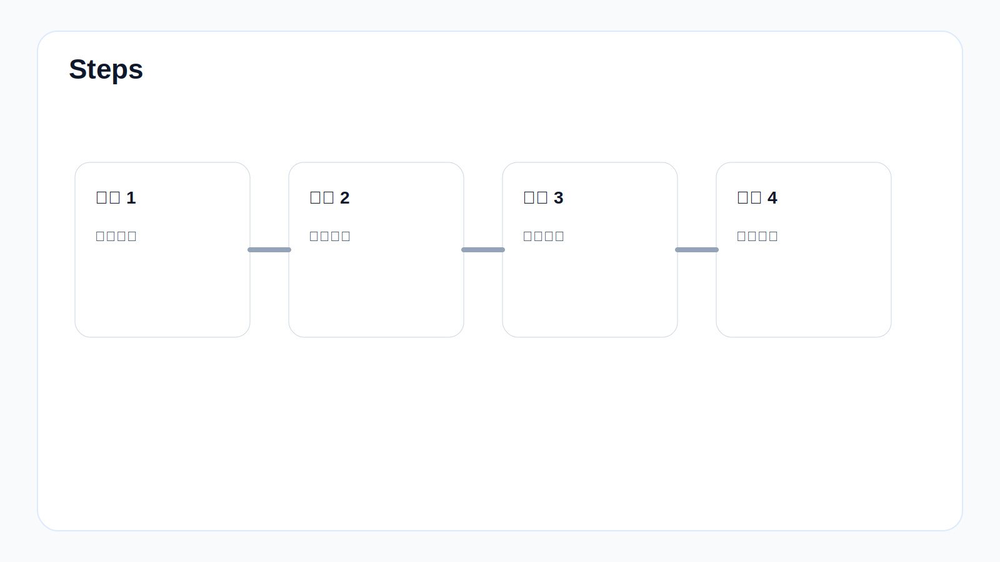

适用场景：

- 顺序步骤
- 执行流程
- 线性推进链路

关键字段：

- `title`
- `steps`

示例：

```json
{
  "layout_type": "steps",
  "title": "生成网页 PPT 的四步",
  "steps": [
    { "title": "识别类型", "bullets": ["先判断课件/方案/汇报/演示"] },
    { "title": "生成大纲", "bullets": ["写 outline.json"] },
    { "title": "展开详情", "bullets": ["写 deck.json 和 slides"] },
    { "title": "预览验证", "bullets": ["在 viewer 中检查"] }
  ]
}
```

### `four_grid`

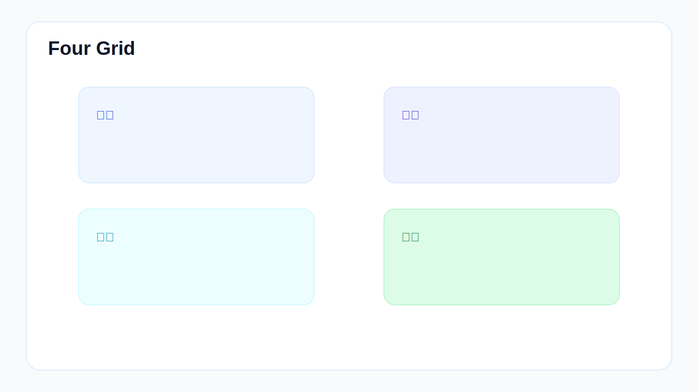

适用场景：

- 四象限解释
- 四部分拆解
- 输入/输出/约束/验证

关键字段：

- `title`
- `items`

示例：

```json
{
  "layout_type": "four_grid",
  "title": "Skill 的四个关注点",
  "items": [
    { "title": "输入", "bullets": ["读取原始需求"] },
    { "title": "结构", "bullets": ["规划章节顺序"] },
    { "title": "表达", "bullets": ["匹配合适 layout"] },
    { "title": "验证", "bullets": ["检查超屏和缺图"] }
  ]
}
```

### `matrix_2x2`

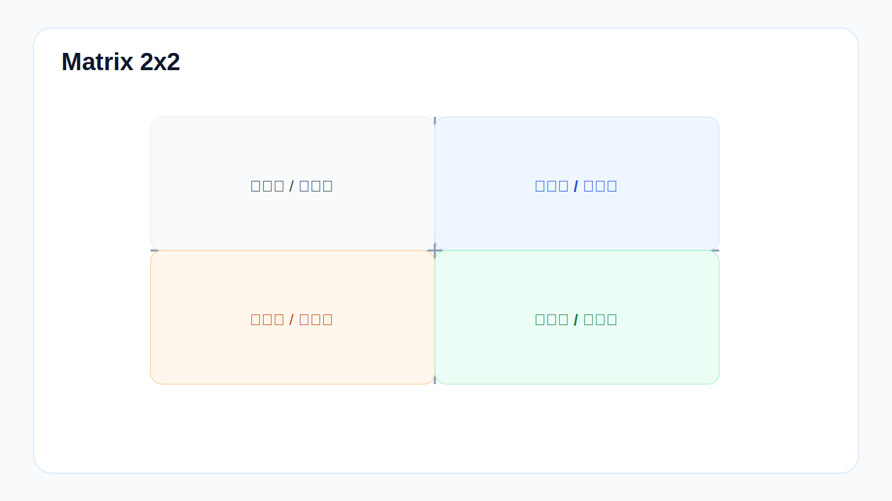

适用场景：

- 二维判断
- 价值/投入分类
- 优先级划分

关键字段：

- `title`
- `quadrants`

示例：

```json
{
  "layout_type": "matrix_2x2",
  "title": "任务优先级矩阵",
  "quadrants": [
    { "title": "高价值低投入", "bullets": ["优先推进"] },
    { "title": "高价值高投入", "bullets": ["纳入计划"] },
    { "title": "低价值低投入", "bullets": ["按需处理"] },
    { "title": "低价值高投入", "bullets": ["避免投入"] }
  ]
}
```

### `architecture_layered`

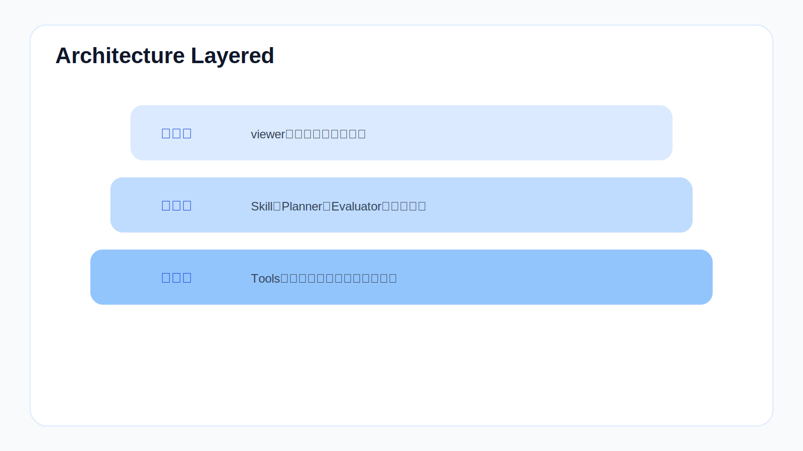

适用场景：

- 分层架构
- 系统组成
- 能力栈说明

关键字段：

- `title`
- `layers`

示例：

```json
{
  "layout_type": "architecture_layered",
  "title": "网页 PPT 系统分层",
  "layers": [
    { "title": "交互层", "bullets": ["viewer", "目录跳转"] },
    { "title": "编排层", "bullets": ["Skill", "layout 选择"] },
    { "title": "执行层", "bullets": ["server", "文件系统", "构建"] }
  ]
}
```

### `dependency_graph`

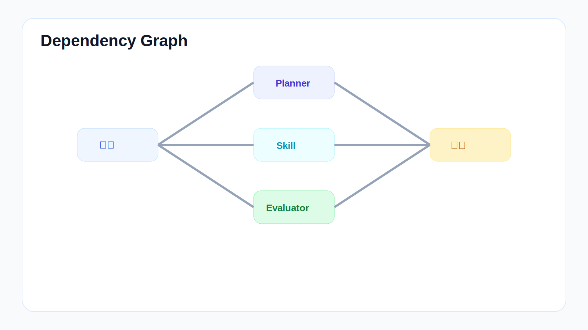

适用场景：

- 角色依赖
- 模块依赖
- 从任务到交付的关系网络

关键字段：

- `title`
- `nodes`
- `links`

示例：

```json
{
  "layout_type": "dependency_graph",
  "title": "产物关系图",
  "nodes": [
    { "id": "input", "label": "input" },
    { "id": "outline", "label": "outline.json" },
    { "id": "slides", "label": "slides/*.json" },
    { "id": "viewer", "label": "ppt-viewer" }
  ],
  "links": [
    { "source": "input", "target": "outline" },
    { "source": "outline", "target": "slides" },
    { "source": "slides", "target": "viewer" }
  ]
}
```

### `bar_chart`

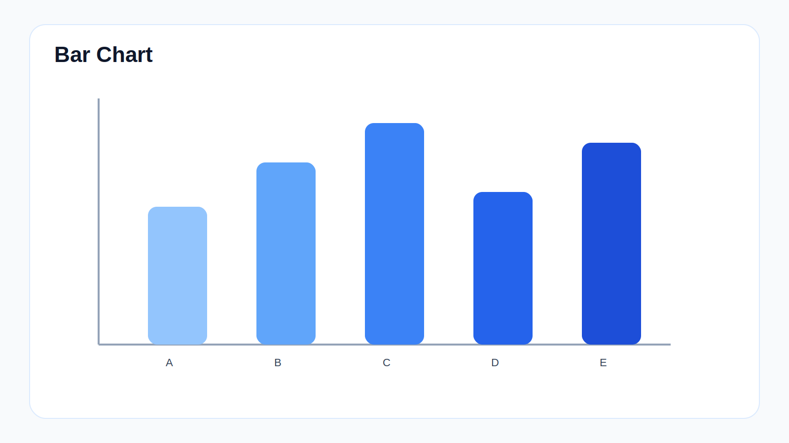

适用场景：

- 分类数据对比
- 指标排名
- 数量级展示

关键字段：

- `title`
- `data` 或 `series`

示例：

```json
{
  "layout_type": "bar_chart",
  "title": "不同页面类型数量",
  "unit": "页",
  "data": [
    { "label": "文字页", "value": 6 },
    { "label": "图形页", "value": 10 },
    { "label": "图表页", "value": 4 }
  ]
}
```

### `line_chart`

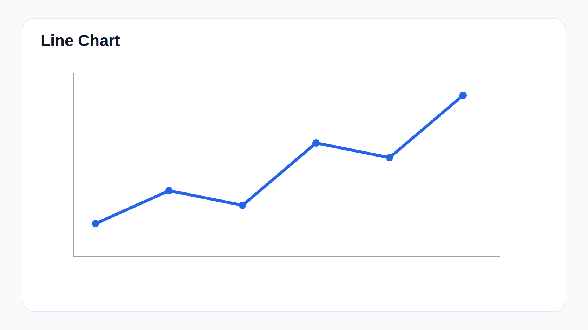

适用场景：

- 趋势变化
- 时间序列
- 指标曲线

关键字段：

- `title`
- `data` 或 `series`

示例：

```json
{
  "layout_type": "line_chart",
  "title": "生成质量迭代趋势",
  "unit": "分",
  "data": [
    { "label": "第 1 轮", "value": 68 },
    { "label": "第 2 轮", "value": 79 },
    { "label": "第 3 轮", "value": 88 }
  ]
}
```

## 补充 Layout

### `agenda`

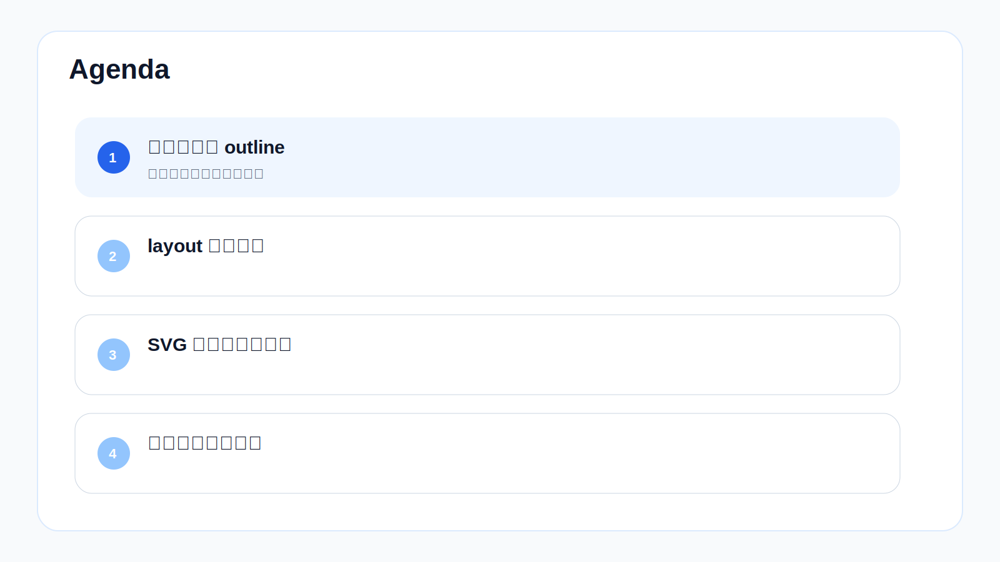

适用场景：

- 目录页
- 章节预告
- 开场时说明整套内容节奏

关键字段：

- `title`
- `bullets`

示例：

```json
{
  "layout_type": "summary",
  "title": "本节总结",
  "bullets": ["先定结构，再定内容", "优先图形化表达", "每轮都做质检和预览"]
}
```

### `summary`

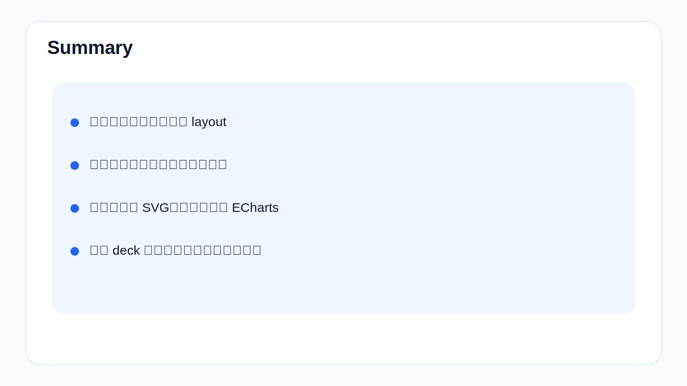

适用场景：

- 结尾总结
- 阶段回顾
- 一页归纳核心结论

关键字段：

- `title`
- `bullets`

### `thank_you`

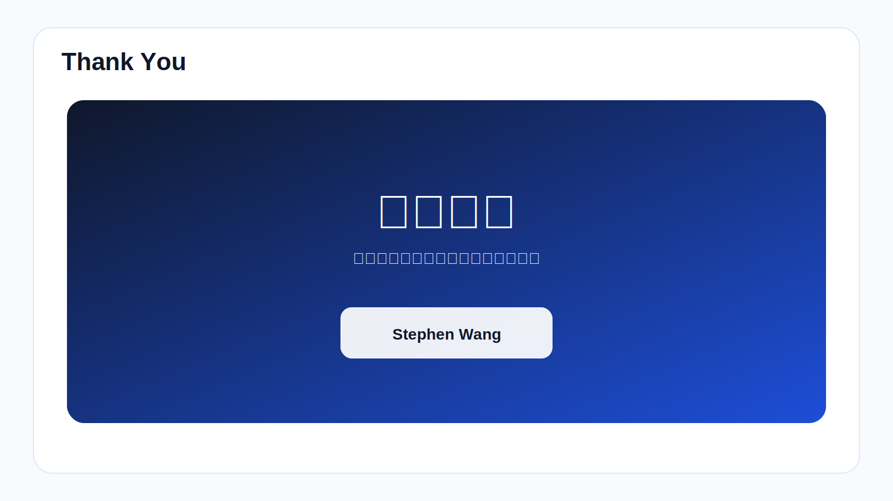

适用场景：

- 收尾页
- 致谢页
- 结束后的联系方式或行动引导

关键字段：

- `title`
- `subtitle`

示例：

```json
{
  "layout_type": "thank_you",
  "title": "感谢观看",
  "subtitle": "欢迎继续 fork 和扩展这套系统"
}
```

### `appendix`

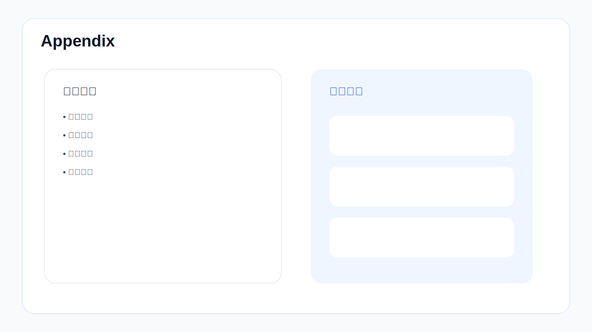

适用场景：

- 补充材料
- 备份页
- 延伸说明和参考链接

关键字段：

- `title`
- `bullets`

示例：

```json
{
  "layout_type": "appendix",
  "title": "附录",
  "bullets": ["术语解释", "补充截图", "参考链接"]
}
```

### `quote`

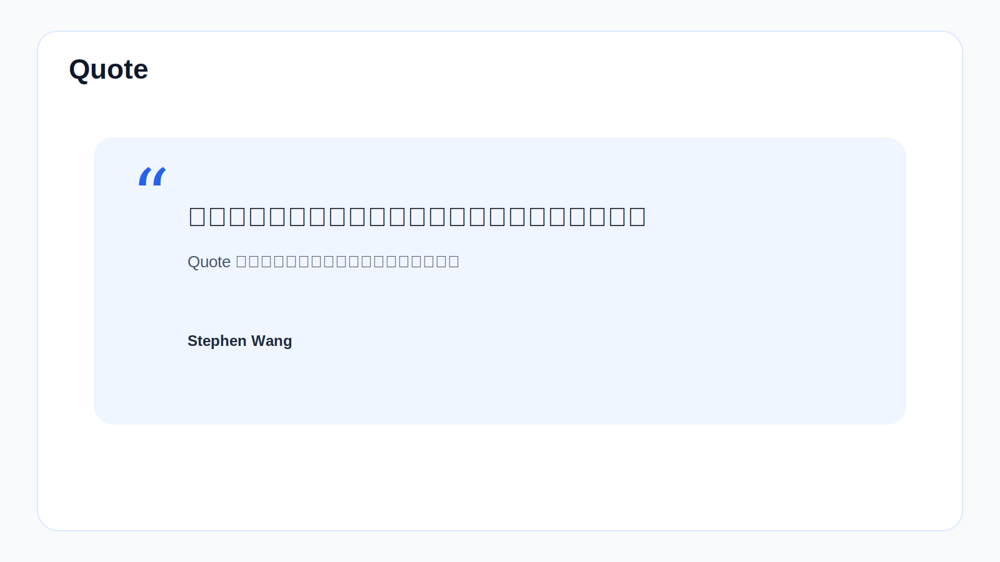

适用场景：

- 强调一句关键原则
- 插入观点页
- 引用原话或方法论判断

关键字段：

- `title`
- `quote`
- `by`
- `notes`

示例：

```json
{
  "layout_type": "quote",
  "title": "关键判断",
  "quote": "先把流程变成可执行系统，再把回答变成稳定交付。",
  "by": "Stephen Wang",
  "notes": "适合作为阶段总结页。"
}
```

### `swot`

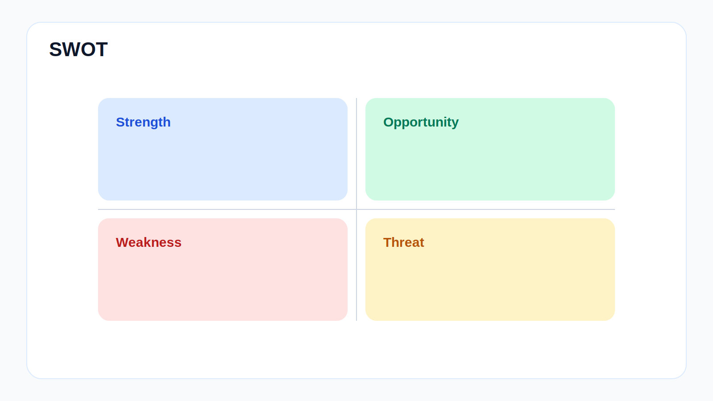

适用场景：

- 优势劣势分析
- 内外部条件分析
- 战略判断的四象限表达

关键字段：

- `title`
- `quadrants`

示例：

```json
{
  "layout_type": "swot",
  "title": "Skill 工程化 SWOT",
  "quadrants": [
    { "title": "Strength", "bullets": ["可复用", "可验证"] },
    { "title": "Weakness", "bullets": ["前期搭建成本高"] },
    { "title": "Opportunity", "bullets": ["可扩展更多类型"] },
    { "title": "Threat", "bullets": ["规范不一致会退化"] }
  ]
}
```

### `pyramid`

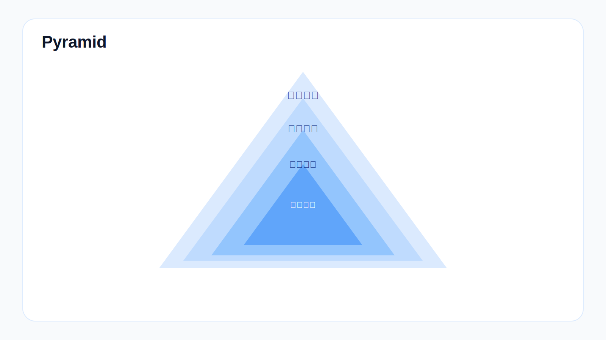

适用场景：

- 层级价值表达
- 从基础到高阶的能力栈
- 金字塔式结论归纳

关键字段：

- `title`
- `levels` 或 `blocks`

示例：

```json
{
  "layout_type": "pyramid",
  "title": "能力金字塔",
  "levels": [
    { "title": "基础资源" },
    { "title": "执行流程" },
    { "title": "质量闭环" },
    { "title": "稳定交付" }
  ]
}
```

### `logic_tree`

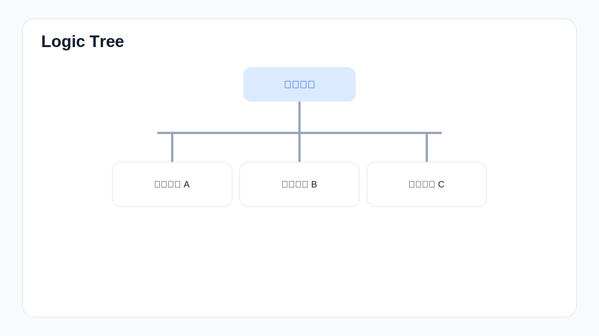

适用场景：

- 问题拆解
- 原因分析
- 方案树和逻辑分支

关键字段：

- `title`
- `root`

示例：

```json
{
  "layout_type": "logic_tree",
  "title": "页面质量问题拆解",
  "root": {
    "text": "为什么页面不好看",
    "children": [
      { "text": "layout 选择不对" },
      { "text": "图形表达不足" },
      { "text": "文字过密" }
    ]
  }
}
```

### `icicle_tree`

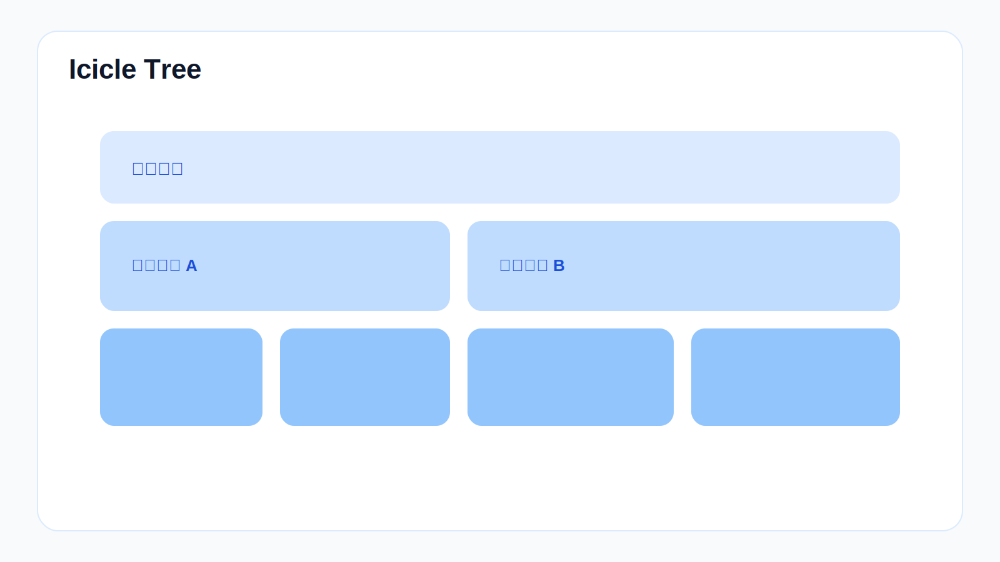

适用场景：

- 分层展开的树状结构
- 自上而下的分类体系
- 需要强调从整体到局部的结构页

关键字段：

- `title`
- `root`

示例：

```json
{
  "layout_type": "icicle_tree",
  "title": "文档结构树",
  "root": {
    "text": "docs",
    "children": [
      { "text": "manual" },
      { "text": "concept" },
      { "text": "layouts" },
      { "text": "fork" }
    ]
  }
}
```

### `process_flow`

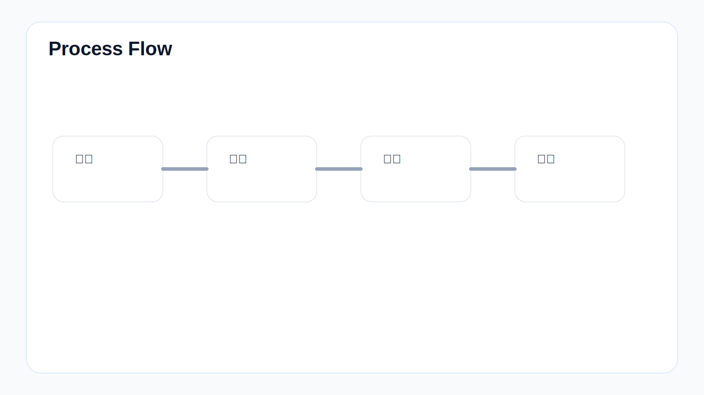

适用场景：

- 线性流程说明
- 系统处理链路
- 先后顺序明确的动作页

关键字段：

- `title`
- `bullets` 或 `table`

示例：

```json
{
  "layout_type": "process_flow",
  "title": "从输入到预览的处理流",
  "bullets": ["读取输入", "生成 outline", "展开 detail", "前端渲染"]
}
```

### `timeline`

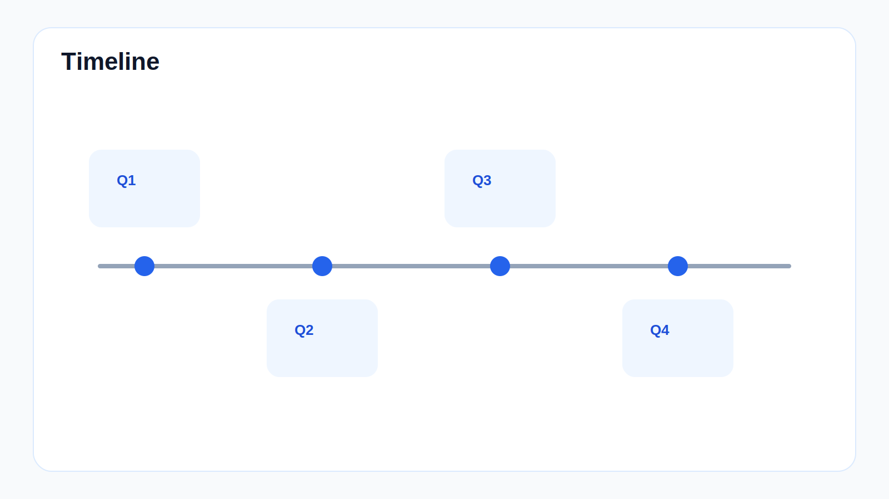

适用场景：

- 时间线
- 阶段推进
- 按季度或月份组织的计划说明

关键字段：

- `title`
- `bullets` 或 `table`

示例：

```json
{
  "layout_type": "timeline",
  "title": "一周落地计划",
  "bullets": ["Day 1 结构设计", "Day 2 layout 扩展", "Day 3 真实 deck 验证", "Day 4 文档收口"]
}
```

### `roadmap`

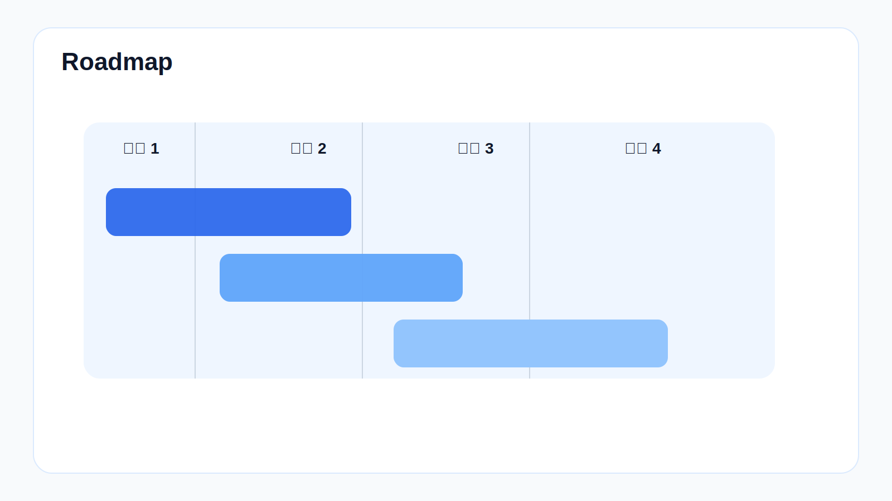

适用场景：

- 产品路线图
- 项目推进路线
- 长周期分阶段规划

关键字段：

- `title`
- `bullets` 或 `table`

示例：

```json
{
  "layout_type": "roadmap",
  "title": "后续路线图",
  "bullets": ["阶段一：完善文档", "阶段二：增加更多组件", "阶段三：扩展新类型", "阶段四：沉淀案例库"]
}
```

### `milestones`

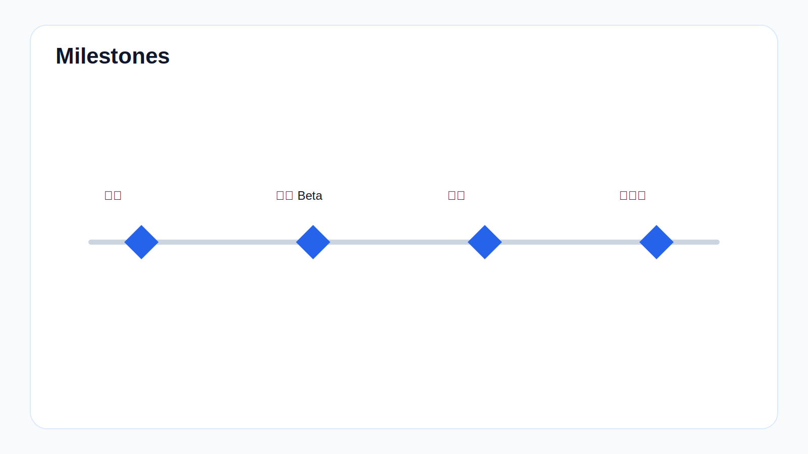

适用场景：

- 里程碑说明
- 关键交付节点
- 需要突出阶段性完成标记的页面

关键字段：

- `title`
- `table`

示例：

```json
{
  "layout_type": "milestones",
  "title": "关键里程碑",
  "table": {
    "headers": ["节点", "目标"],
    "rows": [["M1", "文档补齐"], ["M2", "组件稳定"], ["M3", "真实项目验证"]]
  }
}
```

### `org_roles`

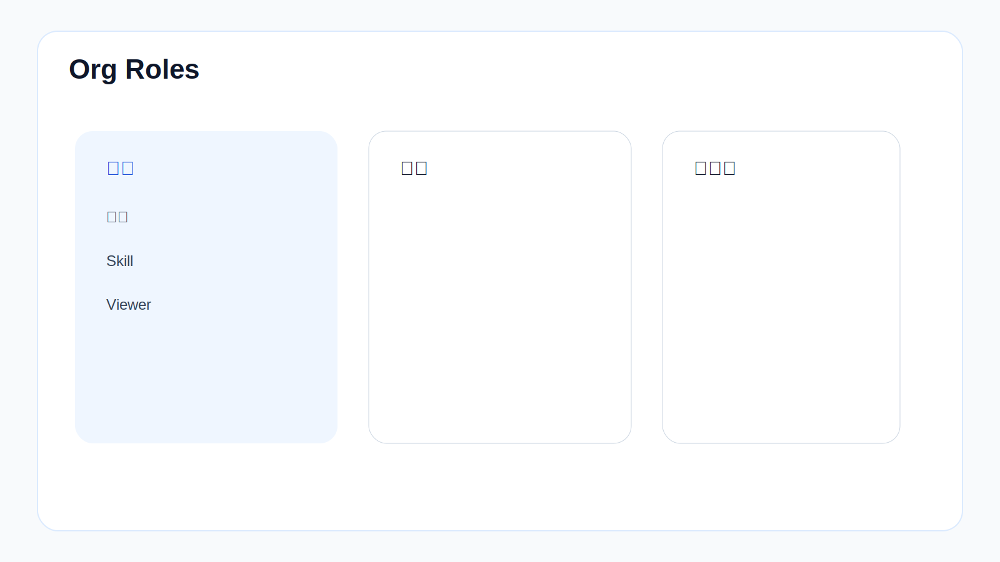

适用场景：

- 组织分工
- 角色职责
- 人员与交付物映射

关键字段：

- `title`
- `table` 或 `bullets`

示例：

```json
{
  "layout_type": "org_roles",
  "title": "角色分工",
  "table": {
    "headers": ["角色", "职责", "产物"],
    "rows": [["用户", "提出需求", "input"], ["Skill", "生成结构", "outline/deck"], ["Viewer", "渲染预览", "页面展示"]]
  }
}
```

### `risk_register`

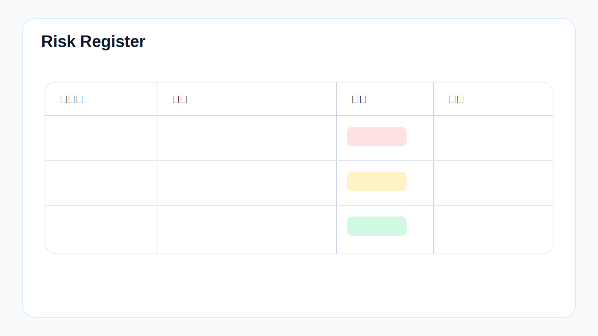

适用场景：

- 风险管理
- 风险台账
- 风险等级和应对策略整理

关键字段：

- `title`
- `table`

示例：

```json
{
  "layout_type": "risk_register",
  "title": "主要风险",
  "table": {
    "headers": ["风险", "等级", "应对"],
    "rows": [["图页过少", "高", "提高 svg_full 比例"], ["内容超屏", "中", "压缩文本并换 layout"]]
  }
}
```

### `pie_chart`

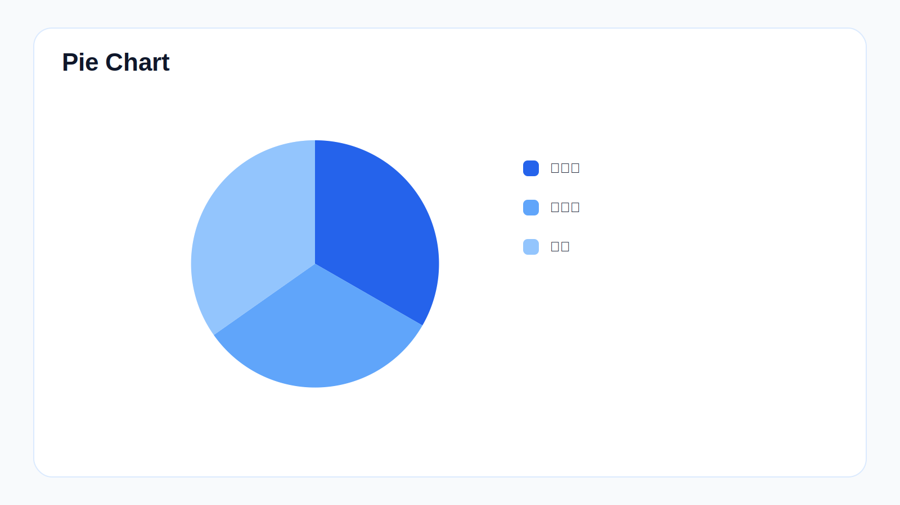

适用场景：

- 占比分析
- 类别构成
- 单组比例关系说明

关键字段：

- `title`
- `data`
- `unit`

示例：

```json
{
  "layout_type": "pie_chart",
  "title": "页面类型占比",
  "unit": "%",
  "data": [
    { "label": "结构图", "value": 45 },
    { "label": "文字页", "value": 30 },
    { "label": "图表页", "value": 25 }
  ]
}
```

### `donut_chart`

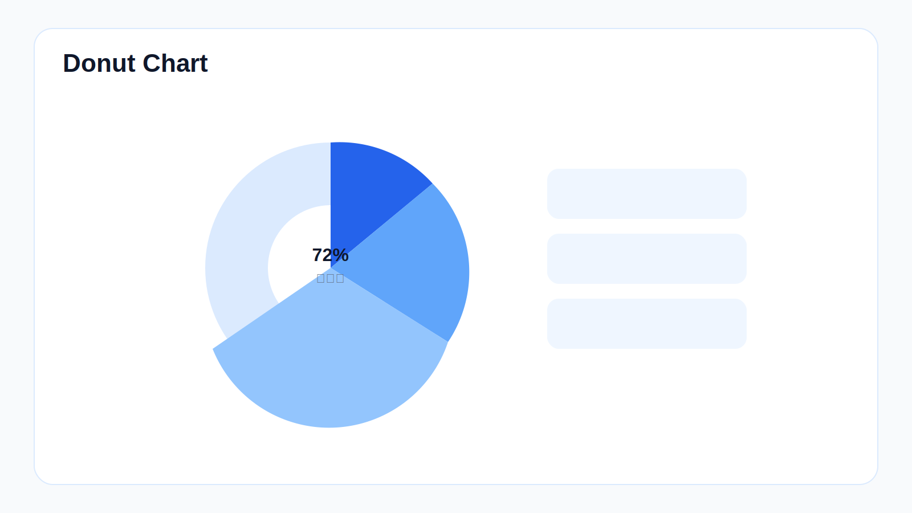

适用场景：

- 构成占比
- 完成率或达成率
- 需要在图中心放核心指标

关键字段：

- `title`
- `data`
- `unit`

示例：

```json
{
  "layout_type": "donut_chart",
  "title": "交付达成率",
  "unit": "%",
  "data": [
    { "label": "完成", "value": 78 },
    { "label": "未完成", "value": 22 }
  ]
}
```

### `area_chart`

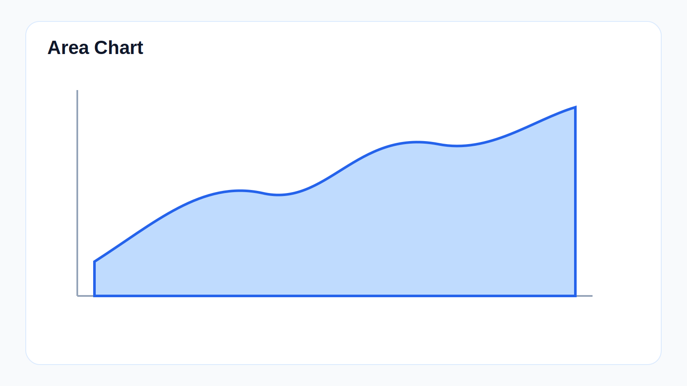

适用场景：

- 趋势面积变化
- 累积量走势
- 需要强调增长区间时

关键字段：

- `title`
- `data` 或 `series`

示例：

```json
{
  "layout_type": "area_chart",
  "title": "生成质量提升趋势",
  "unit": "分",
  "data": [
    { "label": "周一", "value": 60 },
    { "label": "周二", "value": 71 },
    { "label": "周三", "value": 84 }
  ]
}
```

### `scatter_plot`

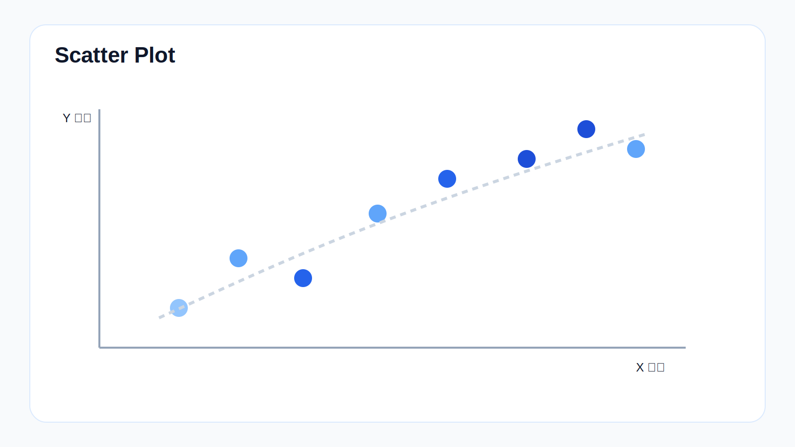

适用场景：

- 两个连续变量关系分析
- 分布特征说明
- 相关性和离群点观察

关键字段：

- `title`
- `data` 或 `series`
- `x_label`
- `y_label`

示例：

```json
{
  "layout_type": "scatter_plot",
  "title": "投入与质量关系",
  "x_label": "投入时间",
  "y_label": "质量得分",
  "data": [
    { "x": 1, "y": 60 }, { "x": 2, "y": 68 }, { "x": 3, "y": 79 }, { "x": 4, "y": 87 }
  ]
}
```

### `bubble_chart`

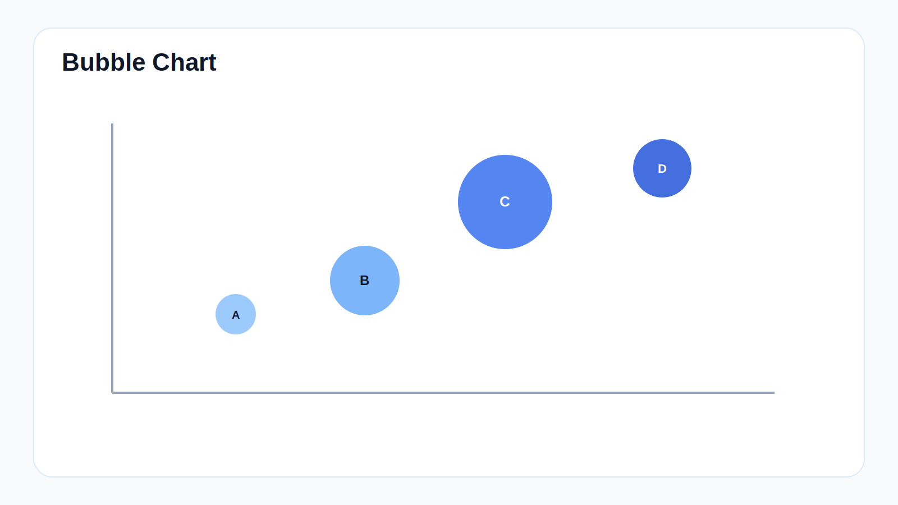

适用场景：

- 三维指标比较
- 横轴、纵轴、规模同时表达
- 多对象综合判断

关键字段：

- `title`
- `data` 或 `series`
- `x_label`
- `y_label`

示例：

```json
{
  "layout_type": "bubble_chart",
  "title": "任务价值比较",
  "x_label": "投入",
  "y_label": "收益",
  "data": [
    { "label": "A", "x": 2, "y": 7, "size": 18 },
    { "label": "B", "x": 5, "y": 9, "size": 30 }
  ]
}
```

### `waterfall_chart`

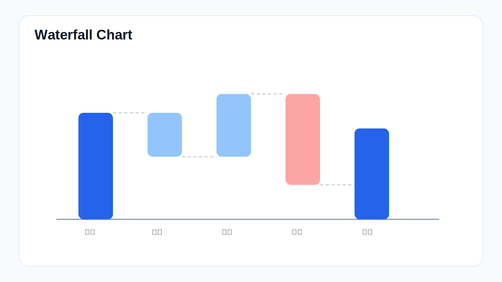

适用场景：

- 展示增减变化对最终结果的影响
- 拆解利润、成本、预算变化
- 表达从基线到结果的累计过程

关键字段：

- `title`
- `data` 或 `series`
- `unit`

示例：

```json
{
  "layout_type": "waterfall_chart",
  "title": "预算变化拆解",
  "unit": "万元",
  "data": [
    { "label": "基线", "value": 100 },
    { "label": "新增投入", "value": 30 },
    { "label": "效率节省", "value": -15 },
    { "label": "结果", "value": 115 }
  ]
}
```

### `funnel_chart`

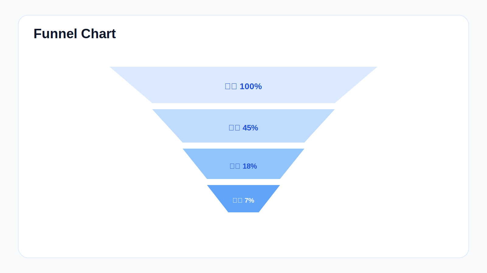

适用场景：

- 漏斗转化分析
- 线索到成交的阶段转化
- 逐层收敛的流程效果说明

关键字段：

- `title`
- `data` 或 `series`
- `unit`

示例：

```json
{
  "layout_type": "funnel_chart",
  "title": "转化漏斗",
  "unit": "%",
  "data": [
    { "label": "访问", "value": 100 },
    { "label": "点击", "value": 42 },
    { "label": "试用", "value": 18 },
    { "label": "成交", "value": 7 }
  ]
}
```

### `heatmap`

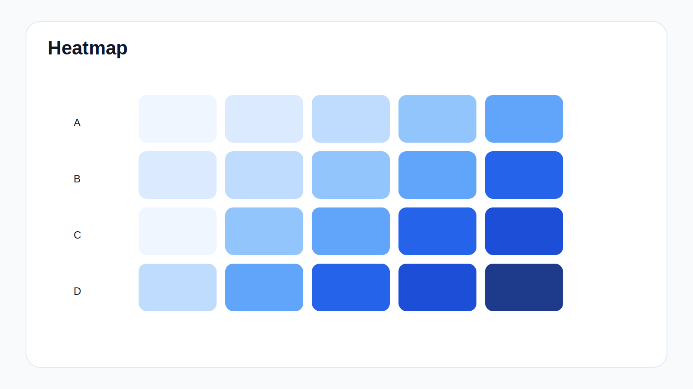

适用场景：

- 强弱分布对比
- 多维矩阵热度分析
- 时间、区域、类别交叉观察

关键字段：

- `title`
- `data` 或 `series`
- `x_labels`
- `y_labels`

示例：

```json
{
  "layout_type": "heatmap",
  "title": "模块热度矩阵",
  "x_labels": ["周一", "周二", "周三"],
  "y_labels": ["模块 A", "模块 B", "模块 C"],
  "data": [
    [2, 3, 5],
    [1, 4, 5],
    [3, 4, 2]
  ]
}
```

### `treemap`

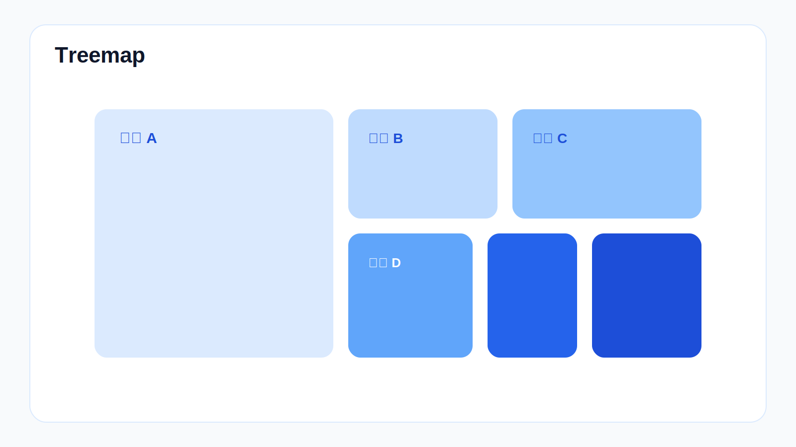

适用场景：

- 分层占比展示
- 模块规模对比
- 用面积表达权重和构成

关键字段：

- `title`
- `data` 或 `root`

示例：

```json
{
  "layout_type": "treemap",
  "title": "模块工作量构成",
  "data": [
    { "label": "viewer", "value": 38 },
    { "label": "skill", "value": 27 },
    { "label": "docs", "value": 21 },
    { "label": "assets", "value": 14 }
  ]
}
```

### `sankey`

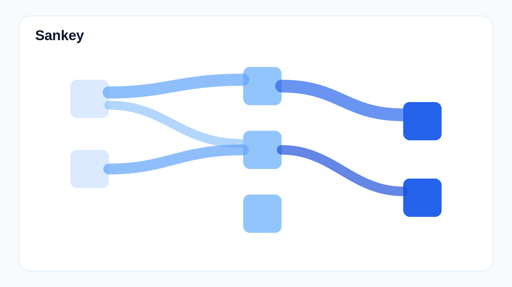

适用场景：

- 流向关系说明
- 从输入到输出的量化流转
- 资源、用户、数据流分析

关键字段：

- `title`
- `nodes`
- `links`

示例：

```json
{
  "layout_type": "sankey",
  "title": "需求到产物的流转",
  "nodes": [
    { "id": "req", "label": "需求" },
    { "id": "outline", "label": "outline" },
    { "id": "detail", "label": "detail" },
    { "id": "viewer", "label": "viewer" }
  ],
  "links": [
    { "source": "req", "target": "outline", "value": 10 },
    { "source": "outline", "target": "detail", "value": 8 },
    { "source": "detail", "target": "viewer", "value": 8 }
  ]
}
```

### `gauge`

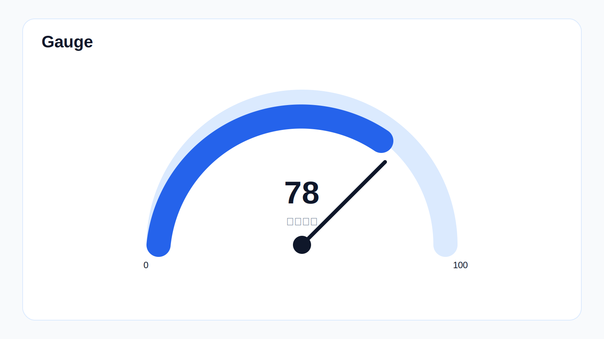

适用场景：

- 综合评分
- 达成率或健康度
- 单一核心指标的仪表盘展示

关键字段：

- `title`
- `value`
- `min`
- `max`

示例：

```json
{
  "layout_type": "gauge",
  "title": "当前质量评分",
  "value": 78,
  "min": 0,
  "max": 100
}
```

### `radar_chart`

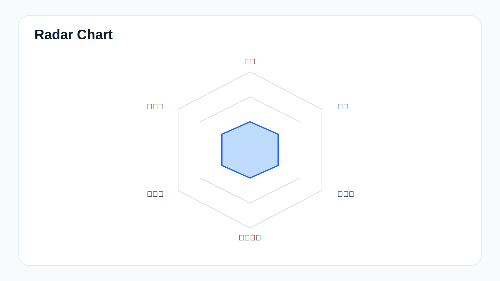

适用场景：

- 多维能力对比
- 多指标评估
- 同一对象的维度画像

关键字段：

- `title`
- `categories`
- `values` 或 `series`
- `max`

示例：

```json
{
  "layout_type": "radar_chart",
  "title": "能力画像",
  "categories": ["质量", "速度", "稳定性", "表达力", "复用性"],
  "values": [82, 76, 88, 79, 84],
  "max": 100
}
```

### `impact_effort`

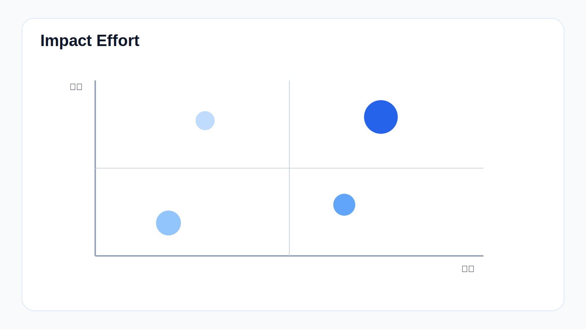

适用场景：

- 优先级排序
- 价值投入判断
- 筛选先做什么和后做什么

关键字段：

- `title`
- `items`

示例：

```json
{
  "layout_type": "impact_effort",
  "title": "任务优先级分布",
  "items": [
    { "name": "补文档", "impact": 9, "effort": 3, "size": 20 },
    { "name": "重做组件", "impact": 8, "effort": 8, "size": 28 }
  ]
}
```

### `gantt_chart`

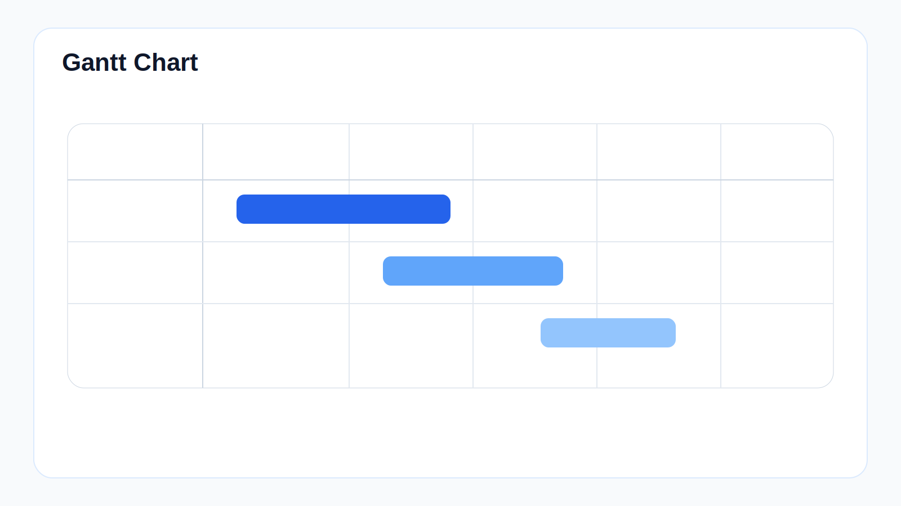

适用场景：

- 项目排期
- 任务时间安排
- 跨阶段的甘特图计划页

关键字段：

- `title`
- `tasks`

示例：

```json
{
  "layout_type": "gantt_chart",
  "title": "实施排期",
  "tasks": [
    { "name": "补 layouts", "start": "2026-06-17", "end": "2026-06-18", "owner": "Agent" },
    { "name": "校验文档", "start": "2026-06-18", "end": "2026-06-19", "owner": "Agent" }
  ]
}
```

### `mind_map`

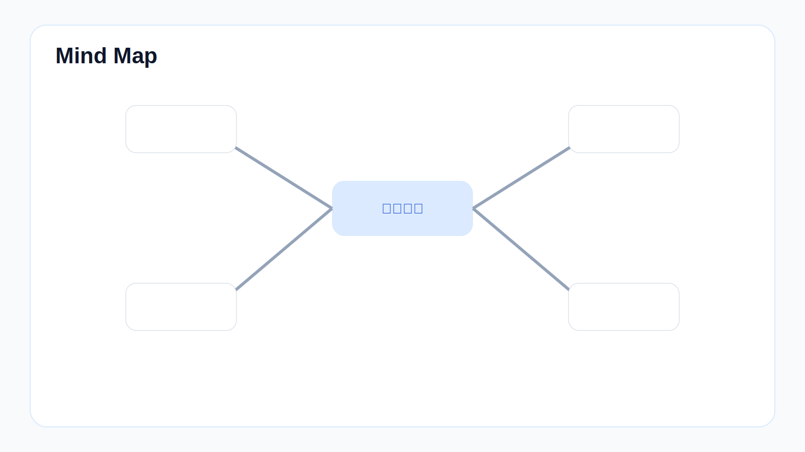

适用场景：

- 思路发散
- 概念整理
- 从中心主题向外展开的说明页

关键字段：

- `title`
- `root`

示例：

```json
{
  "layout_type": "mind_map",
  "title": "Skill 扩展脑图",
  "root": {
    "text": "Fork",
    "children": [
      { "text": "风格" },
      { "text": "layout" },
      { "text": "类型" },
      { "text": "质检" }
    ]
  }
}
```

### `top_bottom`

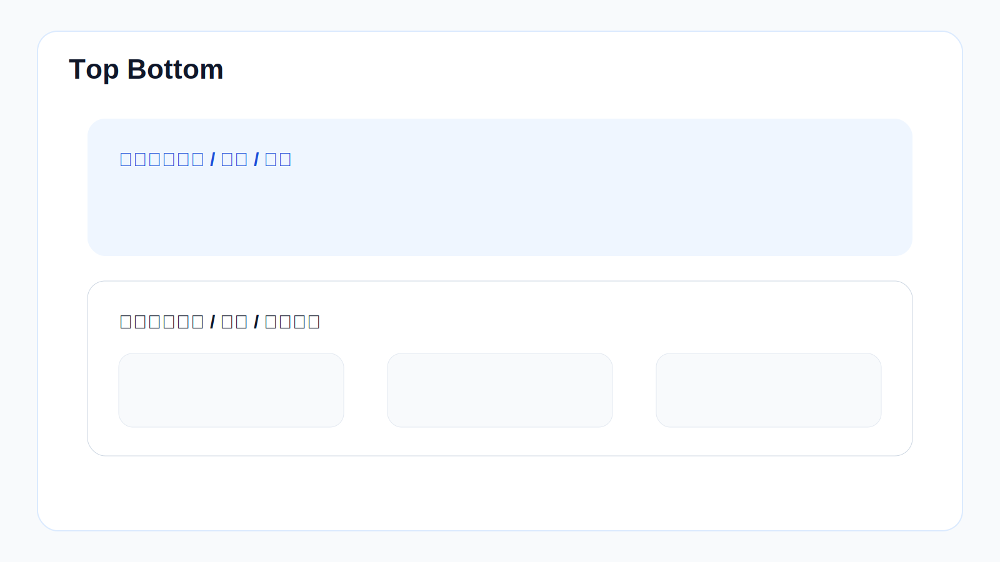

适用场景：

- 上下分区说明
- 上结论下解释
- 总览和细节分层呈现

关键字段：

- `title`
- `top`
- `bottom`

示例：

```json
{
  "layout_type": "top_bottom",
  "title": "上结论下解释",
  "top": { "title": "结论", "text": "先做 outline 再做 detail 才能稳定控制结构。" },
  "bottom": { "blocks": [{ "title": "原因", "text": "先锁定章节，再锁定页面表达。" }] }
}
```

### `nine_grid`

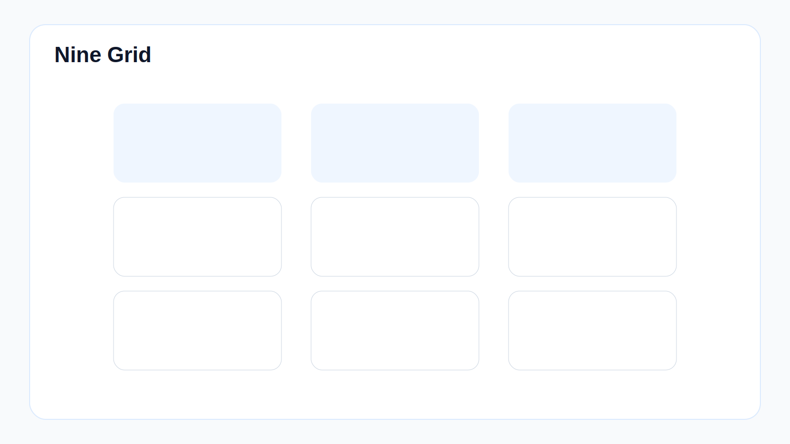

适用场景：

- 九宫格能力说明
- 多模块一页总览
- 固定数量的卡片式拆解

关键字段：

- `title`
- `items`

示例：

```json
{
  "layout_type": "nine_grid",
  "title": "九类常见页面",
  "items": [
    { "title": "封面" }, { "title": "目录" }, { "title": "章节页" },
    { "title": "对比" }, { "title": "步骤" }, { "title": "结构图" },
    { "title": "图表" }, { "title": "案例" }, { "title": "总结" }
  ]
}
```

### `journey_map`

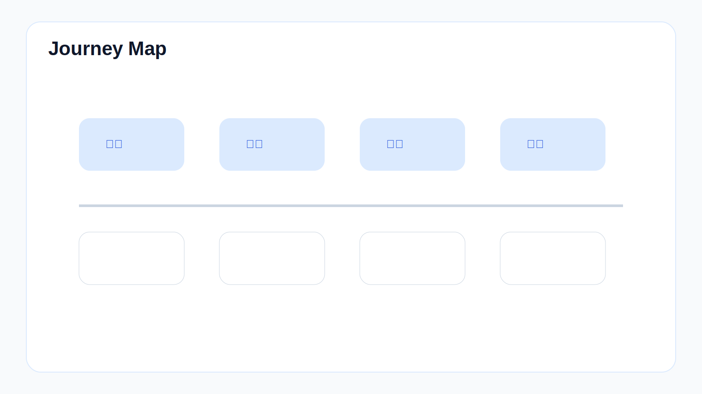

适用场景：

- 用户旅程
- 使用路径分析
- 不同阶段的触点、痛点和机会梳理

关键字段：

- `title`
- `stages`

示例：

```json
{
  "layout_type": "journey_map",
  "title": "用户使用旅程",
  "stages": [
    { "name": "接触", "touchpoints": ["README"], "painpoints": ["不清楚入口"], "opportunities": ["增加 getting-started"] },
    { "name": "使用", "touchpoints": ["outline/detail"], "painpoints": ["layout 难选"], "opportunities": ["补 layouts 文档"] }
  ]
}
```

### `plan_table`

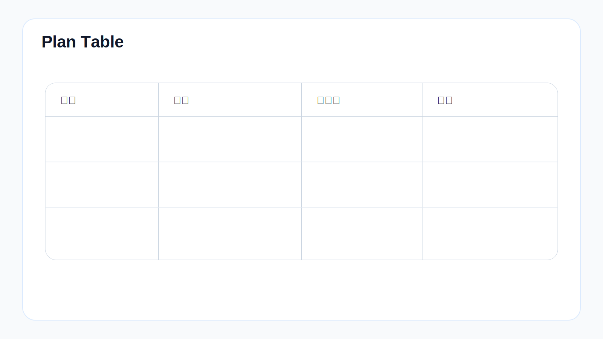

适用场景：

- 实施计划
- 分工与时间安排
- 标准计划表页面

关键字段：

- `title`
- `table`

示例：

```json
{
  "layout_type": "plan_table",
  "title": "执行计划",
  "table": {
    "headers": ["阶段", "动作", "负责人", "时间"],
    "rows": [["文档", "补说明", "Agent", "Day 1"], ["验证", "预览检查", "Agent", "Day 2"]]
  }
}
```

### `cost_benefit`

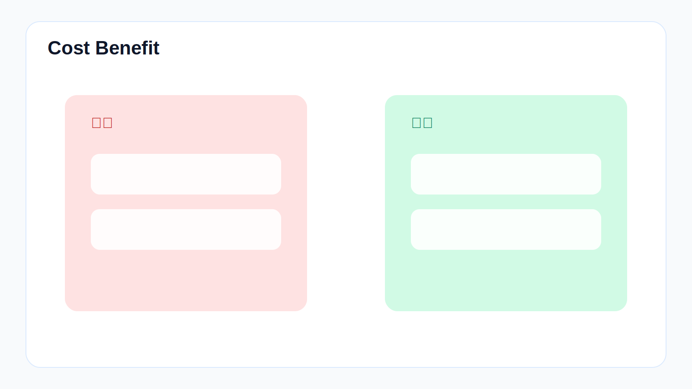

适用场景：

- 成本收益对照
- 投入产出分析
- 决策前权衡说明

关键字段：

- `title`
- `table`

示例：

```json
{
  "layout_type": "cost_benefit",
  "title": "成本收益分析",
  "table": {
    "headers": ["类型", "内容"],
    "rows": [["成本", "增加规则维护工作"], ["收益", "交付质量更稳定"]]
  }
}
```

### `raci`

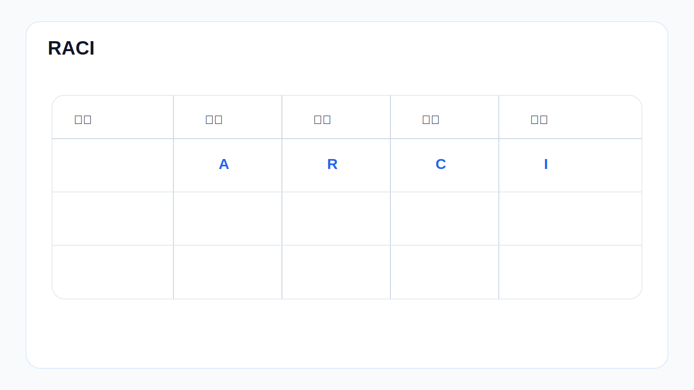

适用场景：

- 责任分配矩阵
- 跨角色协作说明
- 明确 R / A / C / I 的治理页

关键字段：

- `title`
- `table`

示例：

```json
{
  "layout_type": "raci",
  "title": "RACI 分工",
  "table": {
    "headers": ["任务", "产品", "研发", "设计", "运营"],
    "rows": [["定义结构", "A", "R", "C", "I"], ["调整视觉", "C", "R", "A", "I"]]
  }
}
```

### `case_study`

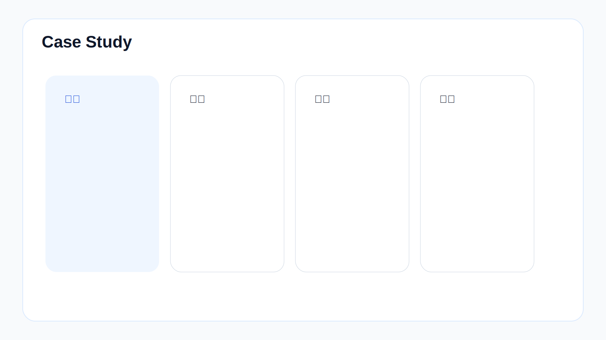

适用场景：

- 案例拆解
- 实践经验复盘
- 背景、做法、成效、启示的固定结构页

关键字段：

- `title`
- `blocks`

示例：

```json
{
  "layout_type": "case_study",
  "title": "真实项目案例",
  "blocks": [
    { "title": "背景", "text": "需要把 skill 工程化成网页 PPT 系统。" },
    { "title": "做法", "text": "补 layout、补 SVG、补文档。" },
    { "title": "成效", "text": "生成结果更稳定，文档更完整。" },
    { "title": "启示", "text": "先统一规则，再扩展类型。" }
  ]
}
```

### `evidence_gallery`

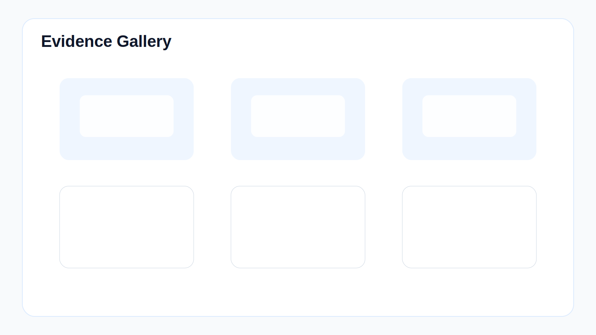

适用场景：

- 证据墙
- 多截图或多素材展示
- 补充案例凭证和界面片段

关键字段：

- `title`
- `bullets`

示例：

```json
{
  "layout_type": "evidence_gallery",
  "title": "证据墙",
  "bullets": ["viewer 截图", "SVG 资产预览", "layout 文档示例", "真实 deck 页面片段"]
}
```

## 选型原则

- 页面意图先于 layout 选择
- 对比页不要误用步骤图
- 阶段页不要退回普通表格
- 工作流页优先保留时序和泳道语义
- 三层结构图优先 `svg_full`，且内容不要写成 bullets
