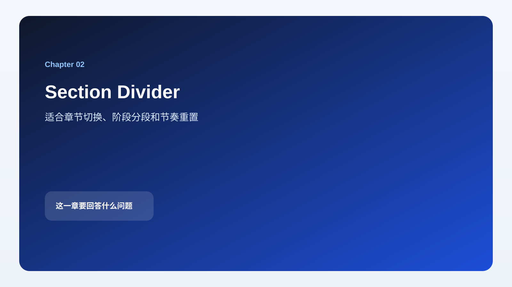
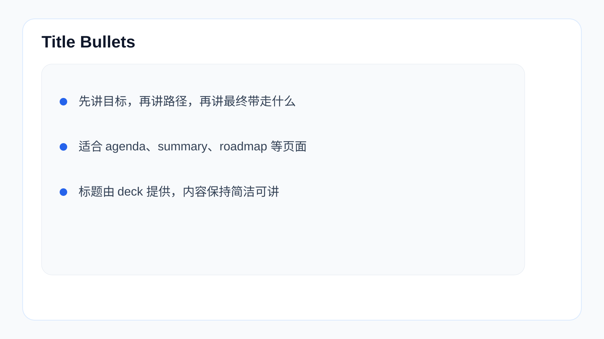
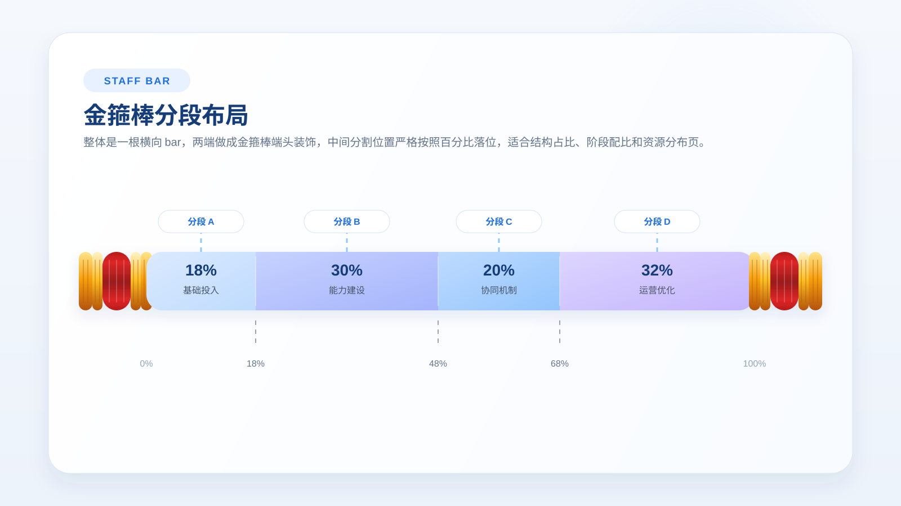
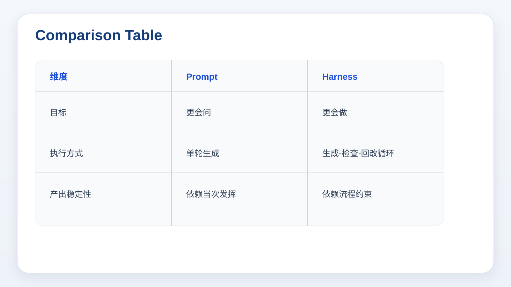
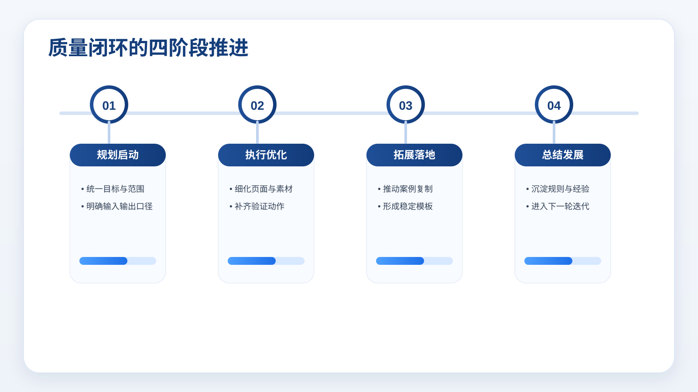
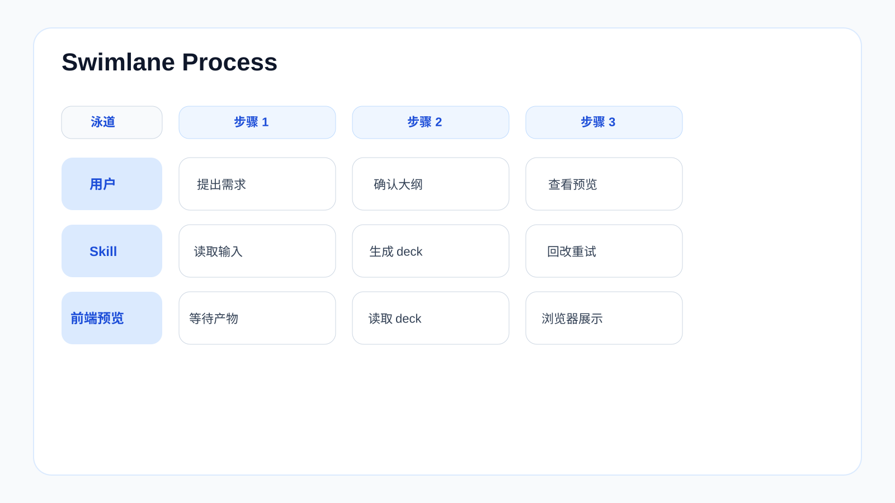
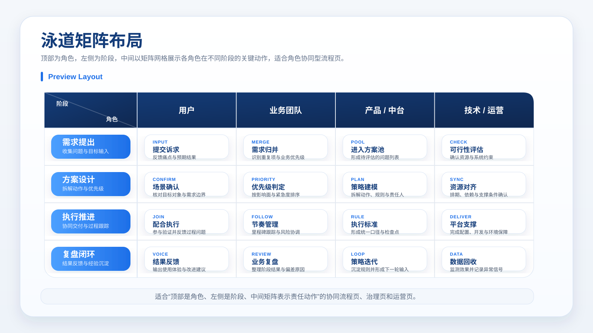

# 封面、分段与泳道类 Layout

[返回总入口](../layouts.md) | [下一类：说明型与视觉中心页](02-explainers-visuals.md)

## 本页目录

- [`cover`](#cover)
- [`section_divider`](#section_divider)
- [`title_bullets`](#title_bullets)
- [`staff_list`](#staff_list)
- [`comparison_table`](#comparison_table)
- [`phases`](#phases)
- [`swimlane_process`](#swimlane_process)
- [`swimlane_board`](#swimlane_board)

## 常用 Layout

### `cover`


适用场景：

- 首页封面
- 章节封面
- 需要背景图承载情绪的开场页

关键字段：

- `title`
- `subtitle`
- `background`
- `date`
- `lecturer`

示例：

```json
{
  "layout_type": "cover",
  "title": "Skill 和 Harness",
  "subtitle": "从 Prompt Engineering 走向可执行系统",
  "date": "2026-06-17",
  "lecturer": "Stephen Wang",
  "background": {
    "src": "work/assets/001-cover-hero.svg",
    "overlay": "rgba(15,23,42,0.52)",
    "size": "cover",
    "position": "75% 50%"
  }
}
```

### `section_divider`



适用场景：

- 章节切换
- 阶段分段
- 节奏重置

关键字段：

- `title`
- `subtitle`
- `background`
- `chapter_label`

示例：

```json
{
  "layout_type": "section_divider",
  "title": "第二部分：Skill 的执行路径",
  "subtitle": "从触发到产出，先看流程再看实现",
  "chapter_label": "Chapter 02",
  "background": {
    "src": "work/assets/001-chapter-02-bg.svg",
    "overlay": "rgba(15,23,42,0.42)",
    "size": "cover",
    "position": "center"
  }
}
```

### `title_bullets`



适用场景：

- 开场说明
- agenda
- summary
- roadmap
- 执行摘要
- 一个总判断 + 多类能力卡片

关键字段：

- `title`
- `bullets`
- `subtitle`（可选）
- `foreground`
- `cards`（可选，适合 2-4 个并列结果卡片）

示例：

```json
{
  "layout_type": "title_bullets",
  "title": "执行摘要：一个底座 + 三类 AI + 两套保障",
  "subtitle": "核心判断：数字化决定数据可用性，AI 决定决策与自动化效率。",
  "bullets": [
    "一个底座：数据平台 + 集成平台 + 基础设施，统一数据、全域集成、安全合规。",
    "两套保障：组织制度保障与安全合规保障，覆盖治理、培训、考核、审计与权限。",
    "里程碑路径：M01-M03 样板闭环，M04-M06 跨厂复制，M07-M12+ 平台化规模化。"
  ],
  "cards": [
    { "title": "研发 AI", "text": "代码补全、测试生成、架构审查，研发效率提升 30%+。" },
    { "title": "业务 AI", "text": "排产优化、质量预测、设备预警，推动良率提升与停机减少。" },
    { "title": "办公 AI", "text": "文档生成、会议纪要、企业搜索，显著提升协同效率。" }
  ]
}
```

### `staff_list`



适用场景：

- 条目式目录页
- 方法论清单
- 能力拆解页
- 想做得比普通 bullet 更有记忆点的条目页

关键字段：

- `title`
- `items` 或 `bullets`
- `subtitle`（可选）
- `eyebrow`（可选）

示例：

```json
{
  "layout_type": "staff_list",
  "title": "项目推进的四个关键条目",
  "subtitle": "左侧装饰采用“金箍棒式轴条”，适合把多个要点排成规整清单。",
  "items": [
    { "tag": "章节 01", "title": "战略方向", "text": "先明确目标、边界和优先级，避免后续动作散掉。" },
    { "tag": "章节 02", "title": "能力建设", "text": "把数据、流程、平台和组织等支撑能力逐条拆开表达。" },
    { "tag": "章节 03", "title": "执行机制", "text": "条目内部建议采用“短标题 + 一句解释”的稳定结构。" },
    { "tag": "章节 04", "title": "落地保障", "text": "最后收束到治理、节奏、责任人和复盘闭环。" }
  ]
}
```

### `comparison_table`



适用场景：

- 概念对比
- 方案对比
- 前后代际差异

关键字段：

- `title`
- `table.headers`
- `table.rows`

示例：

```json
{
  "layout_type": "comparison_table",
  "title": "三代工程方式的差异",
  "table": {
    "headers": ["维度", "Prompt Engineering", "Harness Engineering"],
    "rows": [
      ["目标", "更会问", "更会做"],
      ["执行方式", "单轮生成", "生成-检查-回改循环"],
      ["产出稳定性", "依赖当次发挥", "依赖流程约束"]
    ]
  }
}
```

### `phases`



适用场景：

- 阶段门禁
- 质量闭环
- 分阶段推进

关键字段：

- `title`
- `narrow`（可选，5 阶段左右总览时可压缩标题区）
- `phases[].title`
- `phases[].text`
- `phases[].bullets`
- `phases[].gate`

示例：

```json
{
  "layout_type": "phases",
  "title": "制造业数字化转型与 AI 导入整体思路",
  "narrow": true,
  "phases": [
    {
      "title": "业务战略规划",
      "bullets": ["对齐战略目标", "参考行业最佳实践", "明确年度任务清单"],
      "gate": "先定方向"
    },
    {
      "title": "当前业务分析",
      "bullets": ["盘点业务现状", "核查数据与系统现状", "识别技术差距"],
      "gate": "先看清差距"
    }
  ]
}
```

### `swimlane_process`



适用场景：

- 多角色协作链路
- 按时间推进的工作流
- 用户、Skill、文件系统、前端预览之间的映射

关键字段：

- `title`
- `headers`（可选，用于给每一列命名）
- `lanes[].name`
- `lanes[].steps`

示例：

```json
{
  "layout_type": "swimlane_process",
  "title": "企业用车需求确认流程",
  "headers": ["申请", "分派", "执行", "完成", "变更", "取消 / 异常"],
  "lanes": [
    { "name": "用车人", "steps": ["申请用车", "", "", "", "变更用车", "取消用车"] },
    { "name": "派车员", "steps": ["", "分派车辆", "", "", "更换车辆 / 撤销分派", "冲突处理 / 紧急变更"] },
    { "name": "司机", "steps": ["", "", "出发", "到达", "更换司机", "司机拒绝 / 紧急停止"] }
  ]
}
```

### `swimlane_board`



适用场景：

- 多责任域并行推进
- 团队 / 模块 / 能力分层说明
- 每条泳道内部再拆关键动作

关键字段：

- `title`
- `lanes[].name`
- `lanes[].note`
- `lanes[].items`

示例：

```json
{
  "layout_type": "swimlane_board",
  "title": "三层协同泳道",
  "lanes": [
    {
      "name": "业务前台",
      "note": "客户需求、场景反馈、优先级输入",
      "items": [
        { "tag": "INPUT", "title": "需求归并", "text": "统一入口、合并重复问题" },
        { "tag": "ACTION", "title": "优先级判定", "text": "按影响面与紧急度排序" },
        { "tag": "OUTPUT", "title": "进入方案池", "text": "形成可执行的问题列表" }
      ]
    },
    {
      "name": "中台策略",
      "note": "规则设计、资源协调、方案落地",
      "items": [
        { "tag": "PLAN", "title": "策略建模", "text": "目标、规则、责任人拆解" },
        { "tag": "SYNC", "title": "跨团队协同", "text": "资源分派、节奏管理、里程碑" },
        { "tag": "RULE", "title": "执行标准", "text": "形成统一口径与检查点" }
      ]
    },
    {
      "name": "后台支撑",
      "note": "数据回收、系统支撑、闭环优化",
      "items": [
        { "tag": "DATA", "title": "指标监测", "text": "持续收集效果与异常信号" },
        { "tag": "SUPPORT", "title": "平台支撑", "text": "自动化、权限、数据底座" },
        { "tag": "LOOP", "title": "结果复盘", "text": "把经验沉淀为下一轮输入" }
      ]
    }
  ]
}
```

## 跨页导航

[返回总入口](../layouts.md) | [下一类：说明型与视觉中心页](02-explainers-visuals.md)
