# 说明型与视觉中心页

[返回总入口](../layouts.md) | [上一类：封面、分段与泳道类](01-foundation-flow.md) | [下一类：结构、流程与架构页](03-structure-analysis.md)

## 本页目录

- [`metro_loop`](#metro_loop)
- [`double_loop`](#double_loop)
- [`iceberg`](#iceberg)
- [`house`](#house)
- [`radial_explainer`](#radial_explainer)
- [`brain_explainer`](#brain_explainer)
- [`profile_intro`](#profile_intro)
- [`chip_explainer`](#chip_explainer)
- [`petal_explainer`](#petal_explainer)
- [`fan_explainer`](#fan_explainer)
- [`screen_explainer`](#screen_explainer)

### `metro_loop`

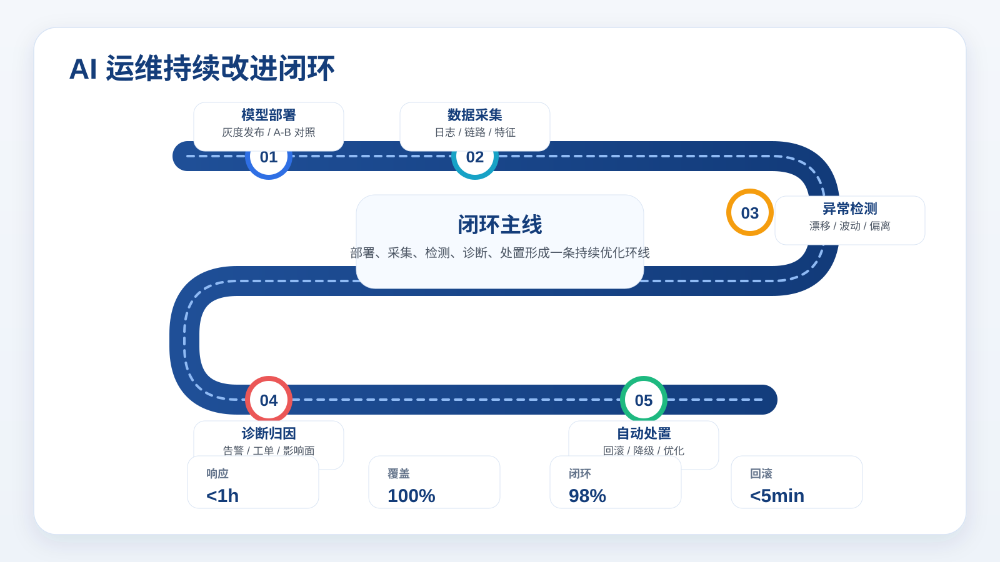

适用场景：

- 持续改进闭环
- AIOps / MLOps 运维闭环
- 地铁站点式阶段链路
- 一页同时展示闭环步骤和 2-4 个摘要指标

关键字段：

- `title`
- `center.title`
- `center.text`
- `stops[]`：`title` + `text`（可选） + `icon`（可选） + `line`（可选）
- `metrics[]`：`label` + `value` + `note`（可选）

示例：

```json
{
  "layout_type": "metro_loop",
  "title": "AI 模型运维可观测系统",
  "center": {
    "title": "AI 模型运维闭环",
    "text": "从部署、采集、检测、诊断到自动处置，形成主动发现、快速恢复、持续优化的一体化环线。"
  },
  "stops": [
    { "title": "模型部署上线", "text": "灰度发布 / 分批切流 / A/B 对照", "icon": "rollout", "line": "blue" },
    { "title": "全维度数据采集", "text": "输出分布 / 特征分布 / 日志 / 链路 / 资源", "icon": "database", "line": "cyan" },
    { "title": "智能异常检测", "text": "数据漂移 / 基线偏离 / 多指标关联", "icon": "search", "line": "orange" },
    { "title": "告警与根因诊断", "text": "分级告警 / 工单联动 / 影响面评估", "icon": "audit", "line": "red" },
    { "title": "自动处置闭环", "text": "自动回滚 / 降级切流 / 规则优化", "icon": "refresh", "line": "green" }
  ],
  "metrics": [
    { "label": "漂移检测响应", "value": "<1h", "note": "自动告警触发" },
    { "label": "灰度覆盖率", "value": "100%", "note": "全模型灰度发布" },
    { "label": "告警闭环率", "value": "98%", "note": "24h 内闭环" },
    { "label": "自动回滚时间", "value": "<5min", "note": "异常自动触发" }
  ]
}
```

### `double_loop`

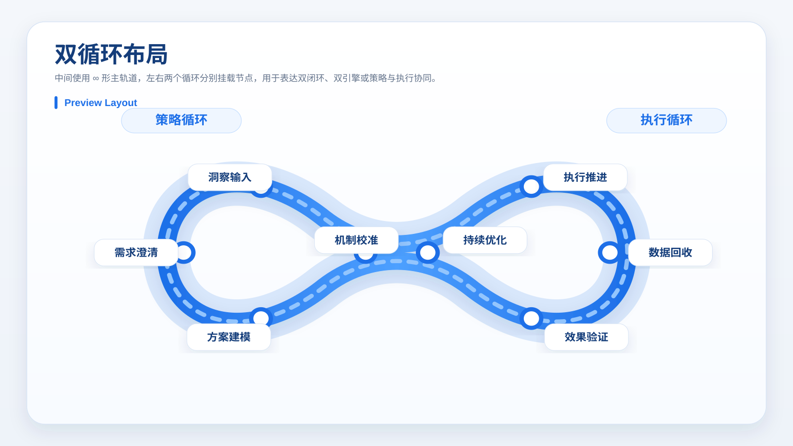

适用场景：

- 双循环治理
- 策略与执行协同
- 前后台联动
- 规划、执行、复盘双引擎

关键字段：

- `title`
- `left_title`
- `right_title`
- `left_nodes[]`
- `right_nodes[]`

示例：

```json
{
  "layout_type": "double_loop",
  "title": "策略与执行双循环",
  "left_title": "策略循环",
  "right_title": "执行循环",
  "left_nodes": [
    { "title": "洞察输入" },
    { "title": "需求澄清" },
    { "title": "方案建模" },
    { "title": "机制校准" }
  ],
  "right_nodes": [
    { "title": "执行推进" },
    { "title": "数据回收" },
    { "title": "效果验证" },
    { "title": "持续优化" }
  ]
}
```

### `iceberg`

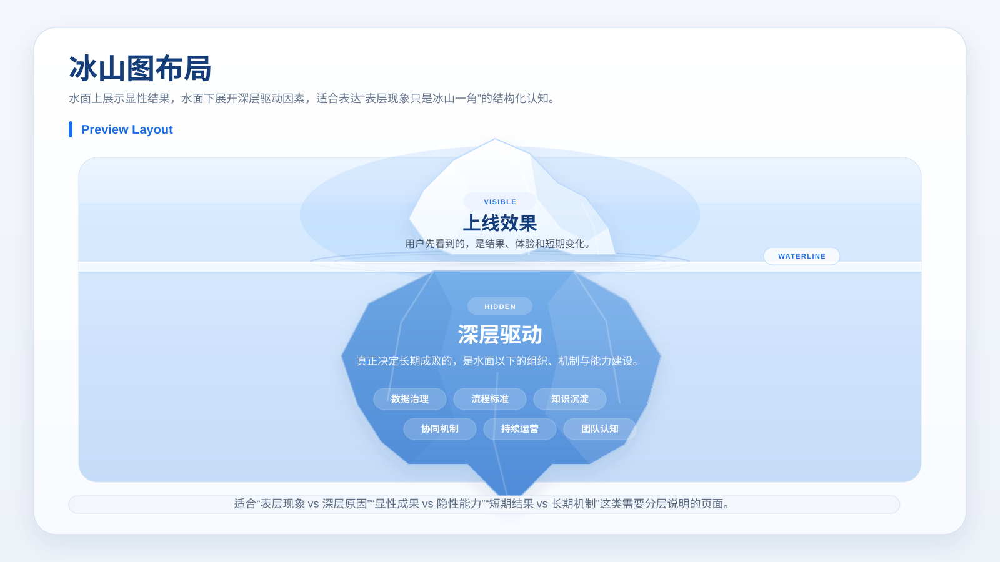

适用场景：

- 冰山模型
- 表层现象与深层根因拆解
- 显性结果与隐性结构说明
- 认知、组织、机制、能力的分层表达

关键字段：

- `title`
- `tip.title`
- `tip.text`
- `base.title`
- `base.text`
- `base.bullets[]`

示例：

```json
{
  "layout_type": "iceberg",
  "title": "AI 落地的冰山结构",
  "tip": {
    "tag": "VISIBLE",
    "title": "上线效果",
    "text": "用户看到的是模型上线、体验改善和短期结果。"
  },
  "base": {
    "tag": "HIDDEN",
    "title": "深层驱动",
    "text": "真正决定长期效果的，是水面以下的组织能力和机制建设。",
    "bullets": ["数据治理", "流程标准", "知识沉淀", "协同机制", "持续运营"]
  }
}
```

### `house`

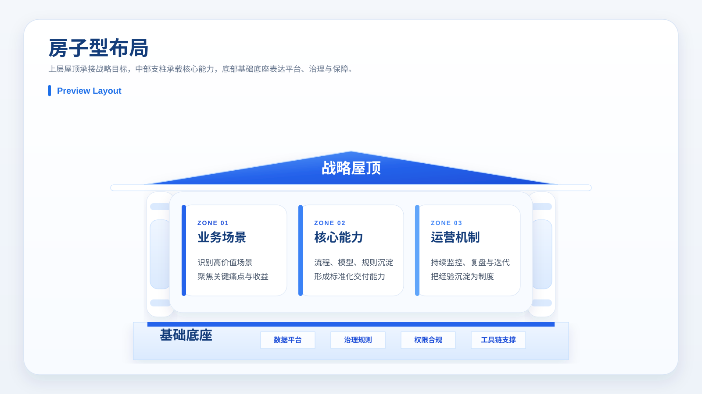

适用场景：

- 战略屋 / 能力屋 / 治理屋
- 一个总目标，下挂 3-4 个能力支柱
- 底部需要明确平台、治理、机制等基础底座

关键字段：

- `title`
- `roof.title`
- `roof.text`
- `pillars[]`
- `foundation.title`
- `foundation.text`
- `foundation.items[]`

示例：

```json
{
  "layout_type": "house",
  "title": "AI 运营能力屋",
  "roof": {
    "title": "统一 AI 运营目标",
    "text": "围绕价值实现、交付标准与衡量口径形成统一屋顶"
  },
  "pillars": [
    {
      "tag": "PILLAR 01",
      "title": "业务场景",
      "text": "锁定高价值场景，明确优先级、收益与试点范围"
    },
    {
      "tag": "PILLAR 02",
      "title": "核心能力",
      "text": "沉淀模型、流程、规则和模板，形成可复制交付能力"
    },
    {
      "tag": "PILLAR 03",
      "title": "运营机制",
      "text": "建立监控、复盘、优化的持续运营闭环"
    }
  ],
  "foundation": {
    "title": "基础底座",
    "text": "用统一平台、治理和权限体系支撑上层能力稳定运行",
    "items": ["数据平台", "治理口径", "权限合规"]
  }
}
```

### `radial_explainer`

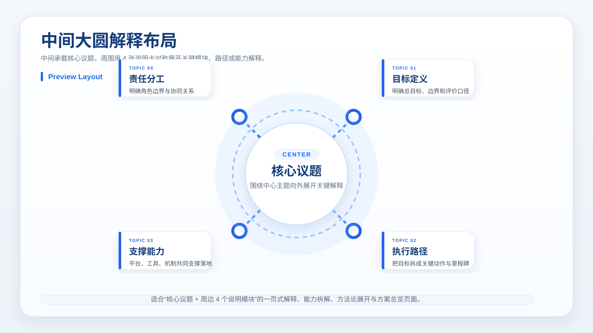

适用场景：

- 一个核心议题，向外解释 4-6 个关键模块
- 方法论展开、能力拆解、方案总览
- 中心概念固定，周围按主题逐条说明

关键字段：

- `title`
- `center.title`
- `center.text`
- `items[]`

示例：

```json
{
  "layout_type": "radial_explainer",
  "title": "智能运营框架总览",
  "center": {
    "title": "核心议题",
    "text": "围绕一个总目标，向外拆分关键模块与动作"
  },
  "items": [
    {
      "tag": "TOPIC 01",
      "title": "目标定义",
      "text": "明确总目标、边界和评价口径"
    },
    {
      "tag": "TOPIC 02",
      "title": "执行路径",
      "text": "把目标拆成关键动作与里程碑"
    },
    {
      "tag": "TOPIC 03",
      "title": "支撑能力",
      "text": "平台、工具、机制共同支撑落地"
    },
    {
      "tag": "TOPIC 04",
      "title": "数据回收",
      "text": "持续收集效果与异常信号闭环优化"
    },
    {
      "tag": "TOPIC 05",
      "title": "责任分工",
      "text": "明确角色边界与协同关系"
    }
  ]
}
```

### `brain_explainer`

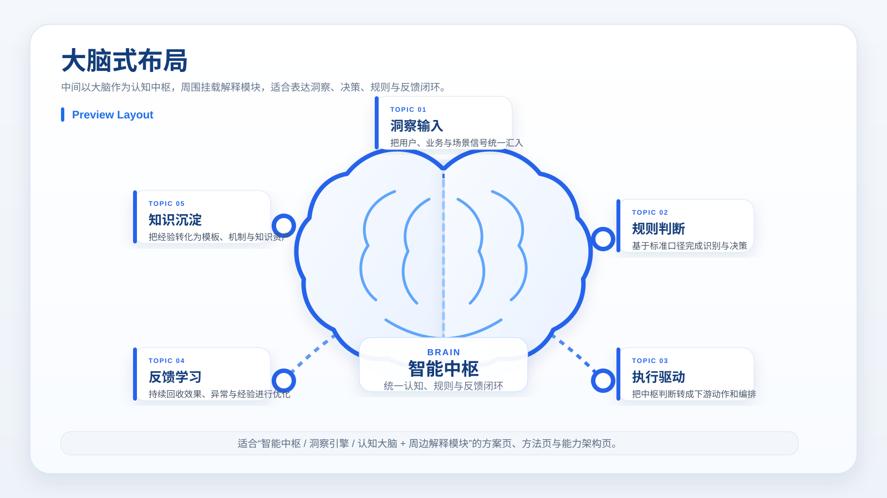

适用场景：

- 智能中枢 / 洞察引擎 / 认知大脑
- 中间是统一判断核心，周围解释输入、规则、执行、反馈等模块
- 一页展示“像大脑一样协同运作”的能力结构

关键字段：

- `title`
- `brain.title`
- `brain.text`
- `items[]`

示例：

```json
{
  "layout_type": "brain_explainer",
  "title": "智能运营大脑",
  "brain": {
    "title": "智能中枢",
    "text": "统一认知、规则和反馈闭环，驱动周边模块协同运作"
  },
  "items": [
    {
      "tag": "TOPIC 01",
      "title": "洞察输入",
      "text": "把用户、业务与场景信号统一汇入"
    },
    {
      "tag": "TOPIC 02",
      "title": "规则判断",
      "text": "基于标准口径完成识别与决策"
    },
    {
      "tag": "TOPIC 03",
      "title": "执行驱动",
      "text": "把中枢判断转成下游动作和编排"
    },
    {
      "tag": "TOPIC 04",
      "title": "反馈学习",
      "text": "持续回收效果、异常与经验进行优化"
    },
    {
      "tag": "TOPIC 05",
      "title": "知识沉淀",
      "text": "把经验转化为模板、机制与知识资产"
    }
  ]
}
```

### `profile_intro`

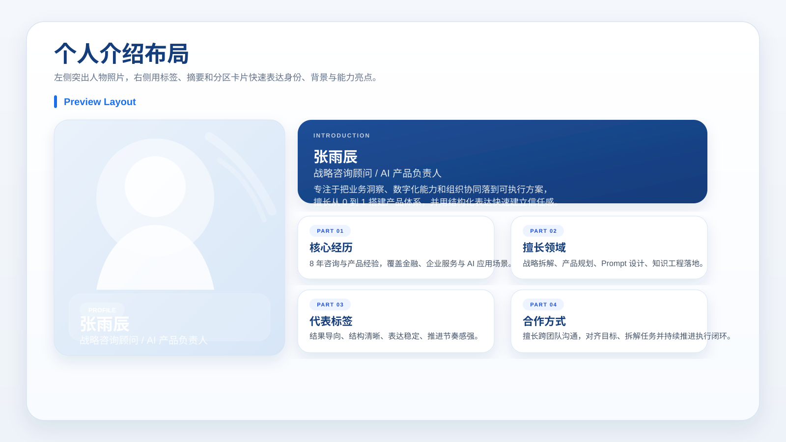

适用场景：

- 个人介绍 / 团队核心成员介绍
- 顾问、讲师、嘉宾、项目负责人简介页
- 一半照片，一半用标签、摘要和分区卡片表达个人背景

关键字段：

- `title`
- `photo.src`
- `profile.name`
- `profile.role`
- `profile.summary`
- `profile.tags[]`
- `sections[]`

示例：

```json
{
  "layout_type": "profile_intro",
  "title": "核心成员介绍",
  "photo": {
    "src": "work/assets/profile-zhangyuchen.png",
    "caption": "项目主负责人"
  },
  "profile": {
    "name": "张雨辰",
    "role": "战略咨询顾问 / AI 产品负责人",
    "summary": "专注于把业务洞察、数字化能力和组织协同落到可执行方案。",
    "organization": "某咨询团队",
    "location": "上海",
    "tags": ["业务洞察", "方案设计", "组织协同"]
  },
  "sections": [
    {
      "label": "PART 01",
      "title": "核心经历",
      "text": "8 年咨询与产品经验，覆盖金融、企业服务与 AI 应用场景。"
    },
    {
      "label": "PART 02",
      "title": "擅长领域",
      "items": ["战略拆解", "产品规划", "Prompt 设计", "知识工程"]
    },
    {
      "label": "PART 03",
      "title": "代表标签",
      "text": "结果导向、结构清晰、表达稳定、推进节奏感强。"
    },
    {
      "label": "PART 04",
      "title": "合作方式",
      "text": "擅长跨团队沟通，对齐目标、拆解任务并持续推进执行闭环。"
    }
  ]
}
```

### `chip_explainer`

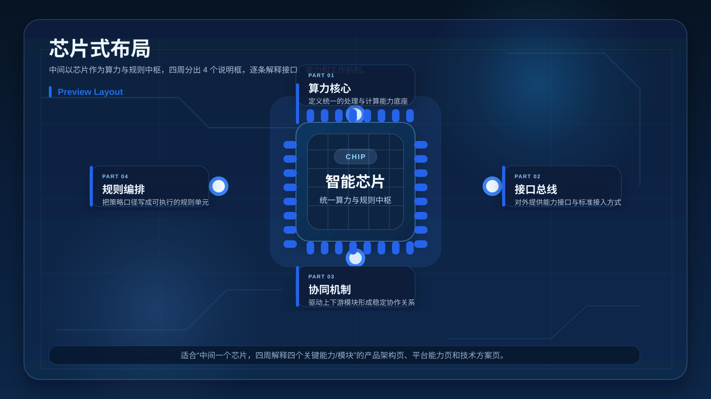

适用场景：

- 平台能力页
- 技术方案页
- 用“芯片”隐喻中枢能力，再拆出四个解释模块

关键字段：

- `title`
- `chip.title`
- `chip.text`
- `items[]`

示例：

```json
{
  "layout_type": "chip_explainer",
  "title": "平台中枢能力",
  "chip": {
    "title": "智能芯片",
    "text": "作为统一算力与规则中枢，向四个方向分发能力、接口与协同机制。"
  },
  "items": [
    {
      "tag": "PART 01",
      "title": "算力核心",
      "text": "定义统一的处理与计算能力底座"
    },
    {
      "tag": "PART 02",
      "title": "接口总线",
      "text": "对外提供能力接口与标准接入方式"
    },
    {
      "tag": "PART 03",
      "title": "协同机制",
      "text": "驱动上下游模块形成稳定协作关系"
    },
    {
      "tag": "PART 04",
      "title": "规则编排",
      "text": "把策略口径写成可执行的规则单元"
    }
  ]
}
```

### `petal_explainer`

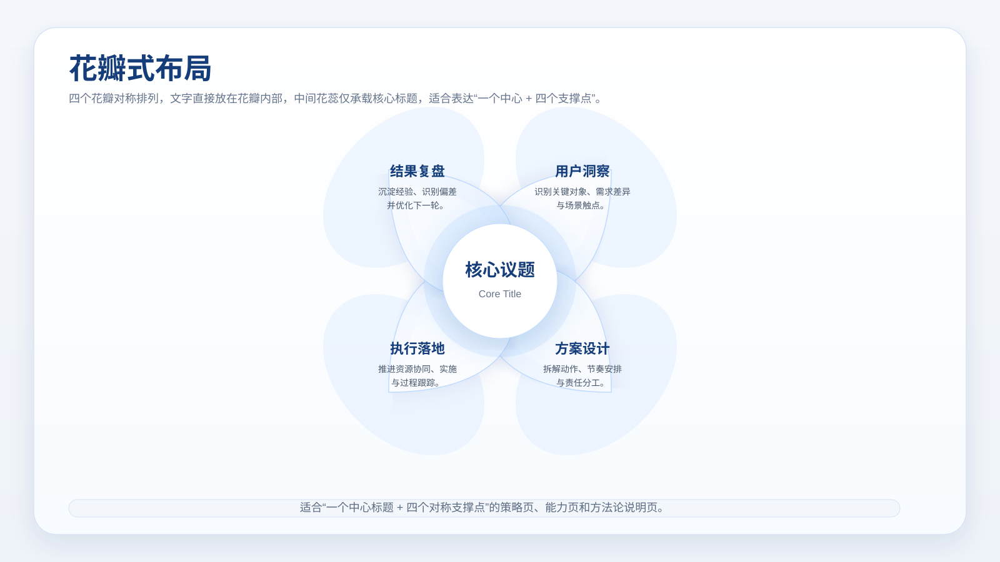

适用场景：

- 四个模块对称说明
- 能力花瓣图
- 核心主题 + 四个支撑点

关键字段：

- `title`
- `core_title`
- `items`

示例：

```json
{
  "layout_type": "petal_explainer",
  "title": "花瓣式能力结构",
  "core_title": "核心议题",
  "items": [
    { "title": "用户洞察", "text": "识别关键对象、需求与触点。" },
    { "title": "方案设计", "text": "拆解动作、节奏与责任分工。" },
    { "title": "执行落地", "text": "推进资源协同与任务闭环。" },
    { "title": "结果复盘", "text": "沉淀经验并优化下一轮动作。" }
  ]
}
```

### `fan_explainer`

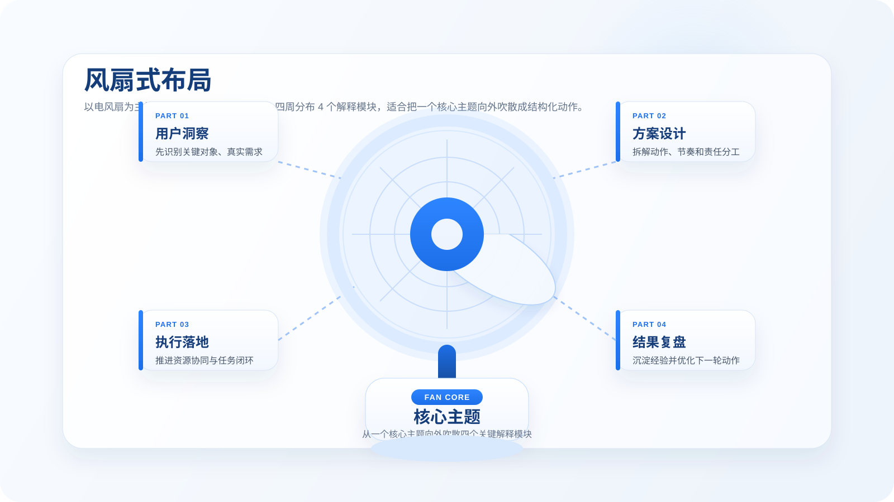

适用场景：

- 核心主题向外展开四个解释模块
- 比花瓣式更有方向感的说明页
- 想表达“展开、铺开、分层解释”的结构页

关键字段：

- `title`
- `core_title` 或 `core`
- `items`

示例：

```json
{
  "layout_type": "fan_explainer",
  "title": "折扇式结构说明",
  "core_title": "核心主题",
  "items": [
    { "title": "用户洞察", "text": "先识别关键对象、需求与触点。" },
    { "title": "方案设计", "text": "拆解动作、节奏与责任分工。" },
    { "title": "执行落地", "text": "推进资源协同与任务闭环。" },
    { "title": "结果复盘", "text": "沉淀经验并优化下一轮动作。" }
  ]
}
```

### `screen_explainer`

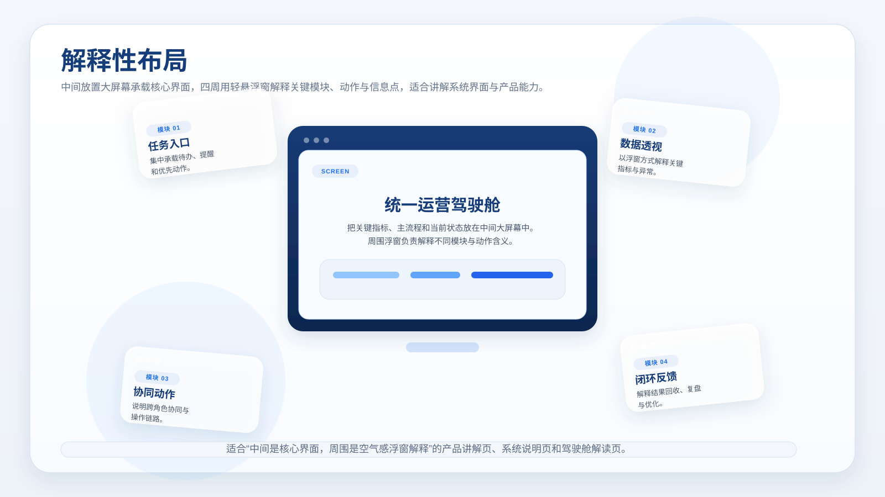

适用场景：

- 中心界面讲解
- 核心屏幕 + 周边说明
- 产品能力解释页

关键字段：

- `title`
- `screen`
- `items`

示例：

```json
{
  "layout_type": "screen_explainer",
  "title": "核心界面解释布局",
  "screen": {
    "tag": "SCREEN",
    "title": "统一运营驾驶舱",
    "text": "把关键指标、主流程和当前状态放在中间大屏幕中。"
  },
  "items": [
    { "title": "任务入口", "text": "集中承载待办、提醒和优先动作。" },
    { "title": "数据透视", "text": "以浮窗方式解释关键指标与异常。"},
    { "title": "协同动作", "text": "说明跨角色协同和操作链路。" },
    { "title": "闭环反馈", "text": "解释结果回收、复盘与优化。"}
  ]
}
```

## 跨页导航

[返回总入口](../layouts.md) | [上一类：封面、分段与泳道类](01-foundation-flow.md) | [下一类：结构、流程与架构页](03-structure-analysis.md)
