# 结构、流程与架构页

[返回总入口](../layouts.md) | [上一类：说明型与视觉中心页](02-explainers-visuals.md) | [下一类：图表、补充与计划页](04-data-extended.md)

## 本页目录

- [`stage_chevrons`](#stage_chevrons)
- [`stage_staircase`](#stage_staircase)
- [`stage_zigzag`](#stage_zigzag)
- [`development_route`](#development_route)
- [`cycle_explainer`](#cycle_explainer)
- [`svg_full`](#svg_full)
- [`two_column`](#two_column)
- [`symmetric_split`](#symmetric_split)
- [`three_column`](#three_column)
- [`problem_statement`](#problem_statement)
- [`before_after`](#before_after)
- [`kpi_cards`](#kpi_cards)
- [`steps`](#steps)
- [`four_grid`](#four_grid)
- [`matrix_2x2`](#matrix_2x2)
- [`quadrant_axes`](#quadrant_axes)
- [`architecture_layered`](#architecture_layered)
- [`dependency_graph`](#dependency_graph)
- [`fishbone`](#fishbone)

### `stage_chevrons`

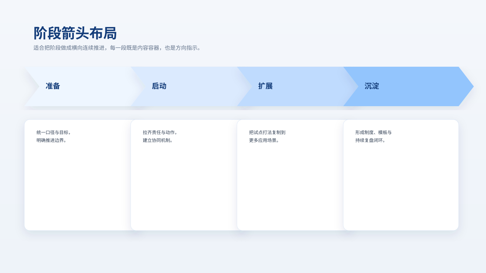

适用场景：

- 横向阶段推进
- 箭头式阶段分段
- 从前到后的连续流程

关键字段：

- `title`
- `stages`

示例：

```json
{
  "layout_type": "stage_chevrons",
  "title": "横向阶段推进",
  "stages": [
    { "title": "准备", "text": "统一口径与目标。" },
    { "title": "启动", "text": "明确动作与责任。" },
    { "title": "扩展", "text": "复制打法并扩大范围。" },
    { "title": "沉淀", "text": "形成机制与复盘闭环。" }
  ]
}
```

### `stage_staircase`

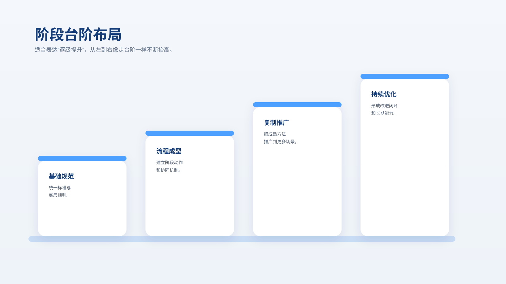

适用场景：

- 台阶式阶段提升
- 成熟度逐级上升
- 从基础到高阶的过程展示

关键字段：

- `title`
- `stages`

示例：

```json
{
  "layout_type": "stage_staircase",
  "title": "台阶式阶段提升",
  "stages": [
    { "title": "基础规范", "text": "统一标准和底层规则。" },
    { "title": "流程成型", "text": "建立阶段动作和协同机制。" },
    { "title": "复制推广", "text": "把成熟方法推广到更多场景。" },
    { "title": "持续优化", "text": "形成改进闭环和长期能力。" }
  ]
}
```

### `stage_zigzag`

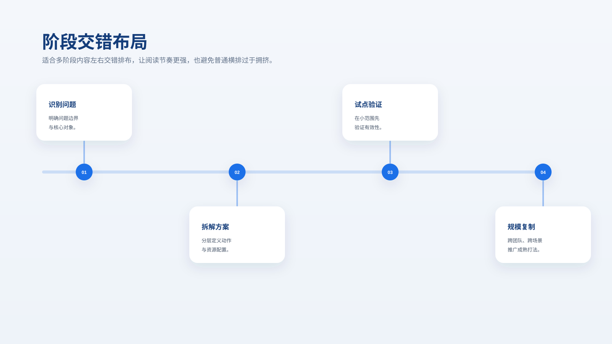

适用场景：

- 左右交错阶段链路
- 节奏感较强的阶段页
- 需要避免横向拥挤的多阶段说明

关键字段：

- `title`
- `stages`

示例：

```json
{
  "layout_type": "stage_zigzag",
  "title": "交错阶段链路",
  "stages": [
    { "title": "识别问题", "text": "明确问题边界与核心对象。" },
    { "title": "拆解方案", "text": "分层定义动作与资源。" },
    { "title": "试点验证", "text": "在小范围验证有效性。" },
    { "title": "规模复制", "text": "跨团队、跨场景推广。" }
  ]
}
```

### `development_route`

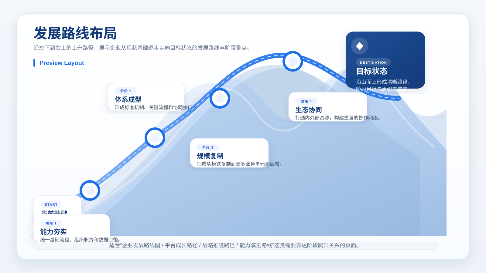

适用场景：

- 企业发展路线图
- 平台成长路径
- 战略推进路线
- 能力演进路径

关键字段：

- `title`
- `base_label`
- `stages[]`
- `destination`

示例：

```json
{
  "layout_type": "development_route",
  "title": "企业发展路线图",
  "base_label": "当前基础",
  "stages": [
    {
      "phase": "阶段 1",
      "title": "能力夯实",
      "text": "统一基础流程、组织职责和数据口径。"
    },
    {
      "phase": "阶段 2",
      "title": "体系成型",
      "text": "形成标准机制、关键流程和协同接口。"
    },
    {
      "phase": "阶段 3",
      "title": "规模复制",
      "text": "把成功模式复制到更多业务单元和区域。"
    },
    {
      "phase": "阶段 4",
      "title": "生态协同",
      "text": "打通内外部资源，构建更强的协作网络。"
    }
  ],
  "destination": {
    "title": "目标状态",
    "text": "形成清晰的发展路径、阶段目标与组织支撑能力。"
  }
}
```

### `cycle_explainer`

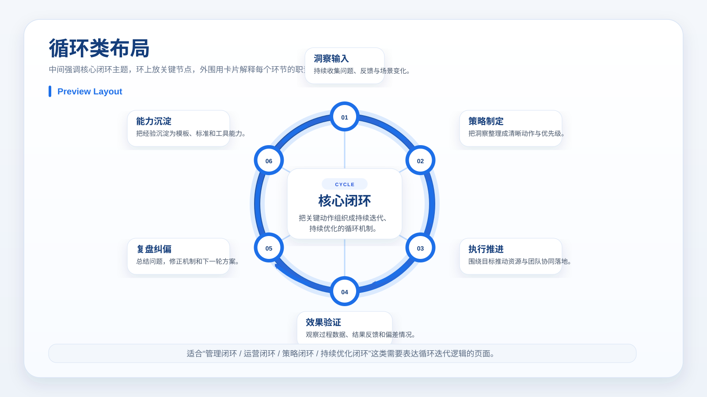

适用场景：

- 管理闭环
- 运营闭环
- 策略闭环
- 持续优化循环

关键字段：

- `title`
- `center`
- `items`

示例：

```json
{
  "layout_type": "cycle_explainer",
  "title": "经营闭环机制",
  "center": {
    "title": "核心闭环",
    "text": "把关键动作组织成持续迭代、持续优化的循环机制。"
  },
  "items": [
    { "tag": "01", "title": "洞察输入", "text": "持续收集问题、反馈与场景变化。" },
    { "tag": "02", "title": "策略制定", "text": "把洞察整理成清晰动作与优先级。" },
    { "tag": "03", "title": "执行推进", "text": "围绕目标推动资源与团队协同落地。" },
    { "tag": "04", "title": "效果验证", "text": "观察过程数据、结果反馈和偏差情况。" },
    { "tag": "05", "title": "复盘纠偏", "text": "总结问题，修正机制和下一轮方案。" },
    { "tag": "06", "title": "能力沉淀", "text": "把经验沉淀为模板、标准和工具能力。" }
  ]
}
```

### `svg_full`

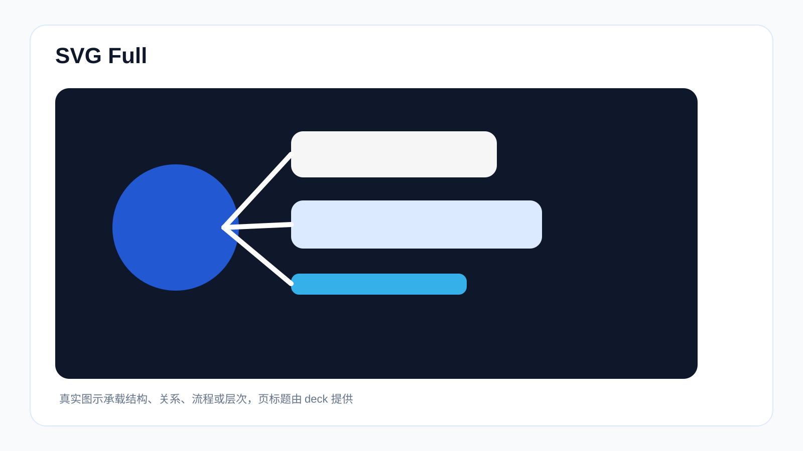

适用场景：

- 结构图
- 关系图
- 工作原理图
- 三层结构图
- 需要真实图形表达的概念页

关键字段：

- `title`
- `svg.src`
- `svg.alt`
- `svg.caption`
- `show_title`

示例：

```json
{
  "layout_type": "svg_full",
  "title": "从 Prompt Engineering 到 Harness Engineering",
  "show_title": true,
  "svg": {
    "src": "work/assets/001-evolution-compare.svg",
    "alt": "三代工程演进关系图",
    "caption": "用真实 SVG 承载结构和关系，而不是继续堆 bullet。"
  }
}
```

使用约束：

- SVG 内不重复写页标题
- 画面尽量填满 16:9
- 优先用卡片、箭头、分层、关系线表达
- 不要把 `svg_full` 当成“换个容器继续放大段文字”
- 如果当前 viewer 里没有完全匹配的新 layout，允许直接用 `svg_full` + `work/assets/*.svg` 落地；待复用稳定后，再沉淀成独立 layout

### `two_column`

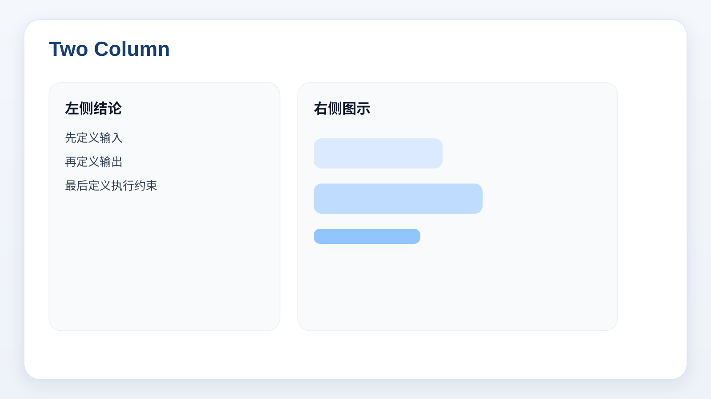

适用场景：

- 左文右图
- 左结论右说明
- 左原则右示意

关键字段：

- `title`
- `left`
- `right`

示例：

```json
{
  "layout_type": "two_column",
  "title": "Skill 的基本职责",
  "left": {
    "title": "左侧结论",
    "bullets": ["先定义输入", "再定义输出", "最后定义执行约束"]
  },
  "right": {
    "title": "右侧图示",
    "image": {
      "src": "work/assets/001-skill-template.svg",
      "caption": "Skill 模板示意"
    }
  }
}
```

### `symmetric_split`

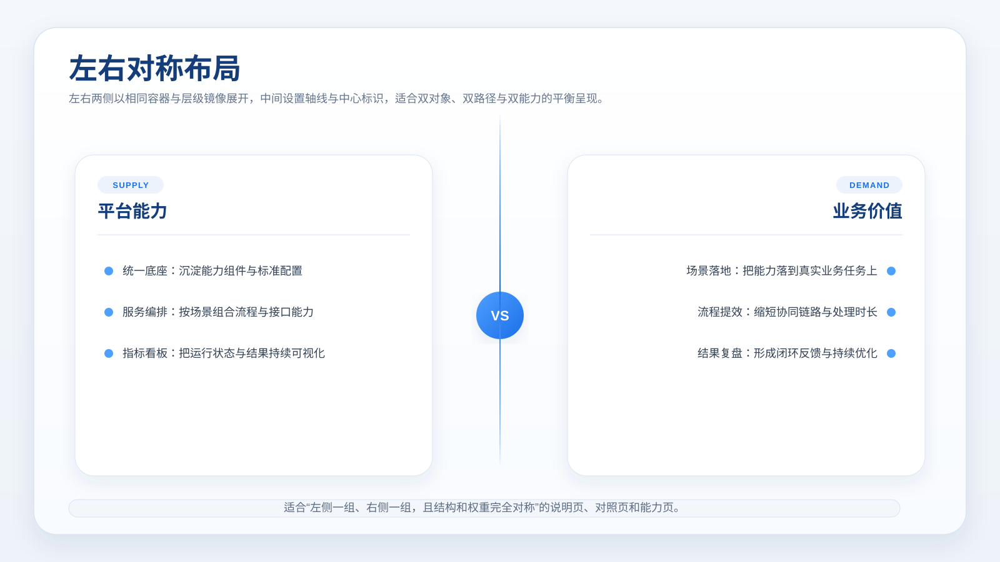

适用场景：

- 左右双侧对称说明
- 两个对象并列展开
- 两类能力 / 两条路径镜像展示

关键字段：

- `title`
- `center_label`（可选）
- `left`
- `right`

示例：

```json
{
  "layout_type": "symmetric_split",
  "title": "能力体系左右对称布局",
  "center_label": "VS",
  "left": {
    "tag": "供给侧",
    "title": "平台能力",
    "bullets": ["统一底座", "服务编排", "指标看板"]
  },
  "right": {
    "tag": "需求侧",
    "title": "业务价值",
    "bullets": ["场景落地", "流程提效", "结果复盘"]
  }
}
```

### `three_column`

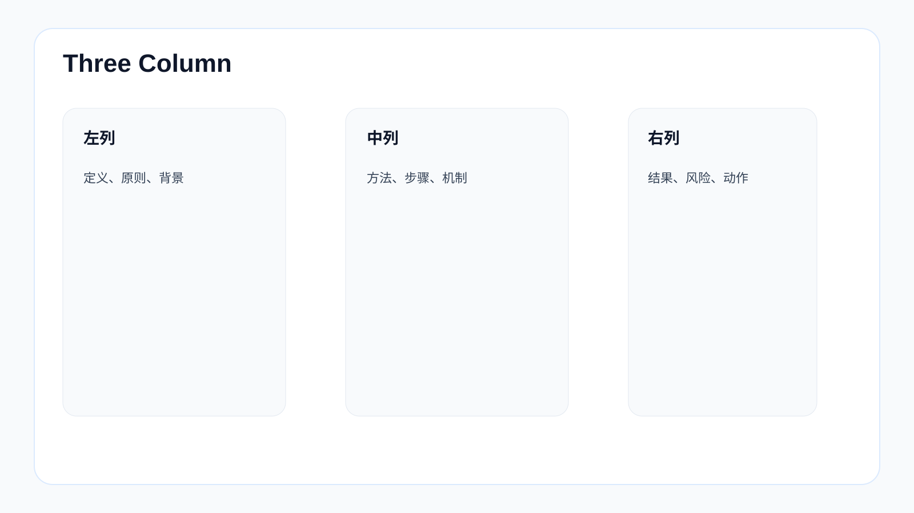

适用场景：

- 三段式拆解
- 三个并列观点
- 三类对象对照

关键字段：

- `title`
- `columns`

示例：

```json
{
  "layout_type": "three_column",
  "title": "Harness 的三个核心层",
  "columns": [
    { "title": "输入层", "bullets": ["接收需求", "读取上下文"] },
    { "title": "执行层", "bullets": ["生成结果", "调用工具"] },
    { "title": "验证层", "bullets": ["检查质量", "回改输出"] }
  ]
}
```

### `problem_statement`

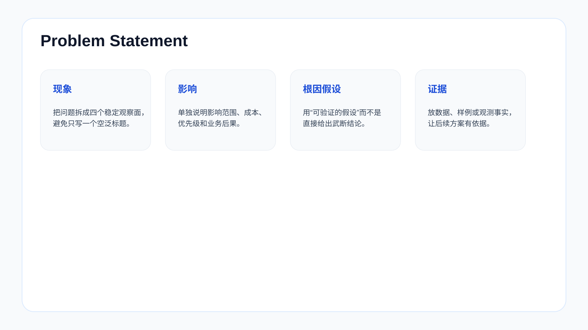

适用场景：

- 问题定义
- 方案前置说明
- 先界定问题，再进入解法

关键字段：

- `title`
- `blocks`

示例：

```json
{
  "layout_type": "problem_statement",
  "title": "为什么不能只靠一次生成",
  "blocks": [
    { "title": "现象", "text": "同一请求多次生成结果差异大。" },
    { "title": "影响", "text": "页面风格和结构不稳定。" },
    { "title": "根因", "text": "缺少固定流程与质量门。" }
  ]
}
```

### `before_after`

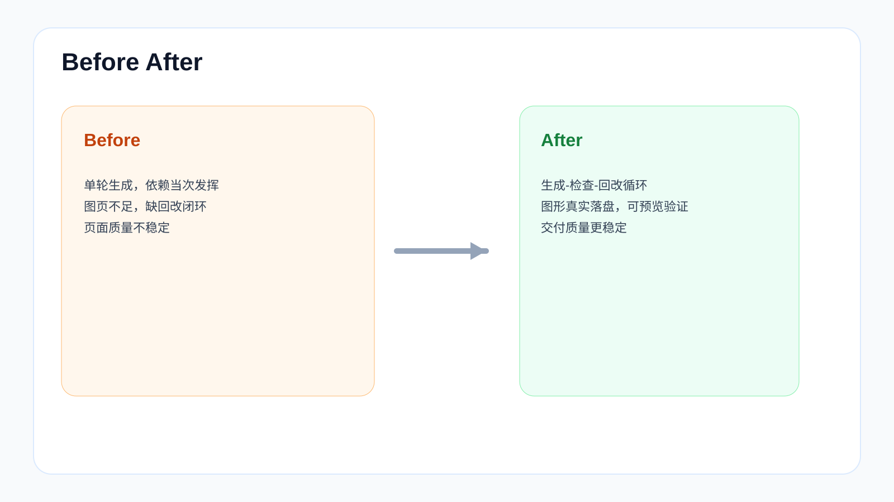

适用场景：

- 改造前后对照
- 单轮方式与闭环方式对照
- 旧方案与新方案对照

关键字段：

- `title`
- `before`：`title` + `text`（段落，可选） + `bullets`（列表，可选），二者可共存也可只填其一
- `after`：`title` + `text`（段落，可选） + `bullets`（列表，可选），同上

bullets 模式示例：

```json
{
  "layout_type": "before_after",
  "title": "Prompt 到 Harness 的变化",
  "before": { "title": "Before", "bullets": ["单轮问答", "靠模型临场发挥"] },
  "after": { "title": "After", "bullets": ["流程化执行", "带质检和回改"] }
}
```

text 模式示例：

```json
{
  "layout_type": "before_after",
  "title": "生成方式对比",
  "before": { "title": "传统做法", "text": "单次生成，缺少回改机制。每次修改需从零开始，没有质量保障环节，交付质量不稳定。" },
  "after": { "title": "Visual-Spec", "text": "生成-检查-回改循环。图形真实落盘可预览验证，每一步都有质检节点，交付质量稳定可控。" }
}
```

### `kpi_cards`

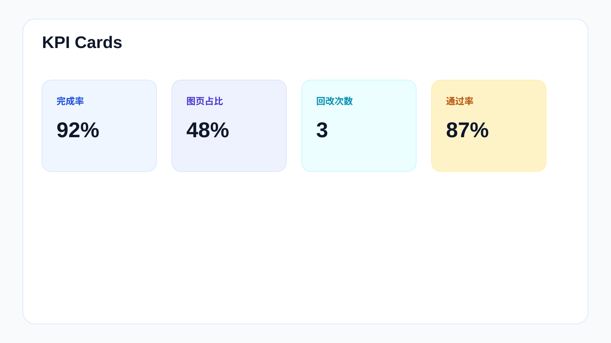

适用场景：

- 核心指标总览
- 一页展示多个关键数值
- 开场或总结的指标摘要

关键字段：

- `title`
- `cards`

示例：

```json
{
  "layout_type": "kpi_cards",
  "title": "本轮交付指标",
  "cards": [
    { "label": "页数", "value": "24", "note": "含结构图 9 页" },
    { "label": "图页占比", "value": "42%", "note": "优先 SVG" },
    { "label": "返工轮次", "value": "2", "note": "detail 阶段回改" }
  ]
}
```

### `steps`

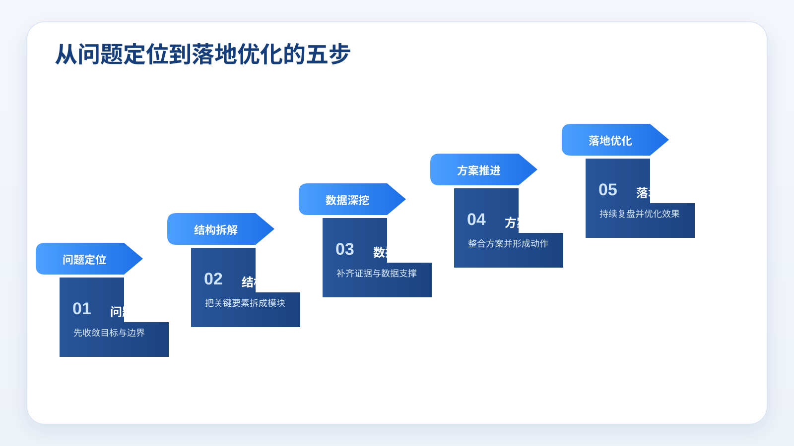

适用场景：

- 顺序步骤
- 执行流程
- 线性推进链路

关键字段：

- `title`
- `steps[].title`
- `steps[].icon`
- `steps[].text`
- `steps[].bullets`

示例：

```json
{
  "layout_type": "steps",
  "title": "数据贯通：全链路集成与追溯",
  "steps": [
    {
      "title": "统一编码体系",
      "icon": "plan",
      "text": "先统一主键和口径，打通跨系统映射。",
      "bullets": ["统一物料、设备、工位、组织编码", "贯穿 ERP → MES → WMS 全链条"]
    },
    {
      "title": "NTP 时间同步",
      "icon": "fit",
      "text": "保证多系统事件顺序可严格还原。",
      "bullets": ["全系统毫秒级时钟对齐", "支撑追溯、审计与异常回放"]
    },
    {
      "title": "全链路追溯",
      "icon": "flow",
      "text": "同时支持正向和反向追溯，覆盖完整工艺路线。",
      "bullets": ["正向：原料 → 半成品 → 成品", "反向：成品 → 原料批次"]
    }
  ]
}
```

### `four_grid`

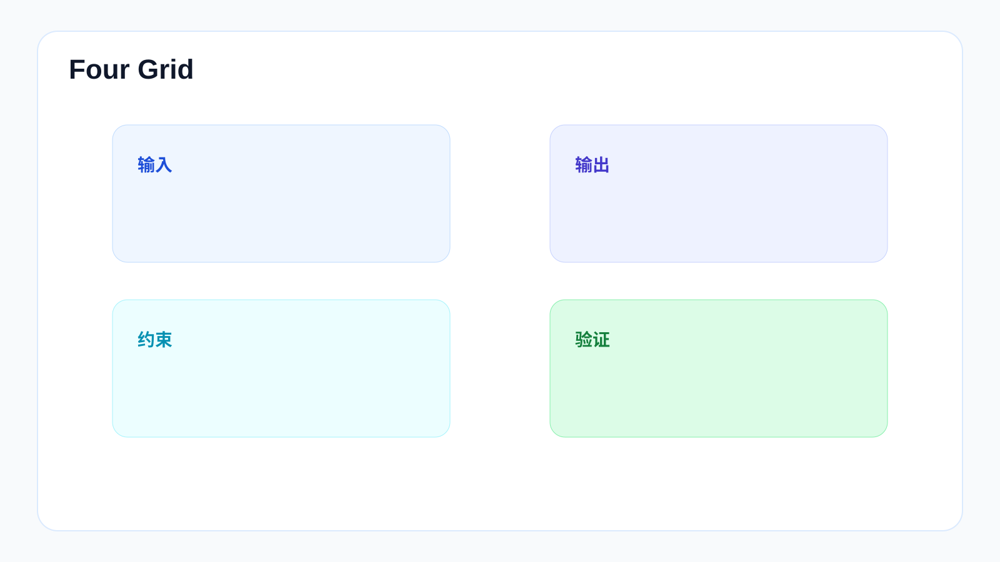

适用场景：

- 四象限解释
- 四部分拆解
- 输入/输出/约束/验证

关键字段：

- `title`
- `items`

示例：

```json
{
  "layout_type": "four_grid",
  "title": "Skill 的四个关注点",
  "items": [
    { "title": "输入", "bullets": ["读取原始需求"] },
    { "title": "结构", "bullets": ["规划章节顺序"] },
    { "title": "表达", "bullets": ["匹配合适 layout"] },
    { "title": "验证", "bullets": ["检查超屏和缺图"] }
  ]
}
```

### `matrix_2x2`

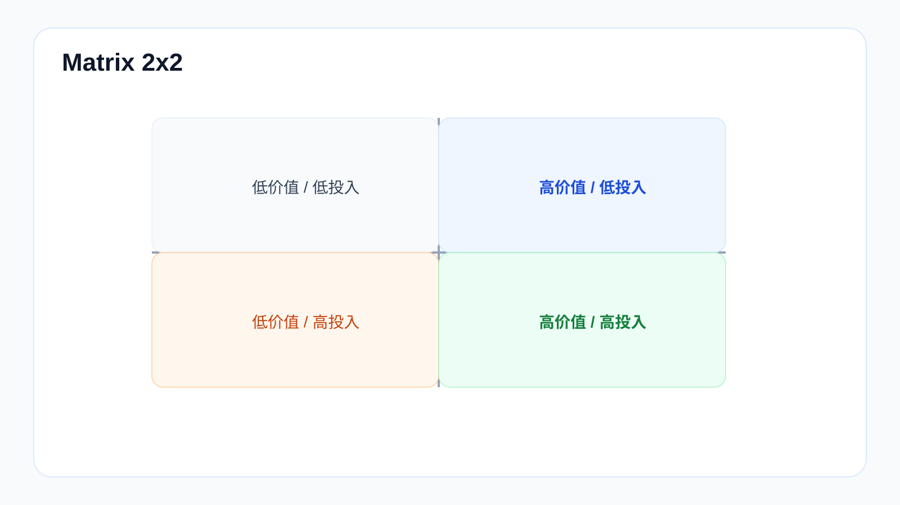

适用场景：

- 二维判断
- 价值/投入分类
- 优先级划分

关键字段：

- `title`
- `quadrants`

示例：

```json
{
  "layout_type": "matrix_2x2",
  "title": "任务优先级矩阵",
  "quadrants": [
    { "title": "高价值低投入", "bullets": ["优先推进"] },
    { "title": "高价值高投入", "bullets": ["纳入计划"] },
    { "title": "低价值低投入", "bullets": ["按需处理"] },
    { "title": "低价值高投入", "bullets": ["避免投入"] }
  ]
}
```

### `quadrant_axes`

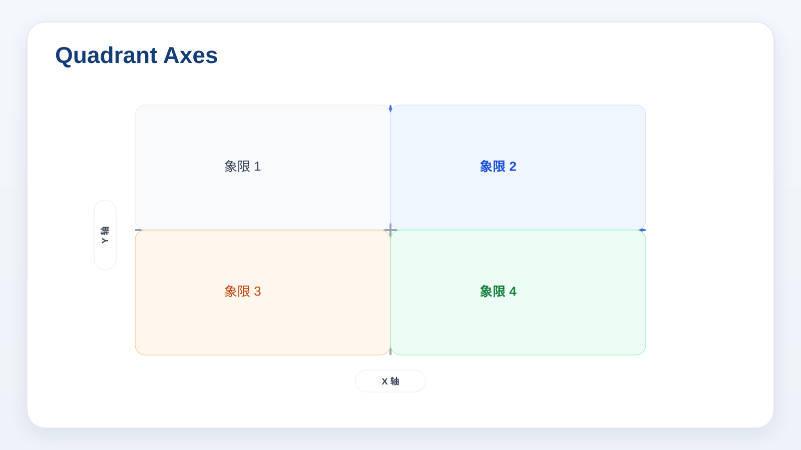

适用场景：

- 四象限分类，同时需要明确横纵轴含义
- 影响/投入、收益/风险等二维坐标解释
- 需要让观众“一眼看懂坐标轴”的四象限页

关键字段：

- `title`
- `x_label`
- `y_label`
- `quadrants`

示例：

```json
{
  "layout_type": "quadrant_axes",
  "title": "价值-投入象限",
  "x_label": "投入",
  "y_label": "价值",
  "quadrants": [
    { "title": "低投入 / 高价值", "bullets": ["优先推进"] },
    { "title": "高投入 / 高价值", "bullets": ["纳入计划"] },
    { "title": "低投入 / 低价值", "bullets": ["按需处理"] },
    { "title": "高投入 / 低价值", "bullets": ["避免投入"] }
  ]
}
```

### `architecture_layered`

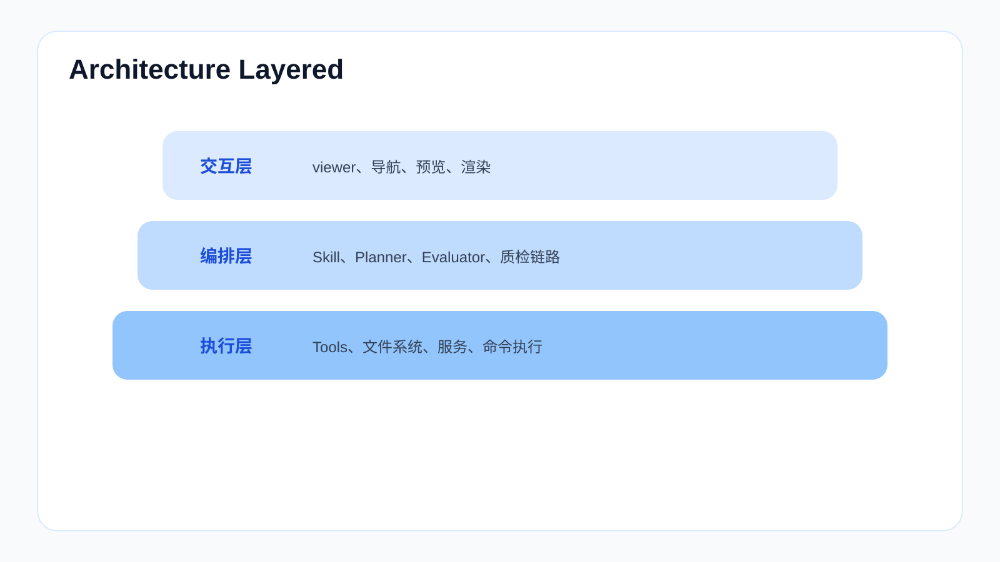

适用场景：

- 分层架构
- 系统组成
- 能力栈说明
- 底座 -> 平台 -> 场景应用

关键字段：

- `title`
- `layers[].title`
- `layers[].icon`
- `layers[].text`
- `layers[].bullets`

示例：

```json
{
  "layout_type": "architecture_layered",
  "title": "AI 建设内容分层",
  "layers": [
    {
      "title": "数字化底座的数据汇总",
      "icon": "database",
      "text": "统一汇聚系统数据、业务事件、设备时序和文档知识。",
      "bullets": ["主数据 / 事件数据 / 时序数据 / 知识库", "先把 AI 可用的数据基础打稳"]
    },
    {
      "title": "AI 基础设施",
      "icon": "workflow",
      "text": "提供模型服务、知识库、算力与统一安全控制。",
      "bullets": ["模型编排", "推理网关", "权限 / 审计 / 集成"]
    },
    {
      "title": "三类 AI 分析系统",
      "icon": "scale",
      "text": "最终支撑业务 AI、研发 AI、办公 AI 三类应用。",
      "bullets": ["质量预测 / 排产优化", "编码辅助 / 测试生成", "文档生成 / 企业搜索"]
    }
  ]
}
```

### `dependency_graph`

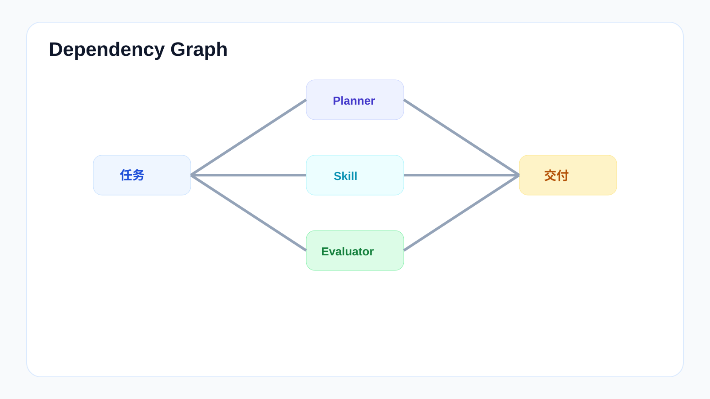

适用场景：

- 角色依赖
- 模块依赖
- 从任务到交付的关系网络

关键字段：

- `title`
- `nodes`
- `links`

示例：

```json
{
  "layout_type": "dependency_graph",
  "title": "产物关系图",
  "nodes": [
    { "id": "input", "label": "input" },
    { "id": "outline", "label": "outline.json" },
    { "id": "slides", "label": "slides/*.json" },
    { "id": "viewer", "label": "ppt-viewer" }
  ],
  "links": [
    { "source": "input", "target": "outline" },
    { "source": "outline", "target": "slides" },
    { "source": "slides", "target": "viewer" }
  ]
}
```

### `fishbone`

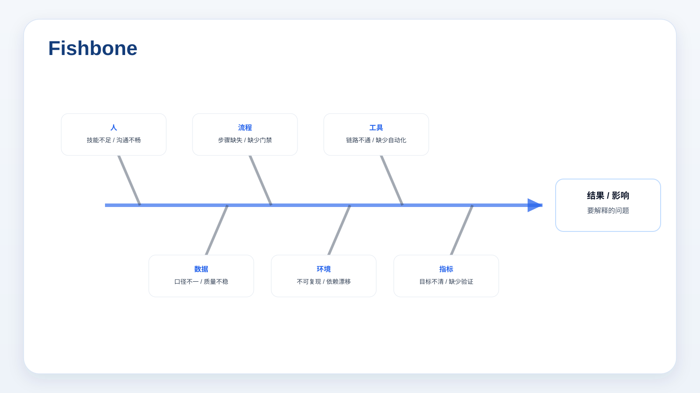

适用场景：

- 根因分析
- 复盘页：为什么没做好 / 为什么丢图 / 为什么超屏
- 需要从多个维度同时拆解原因时

关键字段：

- `title`
- `effect`
- `bones`

示例：

```json
{
  "layout_type": "fishbone",
  "title": "为什么“左右箭头丢失”",
  "effect": "流程图箭头在页面里没显示",
  "bones": [
    { "category": "素材", "causes": ["箭头使用 marker 未定义", "fill/opacity 被覆盖"] },
    { "category": "渲染", "causes": ["SVG 缩放后线太细", "样式被全局覆盖"] },
    { "category": "规范", "causes": ["缺少 SVG 自检", "缺少回归样例"] },
    { "category": "流程", "causes": ["只改了图没预览", "没走整套门禁"] }
  ]
}
```

## 跨页导航

[返回总入口](../layouts.md) | [上一类：说明型与视觉中心页](02-explainers-visuals.md) | [下一类：图表、补充与计划页](04-data-extended.md)
