# 图表、补充与计划页

[返回总入口](../layouts.md) | [上一类：结构、流程与架构页](03-structure-analysis.md)

## 本页目录

- [`bar_chart`](#bar_chart)
- [`line_chart`](#line_chart)
- [`agenda`](#agenda)
- [`summary`](#summary)
- [`thank_you`](#thank_you)
- [`appendix`](#appendix)
- [`quote`](#quote)
- [`triple_metrics`](#triple_metrics)
- [`swot`](#swot)
- [`pyramid`](#pyramid)
- [`logic_tree`](#logic_tree)
- [`icicle_tree`](#icicle_tree)
- [`process_flow`](#process_flow)
- [`timeline`](#timeline)
- [`roadmap`](#roadmap)
- [`milestones`](#milestones)
- [`org_roles`](#org_roles)
- [`risk_register`](#risk_register)
- [`pie_chart`](#pie_chart)
- [`donut_chart`](#donut_chart)
- [`area_chart`](#area_chart)
- [`coordinate_axis`](#coordinate_axis)
- [`scatter_plot`](#scatter_plot)
- [`bubble_chart`](#bubble_chart)
- [`waterfall_chart`](#waterfall_chart)
- [`funnel_chart`](#funnel_chart)
- [`heatmap`](#heatmap)
- [`treemap`](#treemap)
- [`sankey`](#sankey)
- [`gauge`](#gauge)
- [`radar_chart`](#radar_chart)
- [`impact_effort`](#impact_effort)
- [`gantt_chart`](#gantt_chart)
- [`mind_map`](#mind_map)
- [`top_bottom`](#top_bottom)
- [`nine_grid`](#nine_grid)
- [`journey_map`](#journey_map)
- [`plan_table`](#plan_table)
- [`cost_benefit`](#cost_benefit)
- [`raci`](#raci)
- [`target_map`](#target_map)
- [`sector_explainer`](#sector_explainer)
- [`upward_arrows`](#upward_arrows)
- [`kanban_board`](#kanban_board)
- [`month_calendar`](#month_calendar)
- [`case_study`](#case_study)
- [`evidence_gallery`](#evidence_gallery)

### `bar_chart`

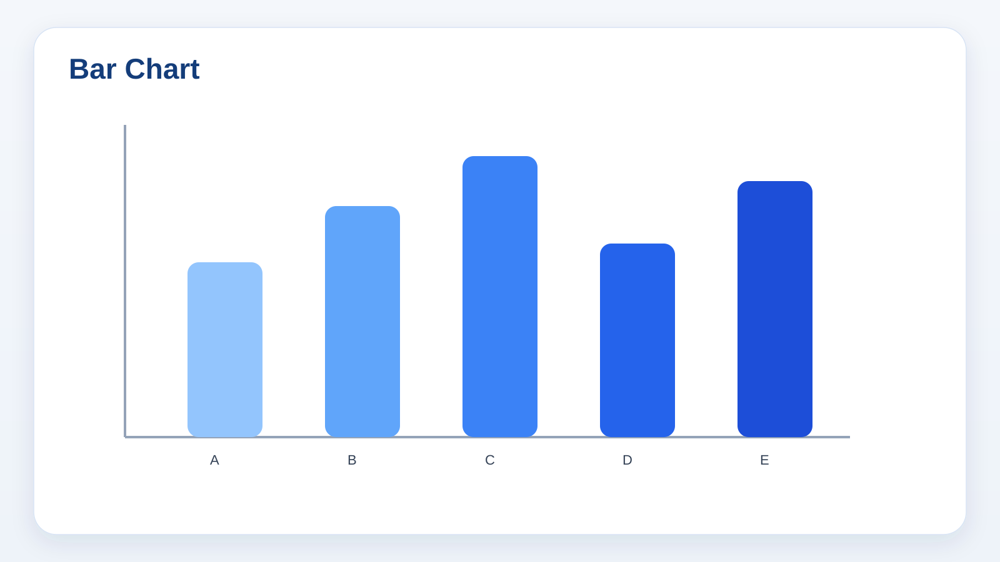

适用场景：

- 分类数据对比
- 指标排名
- 数量级展示

关键字段：

- `title`
- `data` 或 `series`

示例：

```json
{
  "layout_type": "bar_chart",
  "title": "不同页面类型数量",
  "unit": "页",
  "data": [
    { "label": "文字页", "value": 6 },
    { "label": "图形页", "value": 10 },
    { "label": "图表页", "value": 4 }
  ]
}
```

### `line_chart`

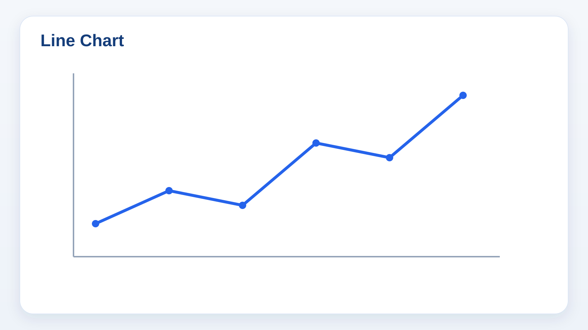

适用场景：

- 趋势变化
- 时间序列
- 指标曲线

关键字段：

- `title`
- `data` 或 `series`

示例：

```json
{
  "layout_type": "line_chart",
  "title": "生成质量迭代趋势",
  "unit": "分",
  "data": [
    { "label": "第 1 轮", "value": 68 },
    { "label": "第 2 轮", "value": 79 },
    { "label": "第 3 轮", "value": 88 }
  ]
}
```

## 补充 Layout

### `agenda`

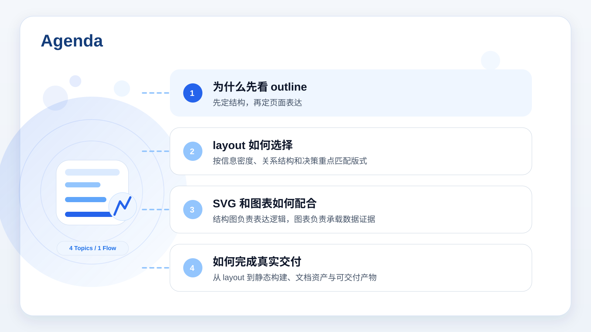

适用场景：

- 目录页
- 章节预告
- 开场时说明整套内容节奏

关键字段：

- `title`
- `bullets`

示例：

```json
{
  "layout_type": "summary",
  "title": "本节总结",
  "bullets": ["先定结构，再定内容", "优先图形化表达", "每轮都做质检和预览"]
}
```

### `summary`

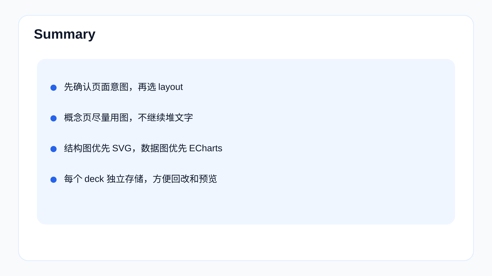

适用场景：

- 结尾总结
- 阶段回顾
- 一页归纳核心结论

关键字段：

- `title`
- `bullets`

### `thank_you`

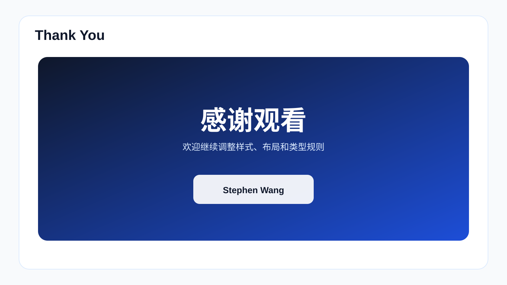

适用场景：

- 收尾页
- 致谢页
- 结束后的联系方式或行动引导

关键字段：

- `title`
- `subtitle`

示例：

```json
{
  "layout_type": "thank_you",
  "title": "感谢观看",
  "subtitle": "欢迎继续 fork 和扩展这套系统"
}
```

### `appendix`

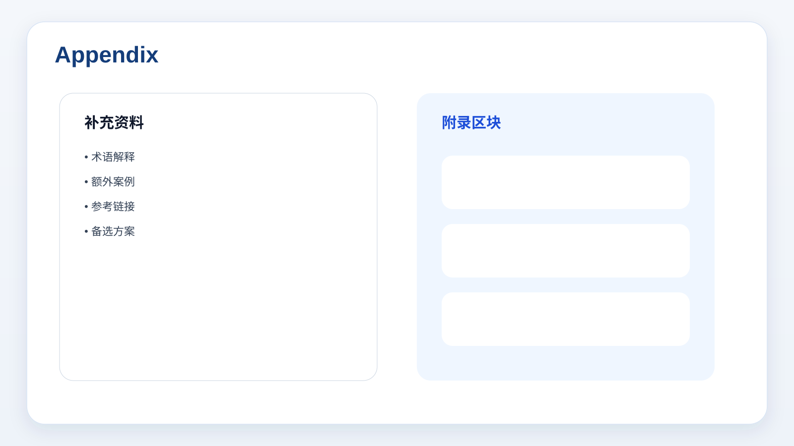

适用场景：

- 补充材料
- 备份页
- 延伸说明和参考链接

关键字段：

- `title`
- `bullets`

示例：

```json
{
  "layout_type": "appendix",
  "title": "附录",
  "bullets": ["术语解释", "补充截图", "参考链接"]
}
```

### `quote`

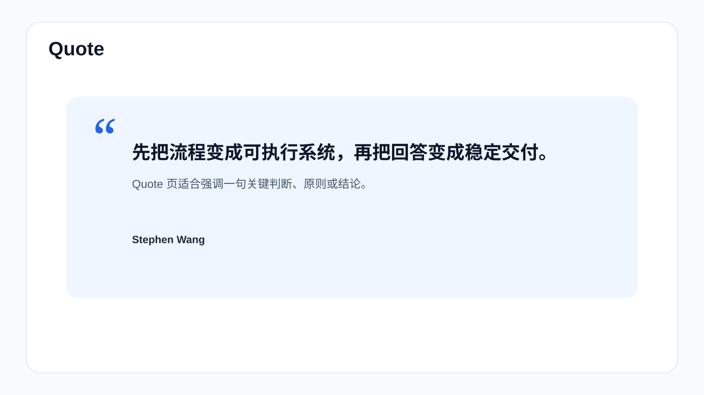

适用场景：

- 强调一句关键原则
- 插入观点页
- 引用原话或方法论判断

关键字段：

- `title`
- `quote`
- `by`
- `notes`

示例：

```json
{
  "layout_type": "quote",
  "title": "关键判断",
  "quote": "先把流程变成可执行系统，再把回答变成稳定交付。",
  "by": "Stephen Wang",
  "notes": "适合作为阶段总结页。"
}
```

### `triple_metrics`

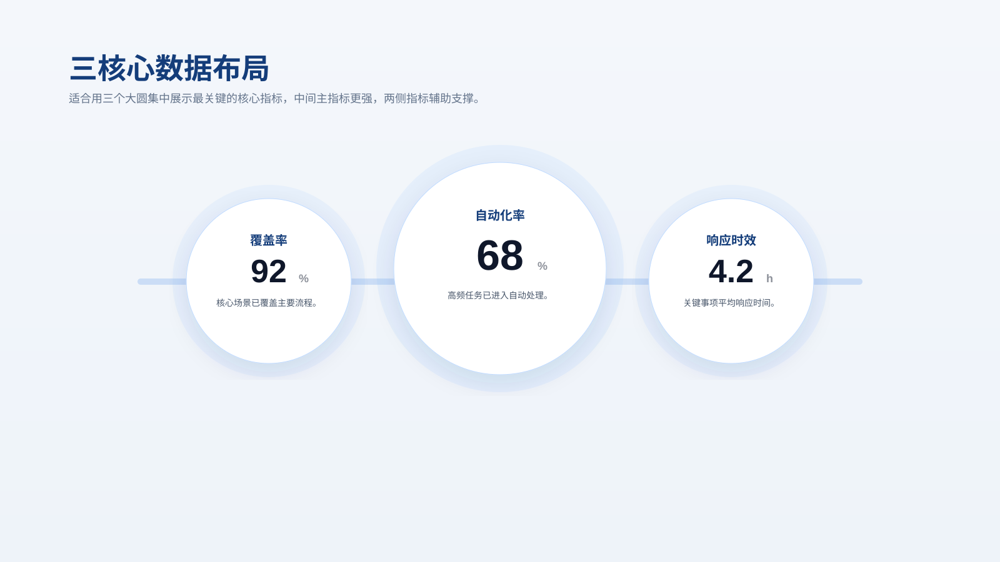

适用场景：

- 三个核心数据展示
- 三大指标并列对比
- 三圆式数据概览

关键字段：

- `title`
- `metrics`

示例：

```json
{
  "layout_type": "triple_metrics",
  "title": "三大核心指标",
  "metrics": [
    { "label": "覆盖率", "value": 92, "unit": "%", "note": "核心场景已覆盖主要流程。" },
    { "label": "自动化率", "value": 68, "unit": "%", "note": "高频任务已进入自动处理。" },
    { "label": "响应时效", "value": 4.2, "unit": "h", "note": "关键事项平均响应时间。" }
  ]
}
```

### `swot`

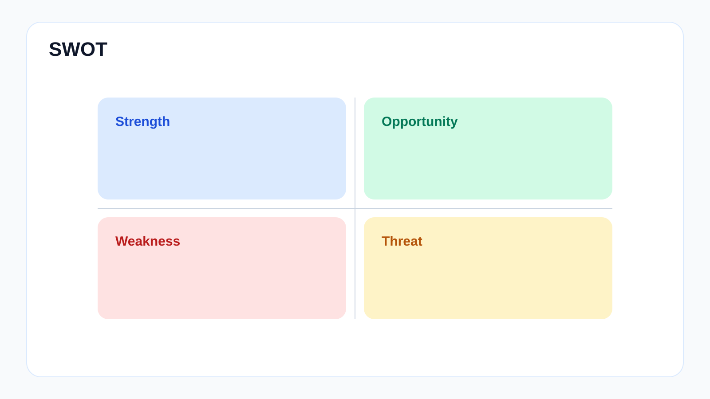

适用场景：

- 优势劣势分析
- 内外部条件分析
- 战略判断的四象限表达

关键字段：

- `title`
- `quadrants`

示例：

```json
{
  "layout_type": "swot",
  "title": "Skill 工程化 SWOT",
  "quadrants": [
    { "title": "Strength", "bullets": ["可复用", "可验证"] },
    { "title": "Weakness", "bullets": ["前期搭建成本高"] },
    { "title": "Opportunity", "bullets": ["可扩展更多类型"] },
    { "title": "Threat", "bullets": ["规范不一致会退化"] }
  ]
}
```

### `pyramid`

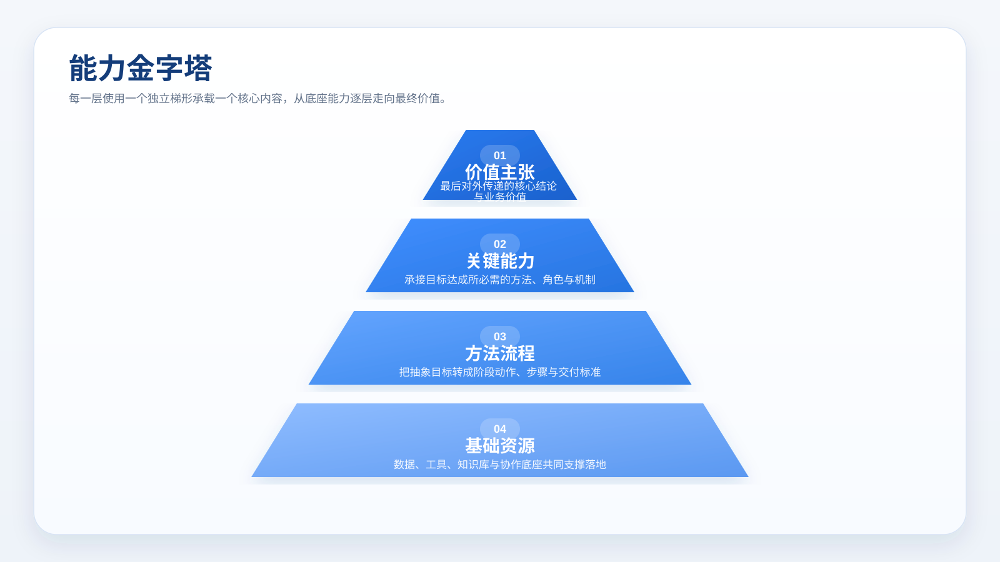

适用场景：

- 每层一个梯形承载一个核心内容
- 从基础到高阶的能力栈
- 金字塔式结论归纳

关键字段：

- `title`
- `levels` 或 `blocks`
- `levels[].title`
- `levels[].text?`
- `levels[].bullets?`

示例：

```json
{
  "layout_type": "pyramid",
  "title": "能力金字塔",
  "levels": [
    { "title": "基础资源", "text": "数据、工具和知识资产共同构成底座。" },
    { "title": "执行流程", "text": "把目标拆成阶段动作、责任人与交付物。" },
    { "title": "质量闭环", "text": "通过检查、反馈和复盘提升稳定性。" },
    { "title": "稳定交付", "text": "最终沉淀成可以持续复用的业务价值。" }
  ]
}
```

### `logic_tree`

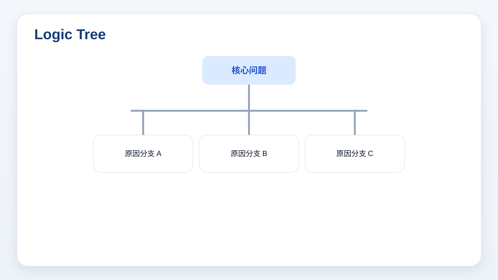

适用场景：

- 问题拆解
- 原因分析
- 方案树和逻辑分支

关键字段：

- `title`
- `root`

示例：

```json
{
  "layout_type": "logic_tree",
  "title": "页面质量问题拆解",
  "root": {
    "text": "为什么页面不好看",
    "children": [
      { "text": "layout 选择不对" },
      { "text": "图形表达不足" },
      { "text": "文字过密" }
    ]
  }
}
```

### `icicle_tree`

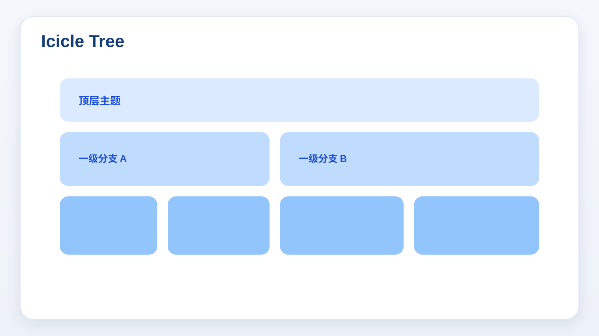

适用场景：

- 分层展开的树状结构
- 自上而下的分类体系
- 需要强调从整体到局部的结构页

关键字段：

- `title`
- `root`

示例：

```json
{
  "layout_type": "icicle_tree",
  "title": "文档结构树",
  "root": {
    "text": "docs",
    "children": [
      { "text": "manual" },
      { "text": "concept" },
      { "text": "layouts" },
      { "text": "fork" }
    ]
  }
}
```

### `process_flow`

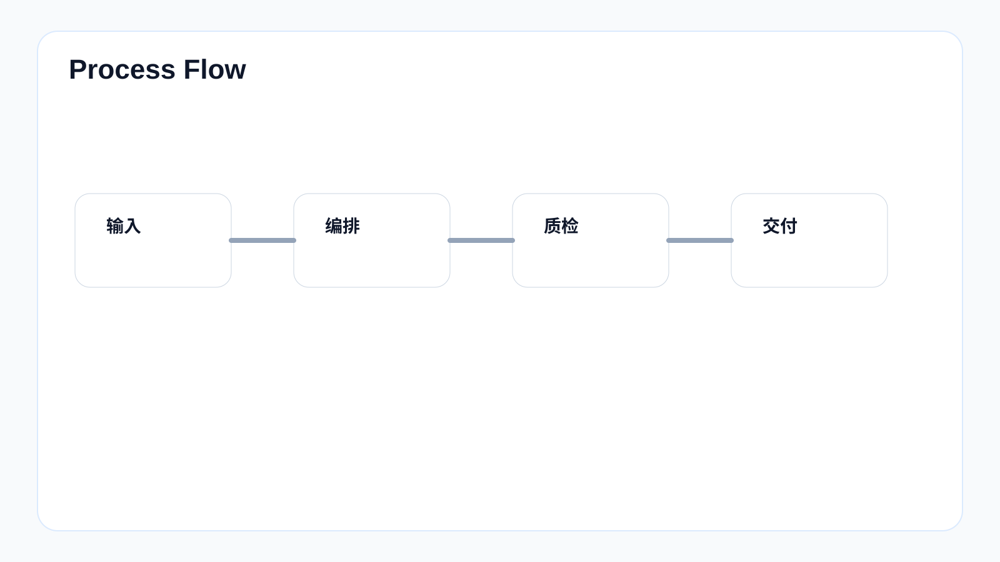

适用场景：

- 线性流程说明
- 系统处理链路
- 先后顺序明确的动作页

关键字段：

- `title`
- `steps`
- `footer_cards`（可选）
- `summary`（可选）
- `steps[].title`
- `steps[].subtitle`
- `steps[].text`
- `steps[].bullets`
- `steps[].icon`
- `steps[].panels`（可选，步骤内子卡片）

示例：

```json
{
  "layout_type": "process_flow",
  "title": "从输入到预览的处理流",
  "steps": [
    {
      "title": "读取输入",
      "subtitle": "读取用户要求与约束",
      "bullets": ["识别语言", "识别类型", "识别资料来源"]
    },
    {
      "title": "生成 outline",
      "subtitle": "先形成章节骨架",
      "bullets": ["提取主线", "控制页数", "分配章节意图"]
    },
    {
      "title": "展开 detail",
      "subtitle": "为每页补结构化字段",
      "bullets": ["选择 layout", "补标题与卡片", "补表格/图表数据"]
    },
    {
      "title": "前端渲染",
      "subtitle": "viewer 直接预览",
      "bullets": ["组件渲染", "缺项兜底", "导出前检查"]
    }
  ],
  "footer_cards": [
    { "title": "输入", "text": "用户要求 + 资料" },
    { "title": "输出", "text": "outline / slides / deck" }
  ],
  "summary": "适合线性流程说明、输入输出链路、阶段步骤 + 输出成果页。"
}
```

### `timeline`

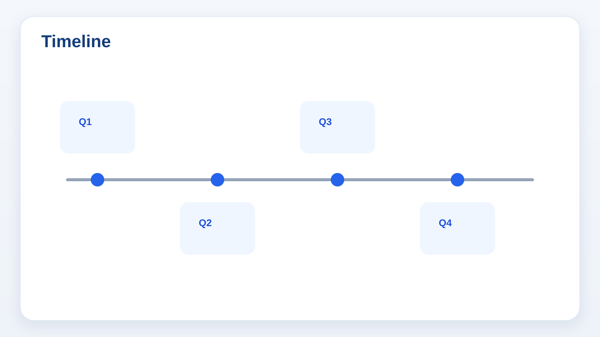

适用场景：

- 时间线
- 阶段推进
- 按季度或月份组织的计划说明

关键字段：

- `title`
- `bullets` 或 `table`

示例：

```json
{
  "layout_type": "timeline",
  "title": "一周落地计划",
  "bullets": ["Day 1 结构设计", "Day 2 layout 扩展", "Day 3 真实 deck 验证", "Day 4 文档收口"]
}
```

### `roadmap`

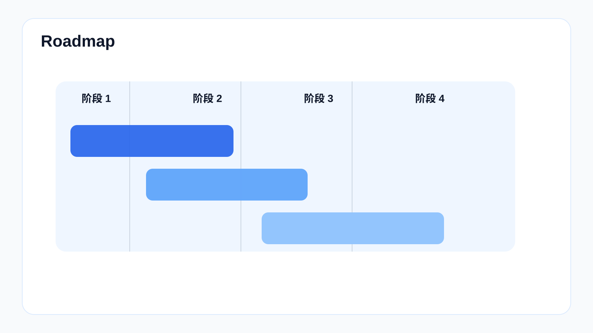

适用场景：

- 产品路线图
- 项目推进路线
- 长周期分阶段规划

关键字段：

- `title`
- `items`
- `actions`（可选）
- `goal`（可选）
- `items[].title`
- `items[].period`
- `items[].text`

示例：

```json
{
  "layout_type": "roadmap",
  "title": "后续路线图",
  "items": [
    { "title": "阶段一：完善文档", "period": "M01-M02", "text": "统一说明、示例和安装路径" },
    { "title": "阶段二：增加更多组件", "period": "M03-M04", "text": "补齐关键结构化 layout" },
    { "title": "阶段三：扩展新类型", "period": "M05-M06", "text": "把高复用案例沉淀成通用组件" }
  ],
  "actions": [
    { "title": "先补 viewer", "text": "优先支持文档里已声明的 layout" },
    { "title": "再补案例", "text": "用真实案例反推字段稳定性" }
  ],
  "goal": "目标：优先形成可复用的 layout 库，而不是只服务单个案例。"
}
```

### `milestones`

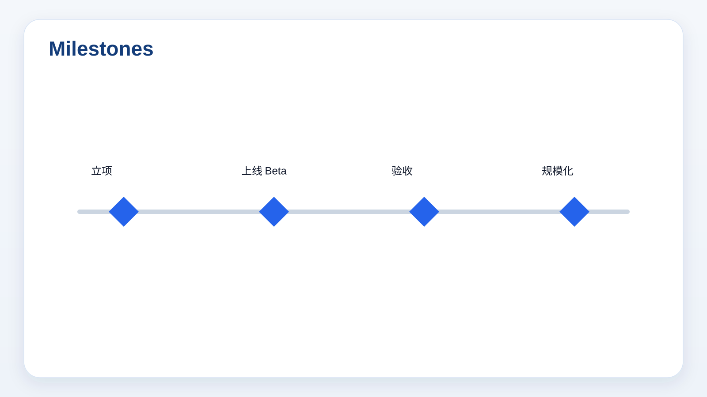

适用场景：

- 里程碑说明
- 关键交付节点
- 需要突出阶段性完成标记的页面

关键字段：

- `title`
- `table`

示例：

```json
{
  "layout_type": "milestones",
  "title": "关键里程碑",
  "table": {
    "headers": ["节点", "目标"],
    "rows": [["M1", "文档补齐"], ["M2", "组件稳定"], ["M3", "真实项目验证"]]
  }
}
```

### `org_roles`

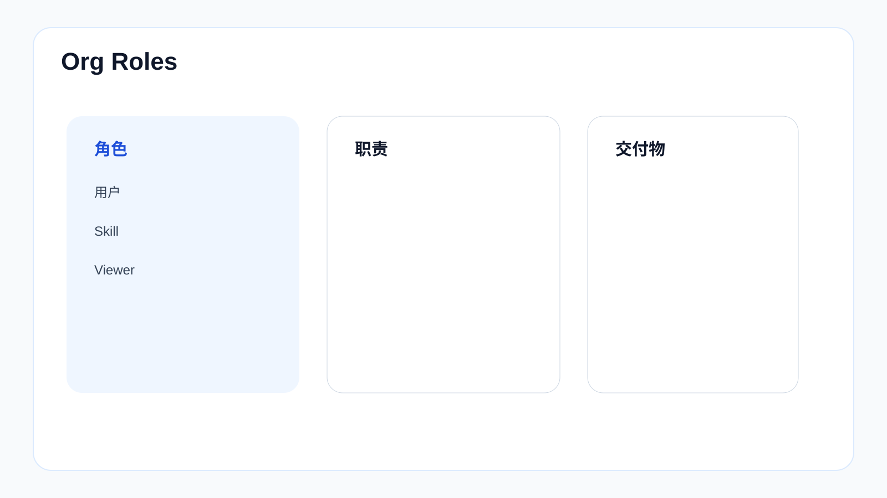

适用场景：

- 组织分工
- 角色职责
- 人员与交付物映射

关键字段：

- `title`
- `table` 或 `bullets`

示例：

```json
{
  "layout_type": "org_roles",
  "title": "角色分工",
  "table": {
    "headers": ["角色", "职责", "产物"],
    "rows": [["用户", "提出需求", "input"], ["Skill", "生成结构", "outline/deck"], ["Viewer", "渲染预览", "页面展示"]]
  }
}
```

### `risk_register`

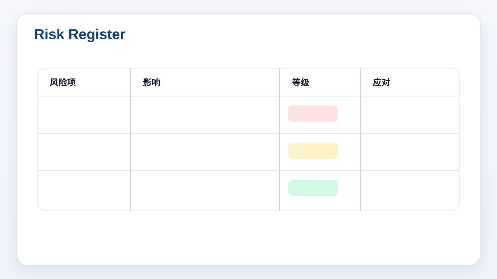

适用场景：

- 风险管理
- 风险台账
- 风险等级和应对策略整理

关键字段：

- `title`
- `table`

示例：

```json
{
  "layout_type": "risk_register",
  "title": "主要风险",
  "table": {
    "headers": ["风险", "等级", "应对"],
    "rows": [["图页过少", "高", "提高 svg_full 比例"], ["内容超屏", "中", "压缩文本并换 layout"]]
  }
}
```

### `pie_chart`

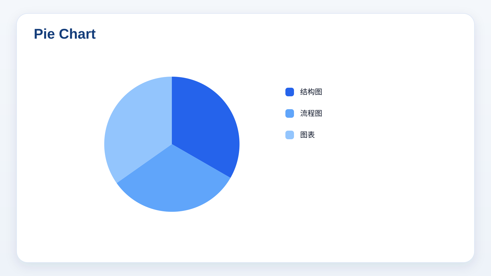

适用场景：

- 占比分析
- 类别构成
- 单组比例关系说明

关键字段：

- `title`
- `data`
- `unit`

示例：

```json
{
  "layout_type": "pie_chart",
  "title": "页面类型占比",
  "unit": "%",
  "data": [
    { "label": "结构图", "value": 45 },
    { "label": "文字页", "value": 30 },
    { "label": "图表页", "value": 25 }
  ]
}
```

### `donut_chart`

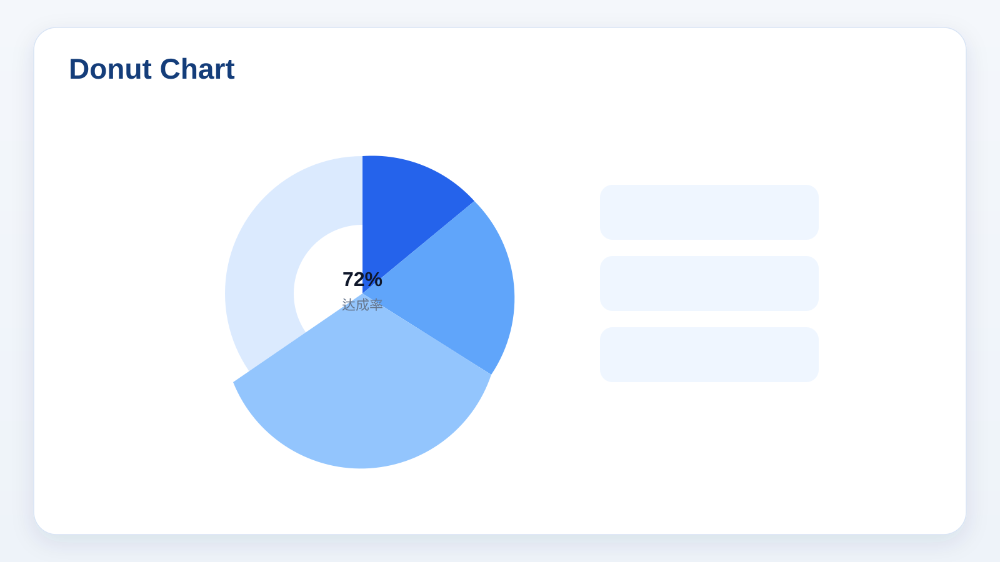

适用场景：

- 构成占比
- 完成率或达成率
- 需要在图中心放核心指标

关键字段：

- `title`
- `data`
- `unit`

示例：

```json
{
  "layout_type": "donut_chart",
  "title": "交付达成率",
  "unit": "%",
  "data": [
    { "label": "完成", "value": 78 },
    { "label": "未完成", "value": 22 }
  ]
}
```

### `area_chart`

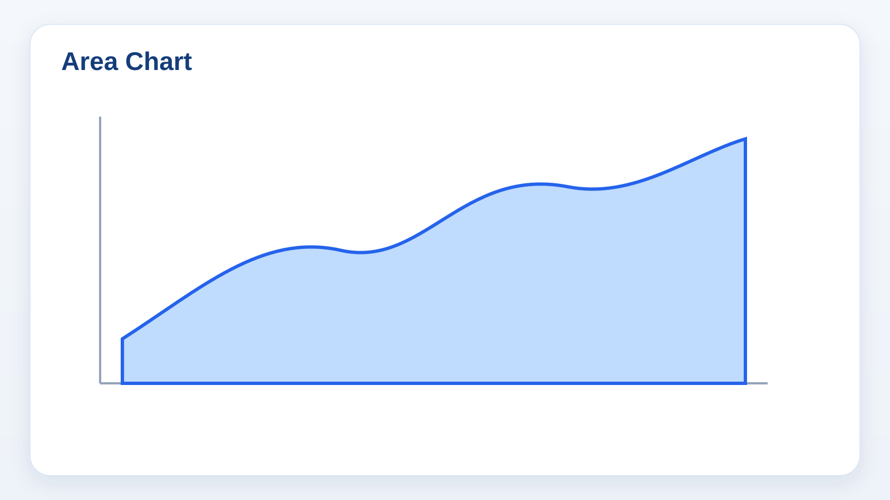

适用场景：

- 趋势面积变化
- 累积量走势
- 需要强调增长区间时

关键字段：

- `title`
- `data` 或 `series`

示例：

```json
{
  "layout_type": "area_chart",
  "title": "生成质量提升趋势",
  "unit": "分",
  "data": [
    { "label": "周一", "value": 60 },
    { "label": "周二", "value": 71 },
    { "label": "周三", "value": 84 }
  ]
}
```

### `coordinate_axis`

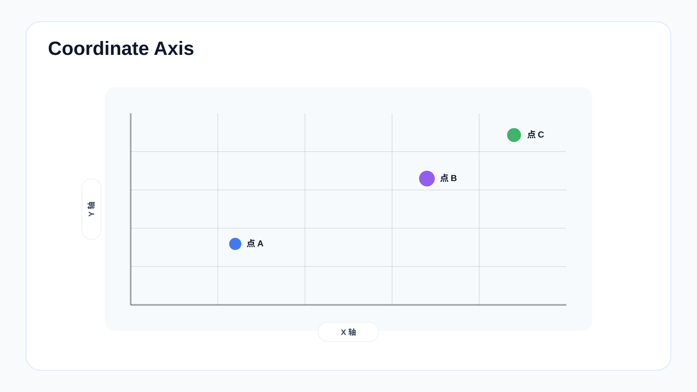

适用场景：

- 用坐标轴表达概念位置（不一定是严格数据图）
- 两个维度同时解释时（例如：投入/收益、风险/回报）
- 为后续的散点图/气泡图做“坐标框架页”

关键字段：

- `title`
- `x_label`
- `y_label`
- `points`

示例：

```json
{
  "layout_type": "coordinate_axis",
  "title": "能力位置图",
  "x_label": "投入",
  "y_label": "收益",
  "points": [
    { "label": "A", "x": 2, "y": 7, "size": 12, "color": "#2563eb" },
    { "label": "B", "x": 5, "y": 9, "size": 18, "color": "#7c3aed" },
    { "label": "C", "x": 8, "y": 4, "size": 14, "color": "#16a34a" }
  ]
}
```

### `scatter_plot`

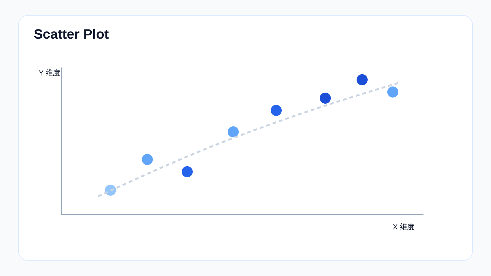

适用场景：

- 两个连续变量关系分析
- 分布特征说明
- 相关性和离群点观察

关键字段：

- `title`
- `data` 或 `series`
- `x_label`
- `y_label`

示例：

```json
{
  "layout_type": "scatter_plot",
  "title": "投入与质量关系",
  "x_label": "投入时间",
  "y_label": "质量得分",
  "data": [
    { "x": 1, "y": 60 }, { "x": 2, "y": 68 }, { "x": 3, "y": 79 }, { "x": 4, "y": 87 }
  ]
}
```

### `bubble_chart`

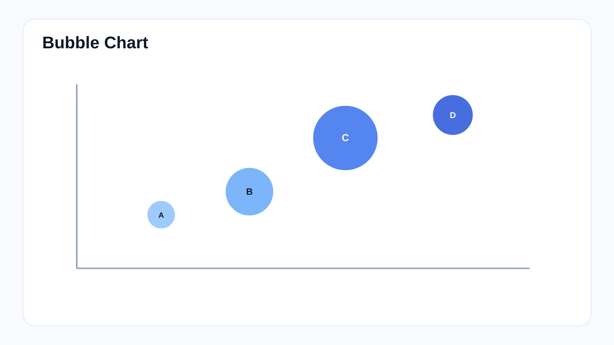

适用场景：

- 三维指标比较
- 横轴、纵轴、规模同时表达
- 多对象综合判断

关键字段：

- `title`
- `data` 或 `series`
- `x_label`
- `y_label`

示例：

```json
{
  "layout_type": "bubble_chart",
  "title": "任务价值比较",
  "x_label": "投入",
  "y_label": "收益",
  "data": [
    { "label": "A", "x": 2, "y": 7, "size": 18 },
    { "label": "B", "x": 5, "y": 9, "size": 30 }
  ]
}
```

### `waterfall_chart`

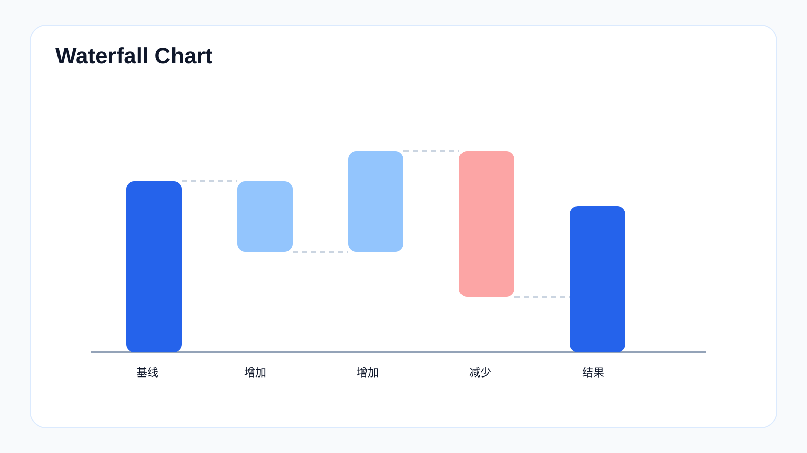

适用场景：

- 展示增减变化对最终结果的影响
- 拆解利润、成本、预算变化
- 表达从基线到结果的累计过程

关键字段：

- `title`
- `data` 或 `series`
- `unit`

示例：

```json
{
  "layout_type": "waterfall_chart",
  "title": "预算变化拆解",
  "unit": "万元",
  "data": [
    { "label": "基线", "value": 100 },
    { "label": "新增投入", "value": 30 },
    { "label": "效率节省", "value": -15 },
    { "label": "结果", "value": 115 }
  ]
}
```

### `funnel_chart`

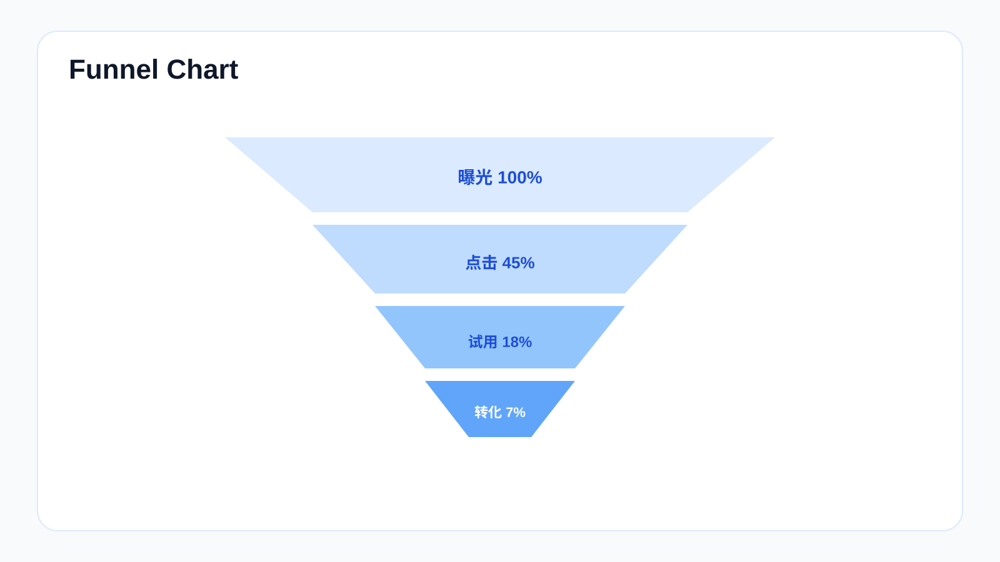

适用场景：

- 用户转化漏斗
- 运营分层沉淀
- 从触达到留存的阶段收束页

关键字段：

- `title`
- `stages[].title`
- `stages[].value`
- `stages[].text`
- `stages[].bullets`

示例：

```json
{
  "layout_type": "funnel_chart",
  "title": "项目复盘：成果与经验沉淀",
  "stages": [
    {
      "title": "用户触达与吸引",
      "value": "12.8 万",
      "text": "聚焦曝光增长与首轮转化。",
      "bullets": ["曝光显著提升", "新增用户数扩大"]
    },
    {
      "title": "用户转化与留存",
      "value": "3.4 万",
      "text": "围绕转化率和留存率做优化。",
      "bullets": ["转化率有效提高", "用户留存率稳定"]
    },
    {
      "title": "用户深度运营与口碑传播",
      "value": "8,600",
      "text": "沉淀复购和口碑扩散。",
      "bullets": ["复购率显著提升", "口碑传播效果增强"]
    }
  ]
}
```

### `heatmap`

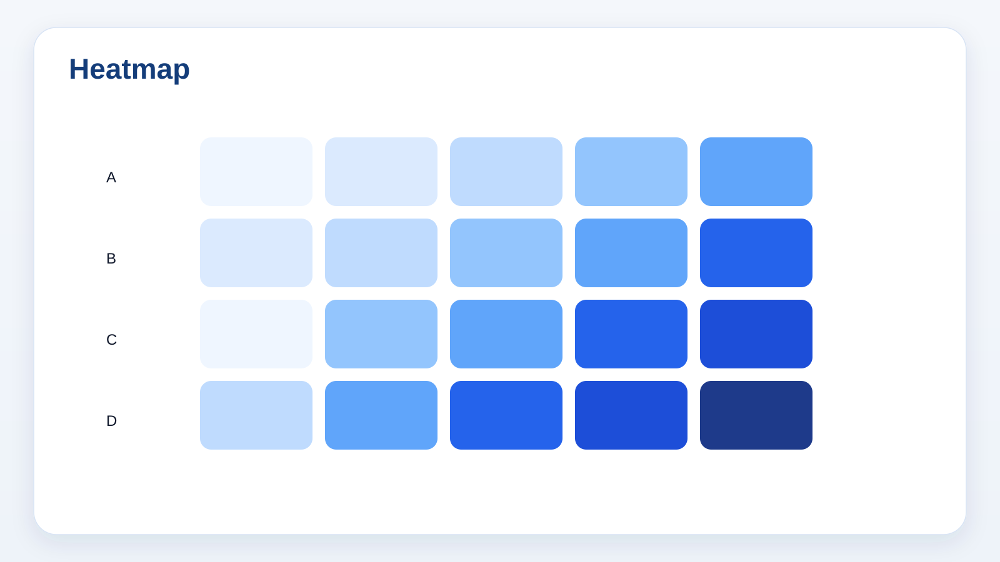

适用场景：

- 强弱分布对比
- 多维矩阵热度分析
- 时间、区域、类别交叉观察

关键字段：

- `title`
- `data` 或 `series`
- `x_labels`
- `y_labels`

示例：

```json
{
  "layout_type": "heatmap",
  "title": "模块热度矩阵",
  "x_labels": ["周一", "周二", "周三"],
  "y_labels": ["模块 A", "模块 B", "模块 C"],
  "data": [
    [2, 3, 5],
    [1, 4, 5],
    [3, 4, 2]
  ]
}
```

### `treemap`

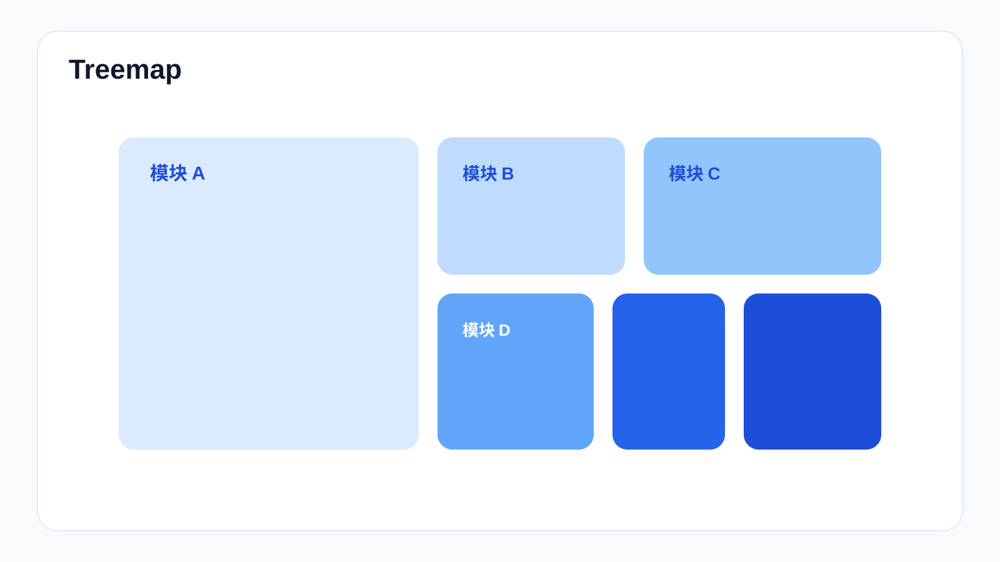

适用场景：

- 分层占比展示
- 模块规模对比
- 用面积表达权重和构成

关键字段：

- `title`
- `data` 或 `root`

示例：

```json
{
  "layout_type": "treemap",
  "title": "模块工作量构成",
  "data": [
    { "label": "viewer", "value": 38 },
    { "label": "skill", "value": 27 },
    { "label": "docs", "value": 21 },
    { "label": "assets", "value": 14 }
  ]
}
```

### `sankey`

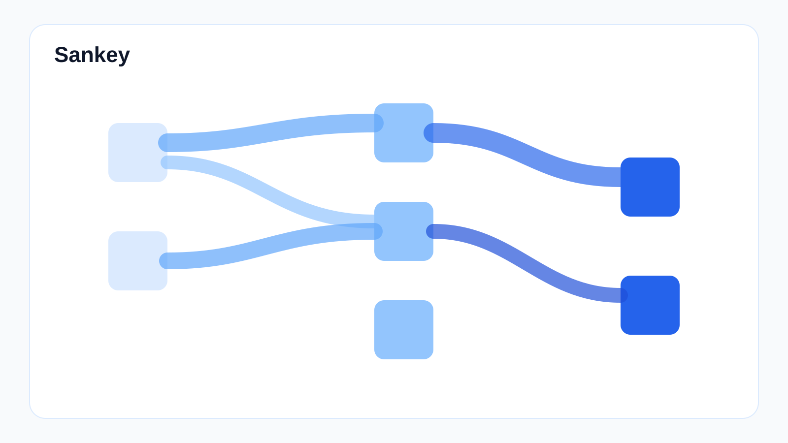

适用场景：

- 流向关系说明
- 从输入到输出的量化流转
- 资源、用户、数据流分析

关键字段：

- `title`
- `nodes`
- `links`

示例：

```json
{
  "layout_type": "sankey",
  "title": "需求到产物的流转",
  "nodes": [
    { "id": "req", "label": "需求" },
    { "id": "outline", "label": "outline" },
    { "id": "detail", "label": "detail" },
    { "id": "viewer", "label": "viewer" }
  ],
  "links": [
    { "source": "req", "target": "outline", "value": 10 },
    { "source": "outline", "target": "detail", "value": 8 },
    { "source": "detail", "target": "viewer", "value": 8 }
  ]
}
```

### `gauge`

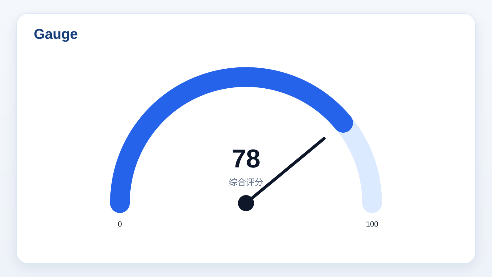

适用场景：

- 综合评分
- 达成率或健康度
- 单一核心指标的仪表盘展示

关键字段：

- `title`
- `value`
- `min`
- `max`

示例：

```json
{
  "layout_type": "gauge",
  "title": "当前质量评分",
  "value": 78,
  "min": 0,
  "max": 100
}
```

### `radar_chart`

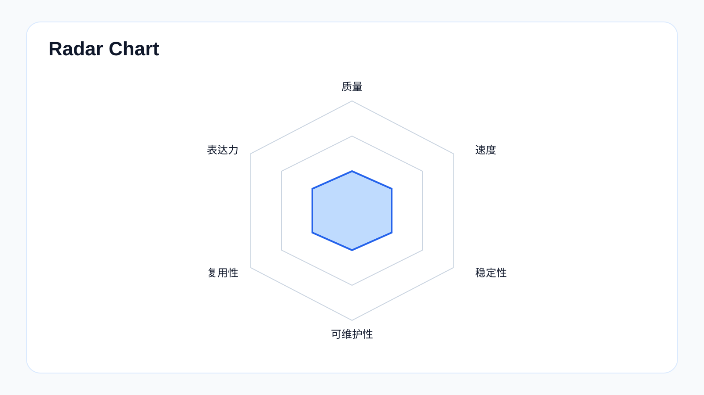

适用场景：

- 多维能力对比
- 多指标评估
- 同一对象的维度画像

关键字段：

- `title`
- `categories`
- `values` 或 `series`
- `max`

示例：

```json
{
  "layout_type": "radar_chart",
  "title": "能力画像",
  "categories": ["质量", "速度", "稳定性", "表达力", "复用性"],
  "values": [82, 76, 88, 79, 84],
  "max": 100
}
```

### `impact_effort`

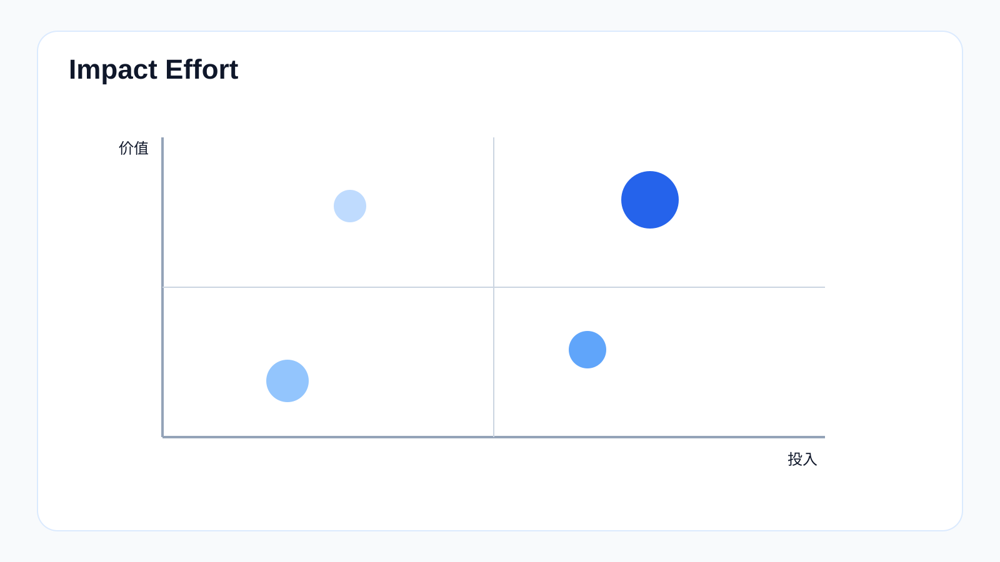

适用场景：

- 优先级排序
- 价值投入判断
- 筛选先做什么和后做什么

关键字段：

- `title`
- `items`

示例：

```json
{
  "layout_type": "impact_effort",
  "title": "任务优先级分布",
  "items": [
    { "name": "补文档", "impact": 9, "effort": 3, "size": 20 },
    { "name": "重做组件", "impact": 8, "effort": 8, "size": 28 }
  ]
}
```

### `gantt_chart`

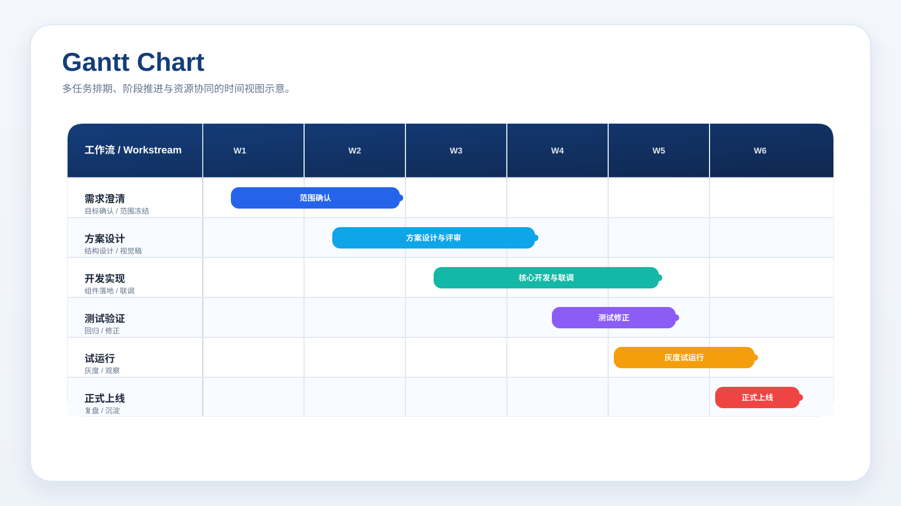

适用场景：

- 项目排期
- 任务时间安排
- 跨阶段的甘特图计划页

关键字段：

- `title`
- `tasks`

示例：

```json
{
  "layout_type": "gantt_chart",
  "title": "实施排期",
  "tasks": [
    { "name": "补 layouts", "start": "2026-06-17", "end": "2026-06-18", "owner": "Agent" },
    { "name": "校验文档", "start": "2026-06-18", "end": "2026-06-19", "owner": "Agent" }
  ]
}
```

### `mind_map`

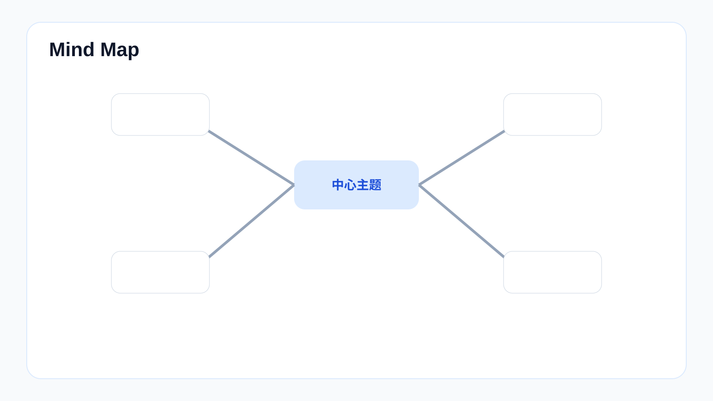

适用场景：

- 思路发散
- 概念整理
- 从中心主题向外展开的说明页

关键字段：

- `title`
- `root`

示例：

```json
{
  "layout_type": "mind_map",
  "title": "Skill 扩展脑图",
  "root": {
    "text": "Fork",
    "children": [
      { "text": "风格" },
      { "text": "layout" },
      { "text": "类型" },
      { "text": "质检" }
    ]
  }
}
```

### `top_bottom`

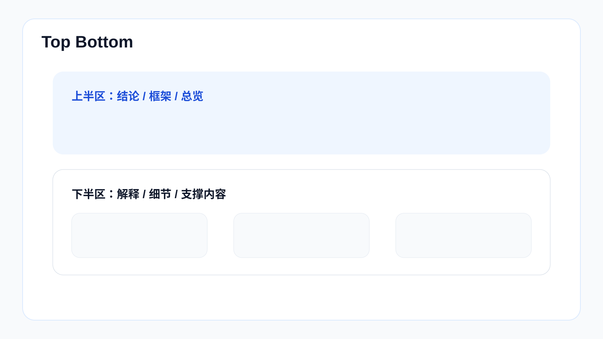

适用场景：

- 上下分区说明
- 上结论下解释
- 总览和细节分层呈现

关键字段：

- `title`
- `top`
- `bottom`

示例：

```json
{
  "layout_type": "top_bottom",
  "title": "上结论下解释",
  "top": { "title": "结论", "text": "先做 outline 再做 detail 才能稳定控制结构。" },
  "bottom": { "blocks": [{ "title": "原因", "text": "先锁定章节，再锁定页面表达。" }] }
}
```

### `nine_grid`

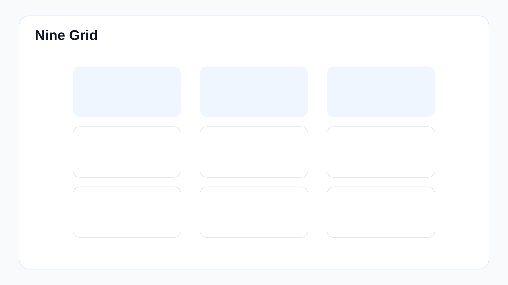

适用场景：

- 九宫格能力说明
- 多模块一页总览
- 固定数量的卡片式拆解

关键字段：

- `title`
- `items[].title`
- `items[].icon`
- `items[].text`
- `items[].bullets`

示例：

```json
{
  "layout_type": "nine_grid",
  "title": "流程系统建设：系统边界与协同",
  "items": [
    { "title": "ERP 企业资源计划", "icon": "chart", "bullets": ["财务", "采购", "销售", "库存"] },
    { "title": "PLM 产品生命周期", "icon": "document", "bullets": ["BOM", "工艺", "变更管理"] },
    { "title": "MES 制造执行", "icon": "flow", "bullets": ["排产", "报工", "追溯"] },
    { "title": "WMS 仓储管理", "icon": "check", "bullets": ["入库", "出库", "盘点"] },
    { "title": "SCM 供应链管理", "icon": "portal", "bullets": ["计划协同", "采购协同", "供应商协同"] },
    { "title": "QMS 质量管理", "icon": "qa", "bullets": ["检验", "SPC", "不合格品"] },
    { "title": "CMMS 设备维护", "icon": "refactor", "bullets": ["点检", "保养", "维修"] },
    { "title": "SCADA / EMS", "icon": "dashboard", "bullets": ["实时监控", "数采", "能效"] },
    { "title": "TMS 物流管理", "icon": "scale", "bullets": ["运输计划", "配送跟踪", "签收回传"] }
  ]
}
```

### `journey_map`

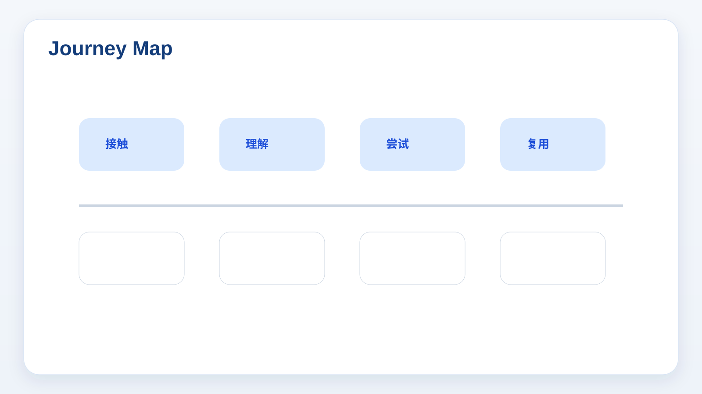

适用场景：

- 用户旅程
- 使用路径分析
- 不同阶段的触点、痛点和机会梳理

关键字段：

- `title`
- `stages`

示例：

```json
{
  "layout_type": "journey_map",
  "title": "用户使用旅程",
  "stages": [
    { "name": "接触", "touchpoints": ["README"], "painpoints": ["不清楚入口"], "opportunities": ["增加 getting-started"] },
    { "name": "使用", "touchpoints": ["outline/detail"], "painpoints": ["layout 难选"], "opportunities": ["补 layouts 文档"] }
  ]
}
```

### `plan_table`

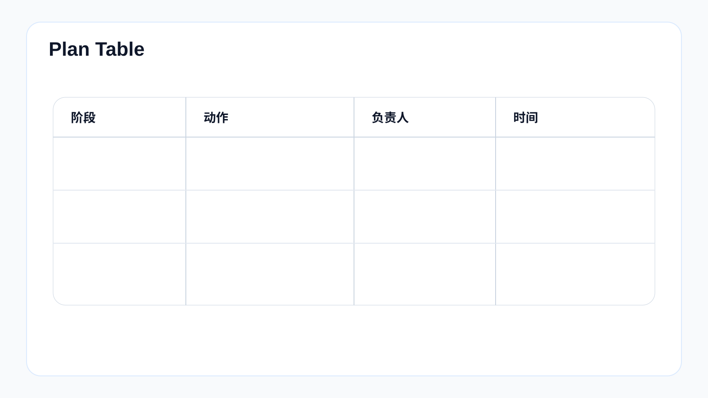

适用场景：

- 实施计划
- 分工与时间安排
- 标准计划表页面

关键字段：

- `title`
- `table`

示例：

```json
{
  "layout_type": "plan_table",
  "title": "执行计划",
  "table": {
    "headers": ["阶段", "动作", "负责人", "时间"],
    "rows": [["文档", "补说明", "Agent", "Day 1"], ["验证", "预览检查", "Agent", "Day 2"]]
  }
}
```

### `cost_benefit`

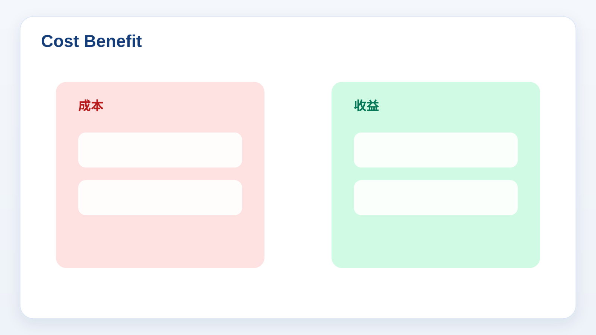

适用场景：

- 成本收益对照
- 投入产出分析
- 决策前权衡说明

关键字段：

- `title`
- `table`

示例：

```json
{
  "layout_type": "cost_benefit",
  "title": "成本收益分析",
  "table": {
    "headers": ["类型", "内容"],
    "rows": [["成本", "增加规则维护工作"], ["收益", "交付质量更稳定"]]
  }
}
```

### `raci`

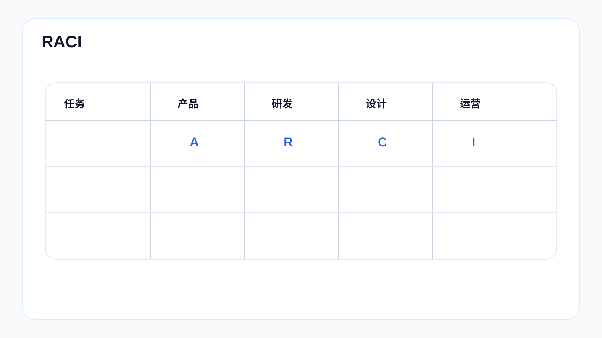

适用场景：

- 责任分配矩阵
- 跨角色协作说明
- 明确 R / A / C / I 的治理页

关键字段：

- `title`
- `table`

示例：

```json
{
  "layout_type": "raci",
  "title": "RACI 分工",
  "table": {
    "headers": ["任务", "产品", "研发", "设计", "运营"],
    "rows": [["定义结构", "A", "R", "C", "I"], ["调整视觉", "C", "R", "A", "I"]]
  }
}
```

### `target_map`

适用场景：

- 年度目标路径
- 从当前基础到目标状态的推进图
- 路线打靶图 / 目标拆解图

关键字段：

- `title`
- `start_label`
- `milestones`
- `goal`

示例：

```json
{
  "layout_type": "target_map",
  "title": "2026 年能力跃迁路径",
  "start_label": "2026",
  "milestones": [
    {
      "label": "M1",
      "title": "技能精进",
      "text": "补齐方法、知识与工具链底座。"
    },
    {
      "label": "M2",
      "title": "管理优化",
      "bullets": ["流程收敛", "时间管理", "资源协同"]
    },
    {
      "label": "M3",
      "title": "团队协作",
      "text": "建立反馈与复盘闭环。"
    },
    {
      "label": "M4",
      "title": "业务成果",
      "bullets": ["产能提升", "绩效改善", "方案沉淀"]
    }
  ],
  "goal": {
    "title": "晋升路径",
    "subtitle": "从执行者走向能稳定打胜仗的负责人",
    "text": "把阶段能力沉淀为可复用的方法与项目成果。"
  }
}
```

### `sector_explainer`

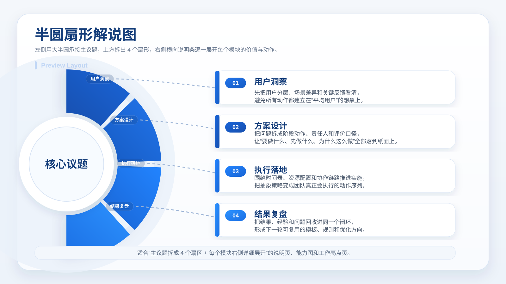

适用场景：

- 左侧扇区总览 + 右侧逐条展开
- 模块说明页
- 能力拆解 / 工作亮点 / 方法论分块解释

关键字段：

- `title`
- `center_title`
- `sectors[].title`
- `sectors[].text`
- `sectors[].bullets`

示例：

```json
{
  "layout_type": "sector_explainer",
  "title": "方法论拆解",
  "center_title": "核心议题",
  "sectors": [
    { "title": "用户洞察", "text": "先把用户分层、场景差异和关键反馈看清。" },
    { "title": "方案设计", "text": "把问题拆成阶段动作、责任人和评价口径。" },
    { "title": "执行落地", "text": "围绕时间表、资源配置和协作链路推进实施。" },
    { "title": "结果复盘", "text": "把结果、经验和问题回收进同一个闭环。" }
  ]
}
```

### `upward_arrows`

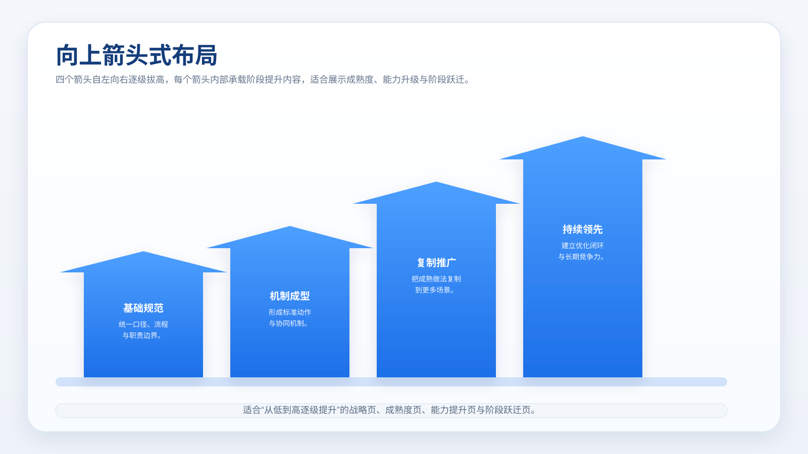

适用场景：

- 能力逐级提升
- 四阶段成熟度提升
- 从基础到拔高的路径说明

关键字段：

- `title`
- `items`

示例：

```json
{
  "layout_type": "upward_arrows",
  "title": "能力提升路径",
  "items": [
    { "title": "基础规范", "text": "统一口径、流程与职责边界。" },
    { "title": "机制成型", "text": "形成标准动作与协同机制。" },
    { "title": "复制推广", "text": "把成熟做法复制到更多场景。" },
    { "title": "持续领先", "text": "建立优化闭环与长期竞争力。" }
  ]
}
```

### `kanban_board`

适用场景：

- 周会执行看板
- 任务推进状态页
- 项目管理 / 运营排期同步

关键字段：

- `title`
- `columns[].title`
- `columns[].cards[].owner`
- `columns[].cards[].task`
- `columns[].cards[].progress`
- `columns[].cards[].due`

示例：

```json
{
  "layout_type": "kanban_board",
  "title": "项目推进看板",
  "columns": [
    {
      "title": "To Do",
      "icon": "todo",
      "cards": [
        { "owner": "产品：陈莉", "task": "确认下周版本功能边界", "due": "07-30" }
      ]
    },
    {
      "title": "In Progress",
      "icon": "doing",
      "cards": [
        { "owner": "研发：李雷", "task": "接入导出链路与预览校验", "progress": "75%" }
      ]
    },
    {
      "title": "Review",
      "icon": "review",
      "cards": [
        { "owner": "设计：陈心茹", "task": "回看目录页与封面的一致性", "note": "补最终修订意见" }
      ]
    },
    {
      "title": "Done",
      "icon": "done",
      "cards": [
        { "owner": "运营：赵志", "task": "完成项目复盘材料整理", "due": "07-28" }
      ]
    }
  ]
}
```

### `month_calendar`

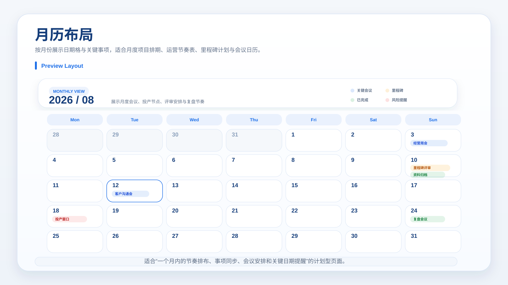

适用场景：

- 月度项目排期
- 运营节奏表
- 会议与里程碑日历

关键字段：

- `title`
- `month`
- `weekdays`
- `days[].day`
- `days[].events`
- `legend`

示例：

```json
{
  "layout_type": "month_calendar",
  "title": "8 月工作月历",
  "month": "2026 / 08",
  "subtitle": "展示月度会议、投产节点、评审安排与复盘节奏",
  "weekdays": ["Mon", "Tue", "Wed", "Thu", "Fri", "Sat", "Sun"],
  "legend": [
    { "label": "关键会议", "tone": "blue" },
    { "label": "里程碑", "tone": "amber" },
    { "label": "已完成", "tone": "green" },
    { "label": "风险提醒", "tone": "red" }
  ],
  "days": [
    { "day": 28, "muted": true },
    { "day": 29, "muted": true },
    { "day": 30, "muted": true },
    { "day": 31, "muted": true },
    { "day": 1 },
    { "day": 2 },
    { "day": 3, "events": [{ "label": "经营周会", "tone": "blue" }] },
    { "day": 10, "events": [{ "label": "里程碑评审", "tone": "amber" }, { "label": "资料归档", "tone": "green" }] },
    { "day": 12, "today": true, "events": [{ "label": "客户沟通会", "tone": "blue" }] },
    { "day": 18, "events": [{ "label": "投产窗口", "tone": "red" }] },
    { "day": 24, "events": [{ "label": "复盘会议", "tone": "green" }] }
  ]
}
```

### `case_study`

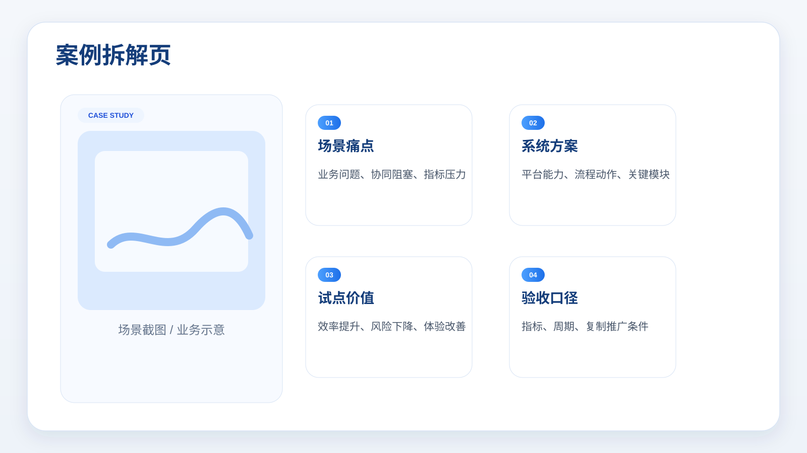

适用场景：

- 案例拆解
- 实践经验复盘
- 背景、做法、成效、启示的固定结构页

关键字段：

- `title`
- `blocks`

示例：

```json
{
  "layout_type": "case_study",
  "title": "真实项目案例",
  "blocks": [
    { "title": "背景", "text": "需要把 skill 工程化成网页 PPT 系统。" },
    { "title": "做法", "text": "补 layout、补 SVG、补文档。" },
    { "title": "成效", "text": "生成结果更稳定，文档更完整。" },
    { "title": "启示", "text": "先统一规则，再扩展类型。" }
  ]
}
```

### `evidence_gallery`

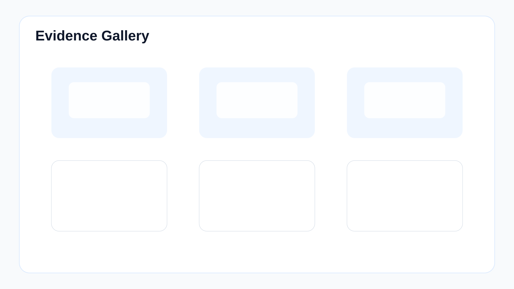

适用场景：

- 证据墙
- 多截图或多素材展示
- 补充案例凭证和界面片段

关键字段：

- `title`
- `bullets`

示例：

```json
{
  "layout_type": "evidence_gallery",
  "title": "证据墙",
  "bullets": ["viewer 截图", "SVG 资产预览", "layout 文档示例", "真实 deck 页面片段"]
}
```

## 跨页导航

[返回总入口](../layouts.md) | [上一类：结构、流程与架构页](03-structure-analysis.md)
