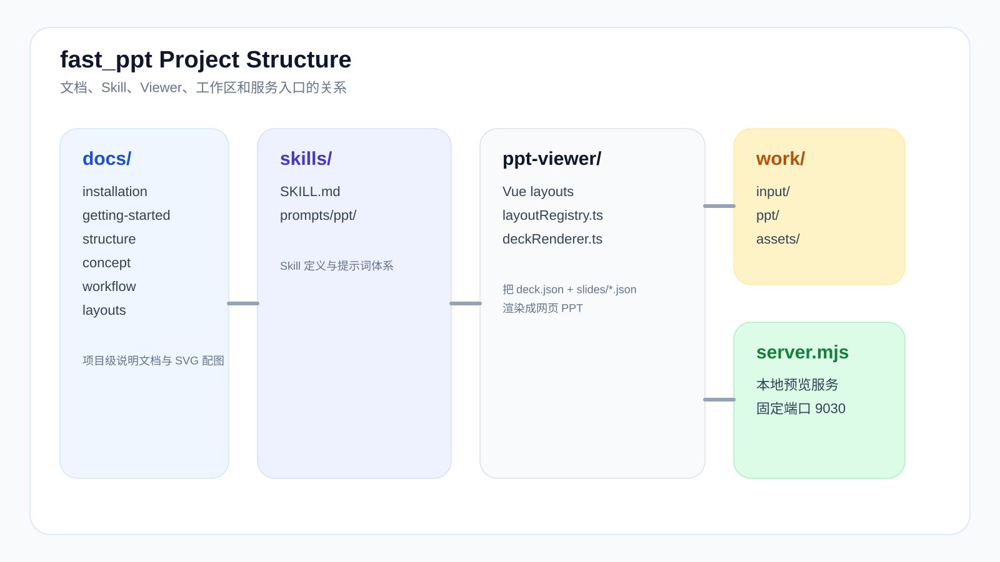

# Structure



## 为什么要先看目录结构

`fast_ppt` 不是一个只有 prompt 的小脚本，它更像一套完整的工程：

- 有输入区
- 有生成区
- 有预览端
- 有导出链路
- 有文档和规则库

理解目录结构的意义，是知道每一种问题该回到哪里处理，而不是所有事情都堆在一个文件里。

## 项目主目录

```text
fast_ppt/
  README.md
  README.en-US.md
  README.ja-JP.md
  LICENSE
  docs/
  skills/
    SKILL.md
    prompts/
      ppt/
  ppt-viewer/
  work/
    input/
    ppt/
    assets/
  lib/
  scripts/
  server.mjs
```

## 目录职责

### `docs/`

放项目文档，包括：

- 安装
- 快速开始
- PPT 类型说明
- 调整指南
- 美化指南
- 工作流
- 目录结构
- layout 类型库
- 使用说明
- 故障排查

这里是给人读的，不是给 viewer 读的。

其中 `docs/zh-CN/layouts.md` 是布局类型库入口页，详细 layout 示例已经拆到 `docs/zh-CN/layouts/*.md` 分类页面中。

### `skills/`

放 Skill 入口和提示词规则，是生成链路的“规则层”。

重点包括：

- `SKILL.md`：Skill 元信息、执行约束和使用方式
- `prompts/ppt/`：PPT 生成提示词、layout 规则、类型规则

如果你发现生成结果经常偏题、layout 选择不稳定、类型判断跑偏，很多时候要回这里改。

### `ppt-viewer/`

这是网页 PPT 的前端渲染工程。

它负责：

- 读取 `deck.json + slides/*.json`
- 根据 `layout_type` 映射到 Vue 组件
- 做浏览器预览
- 生成静态构建产物

重点位置：

- `src/layoutRegistry.ts`：layout 注册表
- `src/components/layouts/`：每种页面布局组件
- `src/lib/`：风格预设、渲染辅助等

如果问题表现为“viewer 里显示不对”“布局超出范围”“某种 layout 不够好看”，通常要看这里。

### `work/input/`

放原始输入材料，按项目分目录。

推荐形式：

```text
work/input/001_项目名/
```

这里存的是原始材料，不是最终产物。

### `work/ppt/`

放每个项目生成出来的结构化结果。

典型目录：

```text
work/ppt/001_项目名/
  outline.json
  deck.json
  slides/
```

其中：

- `outline.json`：章节和页面结构
- `deck.json`：整套 deck 配置和 `slide_files`
- `slides/*.json`：每页的页面数据

如果你在修具体某一页内容，通常是回这里。

### `work/assets/`

放真实被页面引用的 SVG 图形素材。

这部分很重要，因为 `svg_full` 页面不是“占位概念图”，而是会被实际引用的资产。

如果你发现：

- 架构图不够图形化
- 对比图还是文字堆砌
- SVG 页面和页面标题重复

大概率要改这里。

### `lib/`

放服务端或导出链路共用的逻辑，例如：

- PPTX 导出
- 风格预设
- deck 渲染辅助

如果 viewer 好看、导出却不一致，通常要查这里。

### `scripts/`

放脚本化工具，例如：

- 批量导出
- 落盘校验
- 自动化处理流程

适合做重复操作，不适合堆放核心业务逻辑。

### `server.mjs`

本地预览服务入口。

它负责：

- 读取项目目录
- 聚合 deck 数据
- 提供浏览器访问入口
- 接 PPTX 导出接口

如果问题表现为“项目切换不对”“接口不返回”“预览服务打不开”，优先查这里。

## 产物是怎么流动的

最常见的数据流是：

```text
work/input/001_项目名/
  -> /fppt:outline
  -> work/ppt/001_项目名/outline.json
  -> /fppt:detail
  -> work/ppt/001_项目名/deck.json + slides/*.json
  -> work/assets/*.svg
  -> ppt-viewer / server.mjs 预览
  -> lib/pptxExport.mjs 导出
```

你可以把它理解成四层：

1. 输入层：`work/input/`
2. 结构产物层：`work/ppt/`
3. 图形资产层：`work/assets/`
4. 渲染与导出层：`ppt-viewer/` + `lib/` + `server.mjs`

## 出问题时应该去哪里改

### 结构不顺

看：

- `outline.json`
- `skills/prompts/ppt/*`

### 单页字段不完整

看：

- `work/ppt/xxx/slides/*.json`

### SVG 图不对

看：

- `work/assets/*.svg`

### viewer 渲染不对

看：

- `ppt-viewer/src/components/layouts/*`
- `ppt-viewer/src/layoutRegistry.ts`
- `ppt-viewer/src/style.css`

### 导出和 viewer 不一致

看：

- `lib/pptxExport.mjs`
- `ppt-viewer/src/lib/*`
- `server.mjs`

## 推荐阅读顺序

如果你是第一次接手这个项目，建议按这个顺序看：

1. [Getting Started](getting-started.md)
2. [Workflow](workflow.md)
3. [Layouts](layouts.md)
4. [Manual](manual.md)
