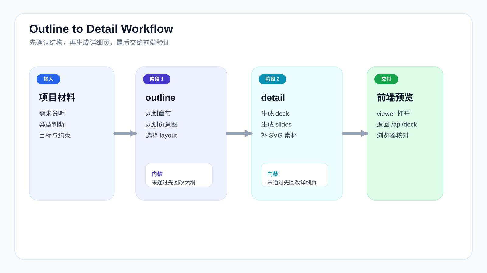

# Workflow

## 为什么不是一次性生成完

`fast_ppt` 的核心不是“让模型一口气吐出 60 页 PPT”，而是把生成过程拆成可检查、可回改、可复用的两段：

1. `outline`
2. `detail`

这样做的原因很直接：

- 大纲问题，应该在结构层解决
- 页面问题，应该在页面层解决
- 图形页问题，应该落到 SVG 或具体 layout 上解决

如果不分层，最后就会变成“整份 deck 都不太对，但不知道该改哪里”。

## 标准工作流

完整链路通常是：

1. 准备输入材料
2. 运行 `/fppt:outline`
3. 检查并确认 `outline.json`
4. 运行 `/fppt:detail`
5. 预览 `deck.json + slides/*.json`
6. 回改结构、页面或 SVG

你可以把它理解成：

- `outline` 负责“搭骨架”
- `detail` 负责“长页面”
- viewer 负责“验收是否真的能看”

## 阶段一：Outline

### 输入

- 用户需求
- 项目材料
- 类型提示词
- 总提示词

### 输出

- `outline.json`

### 这一阶段真正要定下来的东西

- PPT 类型
- 章节结构
- 页序
- 每页意图
- 每页大概适合的 `layout_type`

### 这一阶段不该过早做的事

- 不要急着写每页完整文案
- 不要急着把所有图形都画出来
- 不要在结构还没确认时直接生成最终 deck

## 阶段二：Detail

### 输入

- 已确认的 `outline.json`

### 输出

- `deck.json`
- `slides/*.json`
- `work/assets/*.svg`

### 这一阶段负责什么

- 把每页结构写成前端可渲染的 JSON
- 把图示类页面落成真实 SVG 资产
- 把 `layout_type` 对应到能预览的页面内容

### 这一阶段不该承担什么

- 不应该回头重新定义整套章节逻辑
- 不应该在大纲方向错误时硬修单页

如果你发现“每一页都能改，但整份 deck 还是不顺”，大概率应该回 `outline`。

## 回改时应该回哪一层

这是最容易混乱的地方。

### 情况一：章节顺序不对

回改：

- `outline.json`

不要直接在 `slides/*.json` 里硬挪顺序。

### 情况二：某一页 layout 选错了

优先回改：

- `outline.json` 中该页的页面意图 / layout 选择

必要时再改：

- `slides/*.json`

### 情况三：文字对，但图示表达不够

回改：

- `slides/*.json`
- `work/assets/*.svg`
- 对应 viewer layout 组件

### 情况四：viewer 里能看，但导出不一致

回改：

- viewer layout
- `deckRenderer.ts`
- `pptxExport.mjs`

这属于渲染链路一致性问题，不是内容问题。

## 质检闭环

质检不只检查页面是否“像 PPT”，还检查这套生成工作流是不是稳定。

### 1. Skill 自身质检

检查重点：

- 是否严格执行 `outline -> detail`
- 是否在类型未确认时提前进入 detail
- 是否先判断页面意图，再选 layout
- 是否把图示类页面真正做成 SVG 或结构化图形
- 是否给出清楚的通过项、未通过项和回改动作

这一层看的是方法有没有跑偏。

### 2. 大纲质检

检查重点：

- 类型是否正确
- 章节链路是否完整
- 图页比例是否合理
- 每页意图是否清晰
- 是否存在明显重复页或跳跃页

### 3. 详细页质检

检查重点：

- 字段是否完整
- `slide_files` 与实际文件是否一致
- 资产文件是否真实存在
- 内容是否超出 deck 范围
- 对比页 / 阶段页 / 泳道页是否选对 layout
- `svg_full` 是否真正承担图形表达

## 页面表达规则

- 对比页：优先 `comparison_table` 或对比卡片
- 阶段页：优先 `phases` / `steps`
- 时序工作流：优先 `swimlane_process`
- 三层结构：优先 `svg_full`
- 目标推进：优先 `target_map`
- 执行状态：优先 `kanban_board`
- 漏斗收束：优先 `funnel_chart`
- `svg_full`：SVG 内不重复写页面标题，标题默认由 deck 页标题承担

## 一个最常见的错误流程

错误流程通常是这样：

1. 不确认大纲
2. 直接生成 detail
3. 发现很多页面不对
4. 在单页里不断打补丁
5. 最后整套 deck 逻辑越来越乱

正确做法是：

1. 先把 `outline.json` 调顺
2. 再生成 detail
3. 用 viewer 验证单页表现
4. 按结构层 / 页面层 / 资产层分别回改

## 继续阅读

- [Getting Started](getting-started.md)：第一次怎么跑通
- [Structure](structure.md)：目录和产物分别放哪里
- [Manual](manual.md)：实际操作时怎么配合使用
